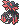

  ⬅️ <a href="https://avventureaditia.github.io/itia-wiki/pokemon/077-panpup/"> 077 - Panpup </a>
  <strong>078 - Pangher</strong> 
  
  <a href="https://avventureaditia.github.io/itia-wiki/pokemon/079-strigowl/"> 079 - Strigowl </a> ➡️

  

  

    

        
Class

        

          
Selvaggio

        

      

    

        
Class

        

          
Selvaggio

        

      

    

      
Types

      

        
        
      

    

    

      
Abilities

      

        <a href='' title="When this Pokemon enters battle, the opponent's Attack is lowered by one stage.  In a double battle, both opponents are affected.  This ability also takes effect when acquired during a battle, but will not take effect again if lost and reobtained without leaving battle.  This ability has no effect on an opponent that has a substitute.  Overworld: If the first Pokemon in the party has this ability, any random encounter with a Pokemon five or more levels lower than it has a 50% chance of being skipped.">Intimidate</a>
        
      

    

    

      
Hidden Ability

      

        
      

    

  

## Generali

=== "Descrizione Pokedex"
    ### Descrizione

    Questo Pokémon è uno dei più abili nella lotta corpo a corpo e solo i Gladeon più abili possono tenergli testa poiché nemici naturali sin dai tempi antichi.  
    I pezzi di armatura presenti sul suo corpo non sono altro che il risultato di questi continui scontri tra specie, nei quali Pangher utilizza i pezzi caduti dal corpo dei Gladeon per aumentare la propria potenza.  

    Per maggiori informazioni il [video completo](https://www.youtube.com/watch?v=2pTDhRxb7-0&list=PLniAakFPn_t9I5zqlYAwZ_iSzJmgu5Nqd&index=13).

=== "Ispirazioni"

    ### Ispirazioni
    Le ispirazioni alla base di Panpup e della sua catena evolutiva sono:
    
    - **Gladiatori**;
    - **Parte mancate del design di Gladeon**;
    - **Venationes**;
    - **Pantere**.

=== "Vincitore del contest"
    ### Vincitore

    Il Vincitore di Itia che ha dato origine a Panpup e la sua catena evolutiva è **Ale**.

## Base Stats
<table style="width: 100%">
  <tbody style="width: 100%;">
    <tr style="display: flex; align-items: center;">
      <th style="color: #737373;" >HP</th>
      <td style="border-top: none; width: 70px">60</td>
      <td style="width: 100%; min-width: 450px; border-top: none;">
        

        

      </td>
    </tr>
    <tr style="display: flex; align-items: center;">
      <th style="color: #737373;">Attack</th>
      <td style="border-top: none; width: 70px">120</td>
      <td style="width: 100%; min-width: 450px; border-top: none;">
        

        

      </td>
    </tr>
    <tr style="display: flex; align-items: center;">
      <th style="color: #737373;">Defense</th>
      <td style="border-top: none; width: 70px">60</td>
      <td style="width: 100%; min-width: 450px; border-top: none;">
        

        

      </td>
    </tr>
    <tr style="display: flex; align-items: center;">
      <th style="color: #737373;">SP Attack</th>
      <td style="border-top: none; width: 70px">105</td>
      <td style="width: 100%; min-width: 450px; border-top: none;">
        

        

      </td>
    </tr>
    <tr style="display: flex; align-items: center;">
      <th style="color: #737373;">SP Defense</th>
      <td style="border-top: none; width: 70px">60</td>
      <td style="width: 100%; min-width: 450px; border-top: none;">
        

        

      </td>
    </tr>
    <tr style="display: flex; align-items: center;">
      <th style="color: #737373;">Speed</th>
      <td style="border-top: none; width: 70px">105</td>
      <td style="width: 100%; min-width: 450px; border-top: none;">
        

        

      </td>
    </tr>
  </tbody>
</table>

## Moveset

=== "Level Up Moves"
    | Level | Name | Power | Accuracy | PP | Type | Damage Class |
        | -- | -- | -- | -- | -- | -- | -- |
        
        

=== "Machine Moves"
    | Machine | Name | Power | Accuracy | PP | Type | Damage Class |
        | -- | -- | -- | -- | -- | -- | -- |
        
        
