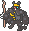

  ⬅️ <a href="https://avventureaditia.github.io/itia-wiki/pokemon/078-pangher/"> 078 - Pangher </a>
  <strong>079 - Strigowl</strong> 
  
  <a href="https://avventureaditia.github.io/itia-wiki/pokemon/080-ozbell/"> 080 - Ozbell </a> ➡️

## Pokédex

=== "Tassonomia"
    

      
      

        

          
Class

          

            
Strega

          

        

        

          
Types

          

            
            
          

        

        

          
Ability

          

            <a href='' title="This Pokemon's moves have critical hit rates one stage higher than normal.">Super-luck</a>
          

        

        

          
Cry

          

            <audio controls>
              <source src="../../audio/strigowl.mp3" type="audio/mpeg">
            </audio>
          

        

      

    

=== "Aspetto"
    

      
      

        

          
Height

          

            
0,79 m

          

        

        

          
Weight

          

            
41,32 kg

          

        

        

          
Pokédex Color

          

            
Nero

          

        

        

          
Shape

          

            
          

        

      

    

=== "Allevamento"
    

      
      

        

          

            
Catch rate

            

              
120

            

          

          

            
Gender Ratio

            

              
11.14%

              
/

              
88.86%

            

          

        

        

          

            
Egg Groups

            

              
Flying and Monster

            

          

          

            
Hatch Time

            

              
25 Cycles

            

          

        

        

          

            
Base experience yield

            

              
124

            

          

          

            
Leveling rate

            

              
Medium Fast

            

          

        

        

          

            
Base friendship

            

              
70

            

          

          

            
EV yield

            

              
2 - Sp.Attack

            

          

        

      

    

    

## Generali

=== "Descrizione Pokedex"
    ### Descrizione

    Queste creature hanno l'abitudine di intrufolarsi nelle fattorie sparse per Ilia e portare scompiglio tra i suoi abitanti.  
    Le sue prede preferite sono i Wooloo dei quali si ciba e i Ponyta, che spaventa per il puro gusto di vederli correre in giro, intreccia le piume delle sue ali e le impregna nel sangue delle sue vittime.  

    Per maggiori informazioni il [video completo](https://www.youtube.com/watch?v=2pTDhRxb7-0&list=PLniAakFPn_t9I5zqlYAwZ_iSzJmgu5Nqd&index=13).

=== "Ispirazioni"

    ### Ispirazioni
    Le ispirazioni alla base di Strigowl sono:
    
    - **Strige**;
    - **Barbagianni**;
    - **Streghe**;
    - **Janara**.

=== "Vincitore del contest"
    ### Vincitori

    I Vincitori di Itia che hanno dato origine a Strigowl sono **2DiPixel**, **Alex** e **Michael**.

## Base Stats
<table style="width: 100%">
  <tbody style="width: 100%;">
    <tr style="display: flex; align-items: center;">
      <th style="color: #737373;" >HP</th>
      <td style="border-top: none; width: 70px">70</td>
      <td style="width: 100%; min-width: 450px; border-top: none;">
        

        

      </td>
    </tr>
    <tr style="display: flex; align-items: center;">
      <th style="color: #737373;">Attack</th>
      <td style="border-top: none; width: 70px">60</td>
      <td style="width: 100%; min-width: 450px; border-top: none;">
        

        

      </td>
    </tr>
    <tr style="display: flex; align-items: center;">
      <th style="color: #737373;">Defense</th>
      <td style="border-top: none; width: 70px">85</td>
      <td style="width: 100%; min-width: 450px; border-top: none;">
        

        

      </td>
    </tr>
    <tr style="display: flex; align-items: center;">
      <th style="color: #737373;">SP Attack</th>
      <td style="border-top: none; width: 70px">110</td>
      <td style="width: 100%; min-width: 450px; border-top: none;">
        

        

      </td>
    </tr>
    <tr style="display: flex; align-items: center;">
      <th style="color: #737373;">SP Defense</th>
      <td style="border-top: none; width: 70px">85</td>
      <td style="width: 100%; min-width: 450px; border-top: none;">
        

        

      </td>
    </tr>
    <tr style="display: flex; align-items: center;">
      <th style="color: #737373;">Speed</th>
      <td style="border-top: none; width: 70px">82</td>
      <td style="width: 100%; min-width: 450px; border-top: none;">
        

        

      </td>
    </tr>
  </tbody>
</table>

## Aspetto di gioco

=== "Base"
    

      

        
      

      

        
      

    

=== "Shiny"
    

      

        
      

      

        
      

    

## Moveset

=== "Level Up Moves"
    | Level | Name | Power | Accuracy | PP | Type | Damage Class |
        | -- | -- | -- | -- | -- | -- | -- |
        
        

=== "Machine Moves"
    | Machine | Name | Power | Accuracy | PP | Type | Damage Class |
        | -- | -- | -- | -- | -- | -- | -- |
        
        
