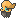

  ⬅️ <a href="https://avventureaditia.github.io/itia-wiki/pokemon/078-pangher/"> 078 - Pangher </a>
  <strong>079 - Strigowl</strong> 
  
  <a href="https://avventureaditia.github.io/itia-wiki/pokemon/080-ozbell/"> 080 - Ozbell </a> ➡️

  

  

    

        
Class

        

          
Strega

        

      

    

      
Types

      

        
        
      

    

    

      
Abilities

      

        <a href='' title="This Pokemon's moves have critical hit rates one stage higher than normal.">Super-luck</a>
        
      

    

    

      
Hidden Ability

      

        
      

    

  

## Generali

=== "Descrizione Pokedex"
    ### Descrizione

    Queste creature hanno l'abitudine di intrufolarsi nelle fattorie sparse per Ilia e portare scompiglio tra i suoi abitanti.  
    Le sue prede preferite sono i Wooloo dei quali si ciba e i Ponyta, che spaventa per il puro gusto di vederli correre in giro, intreccia le piume delle sue ali e le impregna nel sangue delle sue vittime.  

    Per maggiori informazioni il [video completo](https://www.youtube.com/watch?v=2pTDhRxb7-0&list=PLniAakFPn_t9I5zqlYAwZ_iSzJmgu5Nqd&index=13).

=== "Ispirazioni"

    ### Ispirazioni
    Le ispirazioni alla base di Strigowl sono:
    
    - **Strige**;
    - **Barbagianni**;
    - **Streghe**;
    - **Janara**.

=== "Vincitore del contest"
    ### Vincitore

    I Vincitori di Itia che hanno dato origine a Strigowl sono **2DiPixel**, **Alex** e **Michael**.

## Base Stats
<table style="width: 100%">
  <tbody style="width: 100%;">
    <tr style="display: flex; align-items: center;">
      <th style="color: #737373;" >HP</th>
      <td style="border-top: none; width: 70px">70</td>
      <td style="width: 100%; min-width: 450px; border-top: none;">
        

        

      </td>
    </tr>
    <tr style="display: flex; align-items: center;">
      <th style="color: #737373;">Attack</th>
      <td style="border-top: none; width: 70px">60</td>
      <td style="width: 100%; min-width: 450px; border-top: none;">
        

        

      </td>
    </tr>
    <tr style="display: flex; align-items: center;">
      <th style="color: #737373;">Defense</th>
      <td style="border-top: none; width: 70px">85</td>
      <td style="width: 100%; min-width: 450px; border-top: none;">
        

        

      </td>
    </tr>
    <tr style="display: flex; align-items: center;">
      <th style="color: #737373;">SP Attack</th>
      <td style="border-top: none; width: 70px">110</td>
      <td style="width: 100%; min-width: 450px; border-top: none;">
        

        

      </td>
    </tr>
    <tr style="display: flex; align-items: center;">
      <th style="color: #737373;">SP Defense</th>
      <td style="border-top: none; width: 70px">85</td>
      <td style="width: 100%; min-width: 450px; border-top: none;">
        

        

      </td>
    </tr>
    <tr style="display: flex; align-items: center;">
      <th style="color: #737373;">Speed</th>
      <td style="border-top: none; width: 70px">82</td>
      <td style="width: 100%; min-width: 450px; border-top: none;">
        

        

      </td>
    </tr>
  </tbody>
</table>

## Moveset

=== "Level Up Moves"
    | Level | Name | Power | Accuracy | PP | Type | Damage Class |
        | -- | -- | -- | -- | -- | -- | -- |
        
        

=== "Machine Moves"
    | Machine | Name | Power | Accuracy | PP | Type | Damage Class |
        | -- | -- | -- | -- | -- | -- | -- |
        
        
