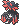
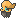
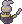
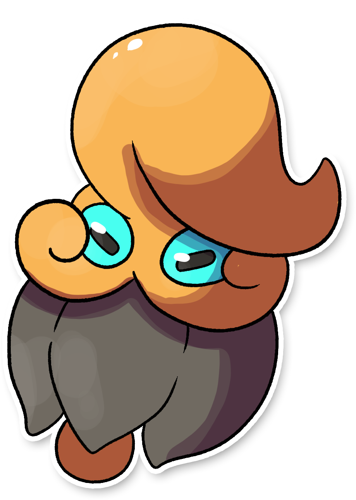
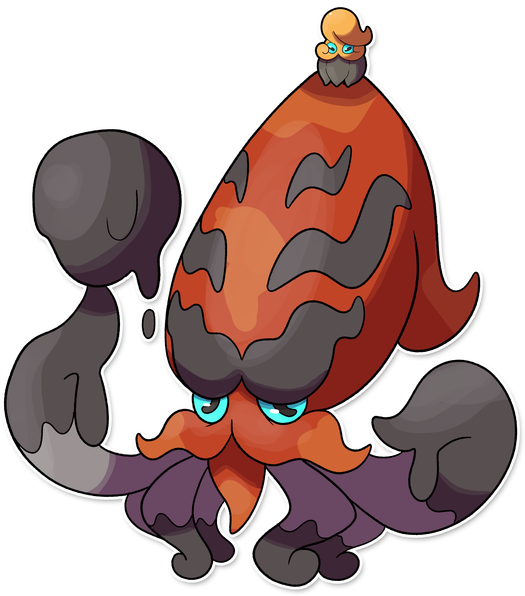

  ⬅️ <a href="https://avventureaditia.github.io/itia-wiki/pokemon/079-strigowl/"> 079 - Strigowl </a>
  <strong>080 - Ozbell</strong> 
  
  <a href="https://avventureaditia.github.io/itia-wiki/pokemon/081-apipomuf/"> 081 - Apipomuf </a> ➡️

## Pokédex - Forma Base

=== "Tassonomia"
    

      
      

        

          
Class

          

            
Campana

          

        

        

          
Types

          

            
            
          

        

        

          
Ability

          

            <a href='' title="Increases super-effective damage dealt to 1.25x.">Orichalcum-pulse</a>
          

        

        

          
Cry

          

            <audio controls>
              <source src="../../audio/ozbell.mp3" type="audio/mpeg">
            </audio>
          

        

      

    

=== "Aspetto"
    

      
      

        

          
Height

          

            
0,34 m

          

        

        

          
Weight

          

            
3,31 kg

          

        

        

          
Pokédex Color

          

            
Nero

          

        

        

          
Shape

          

            
          

        

      

    

=== "Allevamento"
    

      
      

        

          

            
Catch rate

            

              
120

            

          

          

            
Gender Ratio

            

              
50.0%

              
/

              
50.0%

            

          

        

        

          

            
Egg Groups

            

              
Water 3 and Monster

            

          

          

            
Hatch Time

            

              
40 Cycles

            

          

        

        

          

            
Base experience yield

            

              
155

            

          

          

            
Leveling rate

            

              
Slow

            

          

        

        

          

            
Base friendship

            

              
70

            

          

          

            
EV yield

            

              
2 - Defense

            

          

        

      

    

## Pokédex - Forma Richiamo

=== "Tassonomia"
    

      
      

        

          
Class

          

            
Campana

          

        

        

          
Types

          

            
            
          

        

        

          
Ability

          

          <a href='' title="Increases super-effective damage dealt to 1.25x.">Orichalcum-pulse</a>
          

        

        

          
Cry

          

            <audio controls>
              <source src="../../audio/ozbell.mp3" type="audio/mpeg">
            </audio>
          

        

      

    

=== "Aspetto"
    

      
      

        

          
Height

          

            
2,32 m

          

        

        

          
Weight

          

            
45,27 kg

          

        

        

          
Pokédex Color

          

            
Nero

          

        

        

          
Shape

          

            
          

        

      

    

=== "Allevamento"
    

      
      

        

          

            
Catch rate

            

              
120

            

          

          

            
Gender Ratio

            

              
50.0%

              
/

              
50.0%

            

          

        

        

          

            
Egg Groups

            

              
Water 3 and Monster

            

          

          

            
Hatch Time

            

              
40 Cycles

            

          

        

        

          

            
Base experience yield

            

              
155

            

          

          

            
Leveling rate

            

              
Slow

            

          

        

        

          

            
Base friendship

            

              
70

            

          

          

            
EV yield

            

              
2 - Defense

            

          

        

      

    

## Generali

=== "Descrizione Pokedex"
    ### Descrizione

    Questi Pokémon sono apparentemente innocui, poiché piccoli e deboli.
    Il loro corpo ricorda la forma di una piccola campana che agitano in situazioni di pericolo.  
    Sono tuttavia molto dispettosi e si divertono a ricoprire gli altri Pokémon del loro inchiostro appiccicoso.  
    Quando i piccoli Ozbell si sentono in pericolo, agitano il loro corpo a forma di campana, attivando la loro abilità polporichiamo.  
    In questo modo chiedono l'aiuto di una gigantesca creatura Marina che corre in loro soccorso.  
    Non è un'evoluzione, ma una mutazione genetica che ha aumentato a dismisura le dimensioni di un comune Ozbell.  
    Lancia enormi palle di inchiostro che immobilizzano il nemico e lo avvelenano.  

    Per maggiori informazioni il [video completo](https://www.youtube.com/watch?v=2pTDhRxb7-0&list=PLniAakFPn_t9I5zqlYAwZ_iSzJmgu5Nqd&index=13).

=== "Ispirazioni"

    ### Ispirazioni
    Le ispirazioni alla base di Ozbell sono:
    
    - **Ozena**;
    - **La leggenda del Polpo campanaro di Tellaro**;
    - **I Bravi dei Promessi Sposi**;
    - **La peste**.

=== "Vincitore del contest"
    ### Vincitori

    I Vincitori di Itia che hanno dato origine a Ozbell sono **Davide** e **Ciatongo**.

## Base Stats

=== "Forma Base"
    ### Forma Singolo
    <table style="width: 100%">
      <tbody style="width: 100%;">
        <tr style="display: flex; align-items: center;">
          <th style="color: #737373;" >HP</th>
          <td style="border-top: none; width: 70px">45</td>
          <td style="width: 100%; min-width: 450px; border-top: none;">
            

            

          </td>
        </tr>
        <tr style="display: flex; align-items: center;">
          <th style="color: #737373;">Attack</th>
          <td style="border-top: none; width: 70px">20</td>
          <td style="width: 100%; min-width: 450px; border-top: none;">
            

            

          </td>
        </tr>
        <tr style="display: flex; align-items: center;">
          <th style="color: #737373;">Defense</th>
          <td style="border-top: none; width: 70px">20</td>
          <td style="width: 100%; min-width: 450px; border-top: none;">
            

            

          </td>
        </tr>
        <tr style="display: flex; align-items: center;">
          <th style="color: #737373;">SP Attack</th>
          <td style="border-top: none; width: 70px">25</td>
          <td style="width: 100%; min-width: 450px; border-top: none;">
            

            

          </td>
        </tr>
        <tr style="display: flex; align-items: center;">
          <th style="color: #737373;">SP Defense</th>
          <td style="border-top: none; width: 70px">25</td>
          <td style="width: 100%; min-width: 450px; border-top: none;">
            

            

          </td>
        </tr>
        <tr style="display: flex; align-items: center;">
          <th style="color: #737373;">Speed</th>
          <td style="border-top: none; width: 70px">40</td>
          <td style="width: 100%; min-width: 450px; border-top: none;">
            

            

          </td>
        </tr>
      </tbody>
    </table>

=== "Forma Alternativa"
    ### Forma Richiamo
    <table style="width: 100%">
      <tbody style="width: 100%;">
        <tr style="display: flex; align-items: center;">
          <th style="color: #737373;" >HP</th>
          <td style="border-top: none; width: 70px">45</td>
          <td style="width: 100%; min-width: 450px; border-top: none;">
            

            

          </td>
        </tr>
        <tr style="display: flex; align-items: center;">
          <th style="color: #737373;">Attack</th>
          <td style="border-top: none; width: 70px">140</td>
          <td style="width: 100%; min-width: 450px; border-top: none;">
            

            

          </td>
        </tr>
        <tr style="display: flex; align-items: center;">
          <th style="color: #737373;">Defense</th>
          <td style="border-top: none; width: 70px">130</td>
          <td style="width: 100%; min-width: 450px; border-top: none;">
            

            

          </td>
        </tr>
        <tr style="display: flex; align-items: center;">
          <th style="color: #737373;">SP Attack</th>
          <td style="border-top: none; width: 70px">140</td>
          <td style="width: 100%; min-width: 450px; border-top: none;">
            

            

          </td>
        </tr>
        <tr style="display: flex; align-items: center;">
          <th style="color: #737373;">SP Defense</th>
          <td style="border-top: none; width: 70px">135</td>
          <td style="width: 100%; min-width: 450px; border-top: none;">
            

            

          </td>
        </tr>
        <tr style="display: flex; align-items: center;">
          <th style="color: #737373;">Speed</th>
          <td style="border-top: none; width: 70px">50</td>
          <td style="width: 100%; min-width: 450px; border-top: none;">
            

            

          </td>
        </tr>
      </tbody>
    </table>

## Moveset

=== "Level Up Moves"
    | Level | Name | Power | Accuracy | PP | Type | Damage Class |
        | -- | -- | -- | -- | -- | -- | -- |
        
        

=== "Machine Moves"
    | Machine | Name | Power | Accuracy | PP | Type | Damage Class |
        | -- | -- | -- | -- | -- | -- | -- |
        
        
