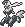

  ⬅️ <a href="https://avventureaditia.github.io/itia-wiki/pokemon/080-ozbell/"> 080 - Ozbell </a>
  <strong>081 - Apipomuf</strong> 
  
  <a href="https://avventureaditia.github.io/itia-wiki/pokemon/082-dracalier/"> 082 - Dracalier </a> ➡️

  

  

    

        
Class

        

          
Pipa

        

      

    

      
Types

      

        
        
      

    

    

      
Abilities

      

        <a href='' title="This Pokemon's damaging moves have a 10% chance to make the target flinch with each hit if they do not already cause flinching as a secondary effect.  This ability does not stack with a held item.  Overworld: The wild encounter rate is halved while this Pokemon is first in the party.">Stench</a>
        
      

    

    

      
Hidden Ability

      

        
      

    

  

## Generali

=== "Descrizione Pokedex"
    ### Descrizione

    C'è chi racconta che la prima pipa, impossessata da questo spettro fu quella di un uomo che provocò con essa un grosso incendio nella sua abitazione, causando la morte del suo unico amato figlio.  
    Lo spirito del bambino avrebbe poi infestato l'oggetto ritornando sotto forma di fumo.  
    Questo Pokémon cerca continuamente ingenui che usino la pipa dove dimora, così da controllarli mentalmente con i suoi miasmi velenosi.  

    Per maggiori informazioni il [video completo](https://www.youtube.com/watch?v=QK6mqPaHbxE&list=PLniAakFPn_t9I5zqlYAwZ_iSzJmgu5Nqd&index=13).

=== "Ispirazioni"

    ### Ispirazioni
    Le ispirazioni alla base di Apipomuf sono:
    
    - **Sandro Pertini**;
    - **Il fumo uccide**, scritta riportata sui pacchetti di sigarette.

=== "Vincitore del contest"
    ### Vincitore

    Il Vincitore di Itia che hanno dato origine a Apipomuf è **Chiara**.

## Base Stats
<table style="width: 100%">
  <tbody style="width: 100%;">
    <tr style="display: flex; align-items: center;">
      <th style="color: #737373;" >HP</th>
      <td style="border-top: none; width: 70px">55</td>
      <td style="width: 100%; min-width: 450px; border-top: none;">
        

        

      </td>
    </tr>
    <tr style="display: flex; align-items: center;">
      <th style="color: #737373;">Attack</th>
      <td style="border-top: none; width: 70px">50</td>
      <td style="width: 100%; min-width: 450px; border-top: none;">
        

        

      </td>
    </tr>
    <tr style="display: flex; align-items: center;">
      <th style="color: #737373;">Defense</th>
      <td style="border-top: none; width: 70px">80</td>
      <td style="width: 100%; min-width: 450px; border-top: none;">
        

        

      </td>
    </tr>
    <tr style="display: flex; align-items: center;">
      <th style="color: #737373;">SP Attack</th>
      <td style="border-top: none; width: 70px">90</td>
      <td style="width: 100%; min-width: 450px; border-top: none;">
        

        

      </td>
    </tr>
    <tr style="display: flex; align-items: center;">
      <th style="color: #737373;">SP Defense</th>
      <td style="border-top: none; width: 70px">105</td>
      <td style="width: 100%; min-width: 450px; border-top: none;">
        

        

      </td>
    </tr>
    <tr style="display: flex; align-items: center;">
      <th style="color: #737373;">Speed</th>
      <td style="border-top: none; width: 70px">96</td>
      <td style="width: 100%; min-width: 450px; border-top: none;">
        

        

      </td>
    </tr>
  </tbody>
</table>

## Moveset

=== "Level Up Moves"
    | Level | Name | Power | Accuracy | PP | Type | Damage Class |
        | -- | -- | -- | -- | -- | -- | -- |
        
        

=== "Machine Moves"
    | Machine | Name | Power | Accuracy | PP | Type | Damage Class |
        | -- | -- | -- | -- | -- | -- | -- |
        
        
