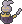

  ⬅️ <a href="https://avventureaditia.github.io/itia-wiki/pokemon/081-apipomuf/"> 081 - Apipomuf </a>
  <strong>082 - Dracalier</strong> 
  
  <a href="https://avventureaditia.github.io/itia-wiki/pokemon/083-gravient/"> 083 - Gravient </a> ➡️

  

  

    

        
Class

        

          
Centauro

        

      

    

      
Types

      

        
        
      

    

    

      
Abilities

      

        <a href='' title="Opposing Pokemon cannot eat held Berries while this Pokemon is in battle.  Affected Pokemon can still use bug bite or pluck to eat a target's Berry.">Unnerve</a>
        
      

    

    

      
Hidden Ability

      

        
      

    

  

## Generali

=== "Descrizione Pokedex"
    ### Descrizione

    La notte è il regno dei Dracalier gruppi di questi Pokémon si riuniscono vagando all'infinito alla ricerca di una guida per il loro numeroso esercito.  
    Corrono a velocità incredibili, ma, nonostante ciò, non producono nessun rumore per via dell'assenza delle gambe e degli zoccoli.  
    Il manto che li ricopre può essere modellato a loro piacimento, trasformandosi in armi da taglio pericolosissime e letali.  
    Si dice che solo un Relicor possa affermare la loro avanzata.  

    Per maggiori informazioni il [video completo](https://www.youtube.com/watch?v=QK6mqPaHbxE&list=PLniAakFPn_t9I5zqlYAwZ_iSzJmgu5Nqd&index=13).

=== "Ispirazioni"

    ### Ispirazioni
    Le ispirazioni alla base di Dracalier, Gravient e la sua catena evolutiva sono:
    
    - **Pria Morta**.

=== "Vincitore del contest"
    ### Vincitore

    Il Vincitore di Itia che ha dato origine a Dracalier, Gravient e la sua catena evolutiva è **Martina**.

## Base Stats
<table style="width: 100%">
  <tbody style="width: 100%;">
    <tr style="display: flex; align-items: center;">
      <th style="color: #737373;" >HP</th>
      <td style="border-top: none; width: 70px">65</td>
      <td style="width: 100%; min-width: 450px; border-top: none;">
        

        

      </td>
    </tr>
    <tr style="display: flex; align-items: center;">
      <th style="color: #737373;">Attack</th>
      <td style="border-top: none; width: 70px">100</td>
      <td style="width: 100%; min-width: 450px; border-top: none;">
        

        

      </td>
    </tr>
    <tr style="display: flex; align-items: center;">
      <th style="color: #737373;">Defense</th>
      <td style="border-top: none; width: 70px">70</td>
      <td style="width: 100%; min-width: 450px; border-top: none;">
        

        

      </td>
    </tr>
    <tr style="display: flex; align-items: center;">
      <th style="color: #737373;">SP Attack</th>
      <td style="border-top: none; width: 70px">80</td>
      <td style="width: 100%; min-width: 450px; border-top: none;">
        

        

      </td>
    </tr>
    <tr style="display: flex; align-items: center;">
      <th style="color: #737373;">SP Defense</th>
      <td style="border-top: none; width: 70px">80</td>
      <td style="width: 100%; min-width: 450px; border-top: none;">
        

        

      </td>
    </tr>
    <tr style="display: flex; align-items: center;">
      <th style="color: #737373;">Speed</th>
      <td style="border-top: none; width: 70px">105</td>
      <td style="width: 100%; min-width: 450px; border-top: none;">
        

        

      </td>
    </tr>
  </tbody>
</table>

## Moveset

=== "Level Up Moves"
    | Level | Name | Power | Accuracy | PP | Type | Damage Class |
        | -- | -- | -- | -- | -- | -- | -- |
        
        

=== "Machine Moves"
    | Machine | Name | Power | Accuracy | PP | Type | Damage Class |
        | -- | -- | -- | -- | -- | -- | -- |
        
        
