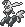
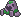
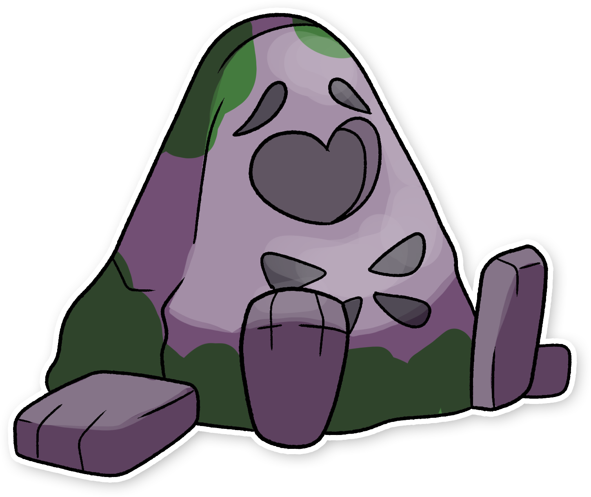

  ⬅️ <a href="https://avventureaditia.github.io/itia-wiki/pokemon/082-dracalier/"> 082 - Dracalier </a>
  <strong>083 - Gravient</strong> 
  
  <a href="https://avventureaditia.github.io/itia-wiki/pokemon/084-relicor/"> 084 - Relicor </a> ➡️

  

  

    

        
Class

        

          
Pietrantica

        

      

    

      
Types

      

        
        
      

    

    

      
Abilities

      

        <a href='' title="Moves that hit this Pokemon have a 30% chance of being Disabled afterward.">Cursed-body</a>
        
      

    

    

      
Hidden Ability

      

        
      

    

  

## Generali

=== "Descrizione Pokedex"
    ### Descrizione

    Questa creatura passa la maggior parte della sua vita ferma ed immobile, mantenendo costantemente un'espressione calma e pacata.  
    Gli studiosi dicono che sia in attesa di qualcosa o di qualcuno, nella speranza di potersi evolvere ed uscire da quello stato di stasi continua tanto immobile che del muschio ha iniziato a crescere.  
    Sul suo corpo ha la particolarità più misteriosa con l'incisione sul petto che ricorda un cuore.  

    Per maggiori informazioni il [video completo](https://www.youtube.com/watch?v=QK6mqPaHbxE&list=PLniAakFPn_t9I5zqlYAwZ_iSzJmgu5Nqd&index=13).

=== "Ispirazioni"

    ### Ispirazioni
    Le ispirazioni alla base di Dracalier, Gravient e la sua catena evolutiva sono:
    
    - **Pria Morta**.

=== "Vincitore del contest"
    ### Vincitore

    Il Vincitore di Itia che ha dato origine a Dracalier, Gravient e la sua catena evolutiva è **Martina**.

## Base Stats
<table style="width: 100%">
  <tbody style="width: 100%;">
    <tr style="display: flex; align-items: center;">
      <th style="color: #737373;" >HP</th>
      <td style="border-top: none; width: 70px">45</td>
      <td style="width: 100%; min-width: 450px; border-top: none;">
        

        

      </td>
    </tr>
    <tr style="display: flex; align-items: center;">
      <th style="color: #737373;">Attack</th>
      <td style="border-top: none; width: 70px">100</td>
      <td style="width: 100%; min-width: 450px; border-top: none;">
        

        

      </td>
    </tr>
    <tr style="display: flex; align-items: center;">
      <th style="color: #737373;">Defense</th>
      <td style="border-top: none; width: 70px">95</td>
      <td style="width: 100%; min-width: 450px; border-top: none;">
        

        

      </td>
    </tr>
    <tr style="display: flex; align-items: center;">
      <th style="color: #737373;">SP Attack</th>
      <td style="border-top: none; width: 70px">40</td>
      <td style="width: 100%; min-width: 450px; border-top: none;">
        

        

      </td>
    </tr>
    <tr style="display: flex; align-items: center;">
      <th style="color: #737373;">SP Defense</th>
      <td style="border-top: none; width: 70px">50</td>
      <td style="width: 100%; min-width: 450px; border-top: none;">
        

        

      </td>
    </tr>
    <tr style="display: flex; align-items: center;">
      <th style="color: #737373;">Speed</th>
      <td style="border-top: none; width: 70px">75</td>
      <td style="width: 100%; min-width: 450px; border-top: none;">
        

        

      </td>
    </tr>
  </tbody>
</table>

##Evolution Change
| Method | Item/Level/Note | Evolved Pokemon |
        | :--: | :--: | :--: |
        | Other | Vince una battaglia in doppio con Dracalier in squadra | [Relicor](https://avventureaditia.github.io/itia-wiki/pokemon/084-relicor/) |
        

## Moveset

=== "Level Up Moves"
    | Level | Name | Power | Accuracy | PP | Type | Damage Class |
        | -- | -- | -- | -- | -- | -- | -- |
        
        

=== "Machine Moves"
    | Machine | Name | Power | Accuracy | PP | Type | Damage Class |
        | -- | -- | -- | -- | -- | -- | -- |
        
        
