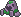

  ⬅️ <a href="https://avventureaditia.github.io/itia-wiki/pokemon/083-gravient/"> 083 - Gravient </a>
  <strong>084 - Relicor</strong> 
  
  <a href="https://avventureaditia.github.io/itia-wiki/pokemon/085-grimtune/"> 085 - Grimtune </a> ➡️

## Pokédex

=== "Tassonomia"
    

      
      

        

          
Class

          

            
Pietrantica

          

        

        

          
Types

          

            
            
          

        

        

          
Ability

          

            <a href='' title="Moves that hit this Pokemon have a 30% chance of being Disabled afterward.">Cursed-body</a>
          

        

        

          
Cry

          

            <audio controls>
              <source src="../../audio/relicor.mp3" type="audio/mpeg">
            </audio>
          

        

      

    

=== "Aspetto"
    

      
      

        

          
Height

          

            
1,73 m

          

        

        

          
Weight

          

            
54,16 kg

          

        

        

          
Pokédex Color

          

            
Viola

          

        

        

          
Shape

          

            
          

        

      

    

=== "Allevamento"
    

      
      

        

          

            
Catch rate

            

              
40

            

          

          

            
Gender Ratio

            

              
50.0%

              
/

              
50.0%

            

          

        

        

          

            
Egg Groups

            

              
Mineral and Monster

            

          

          

            
Hatch Time

            

              
30 Cycles

            

          

        

        

          

            
Base experience yield

            

              
236

            

          

          

            
Leveling rate

            

              
Medium Slow

            

          

        

        

          

            
Base friendship

            

              
70

            

          

          

            
EV yield

            

              
1 - HP / 2 - Attack

            

          

        

      

    

## Generali

=== "Descrizione Pokedex"
    ### Descrizione

    Leggende narrano che quando un Gravient si trovi sulla strada percorsa da una schiera di Dracalier, il cuore scolpito sul petto ritorni a battere facendole evolvere in un Relicor.  
    Si dice che sia lo spirito di un vecchio generale che anche da spettro ritorni torni a comandare il proprio plotone con un'espressione cupa in volto.  
    A significare il suo tormento a ricordo di una disfatta passata che lo portò alla morte.  

    Per maggiori informazioni il [video completo](https://www.youtube.com/watch?v=QK6mqPaHbxE&list=PLniAakFPn_t9I5zqlYAwZ_iSzJmgu5Nqd&index=13).

=== "Ispirazioni"

    ### Ispirazioni
    Le ispirazioni alla base di Dracalier, Gravient e la sua catena evolutiva sono:
    
    - **Pria Morta**.

=== "Vincitore del contest"
    ### Vincitore

    Il Vincitore di Itia che ha dato origine a Dracalier, Gravient e la sua catena evolutiva è **Martina**.

## Base Stats
<table style="width: 100%">
  <tbody style="width: 100%;">
    <tr style="display: flex; align-items: center;">
      <th style="color: #737373;" >HP</th>
      <td style="border-top: none; width: 70px">75</td>
      <td style="width: 100%; min-width: 450px; border-top: none;">
        

        

      </td>
    </tr>
    <tr style="display: flex; align-items: center;">
      <th style="color: #737373;">Attack</th>
      <td style="border-top: none; width: 70px">125</td>
      <td style="width: 100%; min-width: 450px; border-top: none;">
        

        

      </td>
    </tr>
    <tr style="display: flex; align-items: center;">
      <th style="color: #737373;">Defense</th>
      <td style="border-top: none; width: 70px">100</td>
      <td style="width: 100%; min-width: 450px; border-top: none;">
        

        

      </td>
    </tr>
    <tr style="display: flex; align-items: center;">
      <th style="color: #737373;">SP Attack</th>
      <td style="border-top: none; width: 70px">70</td>
      <td style="width: 100%; min-width: 450px; border-top: none;">
        

        

      </td>
    </tr>
    <tr style="display: flex; align-items: center;">
      <th style="color: #737373;">SP Defense</th>
      <td style="border-top: none; width: 70px">80</td>
      <td style="width: 100%; min-width: 450px; border-top: none;">
        

        

      </td>
    </tr>
    <tr style="display: flex; align-items: center;">
      <th style="color: #737373;">Speed</th>
      <td style="border-top: none; width: 70px">45</td>
      <td style="width: 100%; min-width: 450px; border-top: none;">
        

        

      </td>
    </tr>
  </tbody>
</table>

## Aspetto di gioco

=== "Base"
    

      

        
      

      

        
      

    

=== "Shiny"
    

      

        
      

      

        
      

    

## Moveset

=== "Level Up Moves"
    | Level | Name | Power | Accuracy | PP | Type | Damage Class |
        | -- | -- | -- | -- | -- | -- | -- |
        
        

=== "Machine Moves"
    | Machine | Name | Power | Accuracy | PP | Type | Damage Class |
        | -- | -- | -- | -- | -- | -- | -- |
        
        
