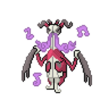

  ⬅️ <a href="https://avventureaditia.github.io/itia-wiki/pokemon/084-relicor/"> 084 - Relicor </a>
  <strong>085 - Grimtune</strong> 
  
  <a href="https://avventureaditia.github.io/itia-wiki/pokemon/086-crisismear/"> 086 - Crisismear </a> ➡️

## Pokédex

=== "Tassonomia"
    

      
      

        

          
Class

          

            
Tetranota

          

        

        

          
Types

          

            
            
          

        

        

          
Ability

          

            <a href='' title="This Pokemon's moves have 1.5x their power if their base power is 60 or less.  This includes moves of variable power, such as hidden power and magnitude, when their power is 60 or less.  helping hand's power boost is taken into account for any move, as is defense curl's power boost for rollout.">Technician</a>
          

        

        

          
Cry

          

            <audio controls>
              <source src="../../audio/grimtune.mp3" type="audio/mpeg">
            </audio>
          

        

      

    

=== "Aspetto"
    

      
      

        

          
Height

          

            
1,30 m

          

        

        

          
Weight

          

            
30,44 kg

          

        

        

          
Pokédex Color

          

            
Rosso

          

        

        

          
Shape

          

            
          

        

      

    

=== "Allevamento"
    

      
      

        

          

            
Catch rate

            

              
30

            

          

          

            
Gender Ratio

            

              
50.00%

              
/

              
50.00%

            

          

        

        

          

            
Egg Groups

            

              
Bug

            

          

          

            
Hatch Time

            

              
15 Cycles

            

          

        

        

          

            
Base experience yield

            

              
187

            

          

          

            
Leveling rate

            

              
Medium Slow

            

          

        

        

          

            
Base friendship

            

              
70

            

          

          

            
EV yield

            

              
3 - Attack

            

          

        

      

    

## Generali

=== "Descrizione Pokedex"
    ### Descrizione

    Questo Pokémon nasce da un Kricketune, il quale è stato emarginato dai suoi simili perché incapace di produrre suoni gradevoli e armoniosi.  
    Dopo la morte, il suo spirito vendicativo si manifesta sotto forma di questa creatura che, tramite le sue inquietanti parodie, costringe chi in vita lo ha deriso, a ballare fino allo sfinimento al ritmo della sua musica.  
    L'unico modo per fermare le danze è la musica di un altro Kricketune.  

    Per maggiori informazioni il [video completo](https://www.youtube.com/watch?v=QK6mqPaHbxE&list=PLniAakFPn_t9I5zqlYAwZ_iSzJmgu5Nqd&index=13).

=== "Ispirazioni"

    ### Ispirazioni
    Le ispirazioni alla base di Grimtune sono:
    
    - **Fantasma del violinista di Scogna Sottana**;
    - **Ragno violino**.

=== "Vincitore del contest"
    ### Vincitore

    Il Vincitore di Itia che ha dato origine a Grimtune è **TheWorld98**.

## Base Stats
<table style="width: 100%">
  <tbody style="width: 100%;">
    <tr style="display: flex; align-items: center;">
      <th style="color: #737373;" >HP</th>
      <td style="border-top: none; width: 70px">97</td>
      <td style="width: 100%; min-width: 450px; border-top: none;">
        

        

      </td>
    </tr>
    <tr style="display: flex; align-items: center;">
      <th style="color: #737373;">Attack</th>
      <td style="border-top: none; width: 70px">105</td>
      <td style="width: 100%; min-width: 450px; border-top: none;">
        

        

      </td>
    </tr>
    <tr style="display: flex; align-items: center;">
      <th style="color: #737373;">Defense</th>
      <td style="border-top: none; width: 70px">71</td>
      <td style="width: 100%; min-width: 450px; border-top: none;">
        

        

      </td>
    </tr>
    <tr style="display: flex; align-items: center;">
      <th style="color: #737373;">SP Attack</th>
      <td style="border-top: none; width: 70px">35</td>
      <td style="width: 100%; min-width: 450px; border-top: none;">
        

        

      </td>
    </tr>
    <tr style="display: flex; align-items: center;">
      <th style="color: #737373;">SP Defense</th>
      <td style="border-top: none; width: 70px">71</td>
      <td style="width: 100%; min-width: 450px; border-top: none;">
        

        

      </td>
    </tr>
    <tr style="display: flex; align-items: center;">
      <th style="color: #737373;">Speed</th>
      <td style="border-top: none; width: 70px">85</td>
      <td style="width: 100%; min-width: 450px; border-top: none;">
        

        

      </td>
    </tr>
  </tbody>
</table>

## Aspetto di gioco

=== "Base"
    

      

        
      

      

        
      

    

=== "Shiny"
    

      

        
      

      

        
      

    

## Moveset

=== "Level Up Moves"
    | Level | Name | Power | Accuracy | PP | Type | Damage Class |
        | -- | -- | -- | -- | -- | -- | -- |
        
        

=== "Machine Moves"
    | Machine | Name | Power | Accuracy | PP | Type | Damage Class |
        | -- | -- | -- | -- | -- | -- | -- |
        
        
