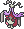
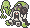
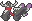

  ⬅️ <a href="https://avventureaditia.github.io/itia-wiki/pokemon/085-grimtune/"> 085 - Grimtune </a>
  <strong>086 - Crisismear</strong> 
  
  <a href="https://avventureaditia.github.io/itia-wiki/pokemon/087-bzzavroom/"> 087 - Bzzavroom </a> ➡️

  

  

    

        
Class

        

          
Crisartista

        

      

    

      
Types

      

        
        
      

    

    

      
Abilities

      

        <a href='' title="After each turn, one of this Pokemon's stats at random rises two stages, and another falls one stage.  If a stat is already at 6 or -6 stages, it will not be chosen to be increased or decreased, respectively.">Moody</a>
        
      

    

    

      
Hidden Ability

      

        
      

    

  

## Generali

=== "Descrizione Pokedex"
    ### Descrizione

    Questo Pokémon sembra essere un pupazzo manovrato dallo spirito che fuoriesce dalla propria coda.  
    A differenza della sua pre-evoluzione, non riesce a produrre nessun tipo di arte per via della creatività ormai svanita.  
    Per rabbia infesta i quadri che trova in giro e li nasconde nei luoghi in cui vive, per poi ammirarli per tutto il tempo, nella speranza che la sua tanto amata ispirazione possa prima o poi tornare.  
    In alcuni casi sembra che un barlume di speranza torni nei suoi occhi e lo spettro sulla coda si trasforma in una pozza di colore.  

    Per maggiori informazioni il [video completo](https://www.youtube.com/watch?v=QK6mqPaHbxE&list=PLniAakFPn_t9I5zqlYAwZ_iSzJmgu5Nqd&index=13).

=== "Ispirazioni"

    ### Ispirazioni
    Le ispirazioni alla base di Crisismear sono:
    
    - **Leonardo da Vinci**;
    - **Gioconda**.

=== "Vincitore del contest"
    ### Vincitore

    Il Vincitore di Itia che ha dato origine a Crisismear è **Dav**.

## Base Stats
<table style="width: 100%">
  <tbody style="width: 100%;">
    <tr style="display: flex; align-items: center;">
      <th style="color: #737373;" >HP</th>
      <td style="border-top: none; width: 70px">85</td>
      <td style="width: 100%; min-width: 450px; border-top: none;">
        

        

      </td>
    </tr>
    <tr style="display: flex; align-items: center;">
      <th style="color: #737373;">Attack</th>
      <td style="border-top: none; width: 70px">100</td>
      <td style="width: 100%; min-width: 450px; border-top: none;">
        

        

      </td>
    </tr>
    <tr style="display: flex; align-items: center;">
      <th style="color: #737373;">Defense</th>
      <td style="border-top: none; width: 70px">50</td>
      <td style="width: 100%; min-width: 450px; border-top: none;">
        

        

      </td>
    </tr>
    <tr style="display: flex; align-items: center;">
      <th style="color: #737373;">SP Attack</th>
      <td style="border-top: none; width: 70px">100</td>
      <td style="width: 100%; min-width: 450px; border-top: none;">
        

        

      </td>
    </tr>
    <tr style="display: flex; align-items: center;">
      <th style="color: #737373;">SP Defense</th>
      <td style="border-top: none; width: 70px">50</td>
      <td style="width: 100%; min-width: 450px; border-top: none;">
        

        

      </td>
    </tr>
    <tr style="display: flex; align-items: center;">
      <th style="color: #737373;">Speed</th>
      <td style="border-top: none; width: 70px">60</td>
      <td style="width: 100%; min-width: 450px; border-top: none;">
        

        

      </td>
    </tr>
  </tbody>
</table>

## Moveset

=== "Level Up Moves"
    | Level | Name | Power | Accuracy | PP | Type | Damage Class |
        | -- | -- | -- | -- | -- | -- | -- |
        
        

=== "Machine Moves"
    | Machine | Name | Power | Accuracy | PP | Type | Damage Class |
        | -- | -- | -- | -- | -- | -- | -- |
        
        
