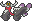
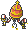
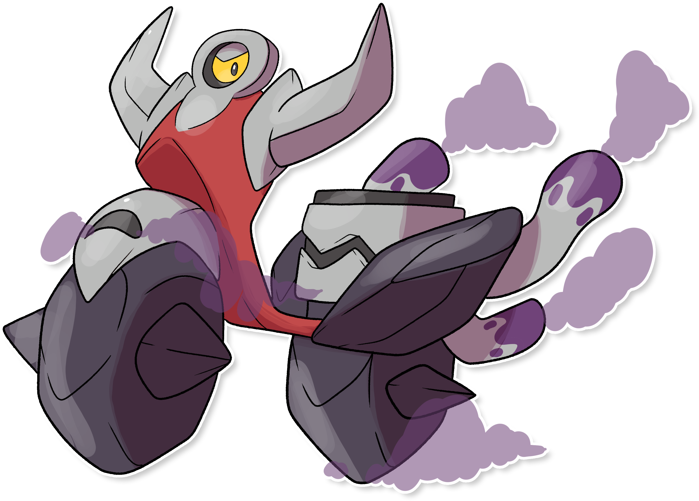

  ⬅️ <a href="https://avventureaditia.github.io/itia-wiki/pokemon/086-crisismear/"> 086 - Crisismear </a>
  <strong>087 - Bzzavroom</strong> 
  
  <a href="https://avventureaditia.github.io/itia-wiki/pokemon/088-papalkei/"> 088 - Papalkei </a> ➡️

## Pokédex

=== "Tassonomia"
    

      
      

        

          
Class

          

            
Motore

          

        

        

          
Types

          

            
            
          

        

        

          
Ability

          

            <a href='' title="This Pokemon's Speed rises one stage after each turn.">Speed-boost</a>
          

        

        

          
Cry

          

            <audio controls>
              <source src="../../audio/bzzavroom.mp3" type="audio/mpeg">
            </audio>
          

        

      

    

=== "Aspetto"
    

      
      

        

          
Height

          

            
1,34 m

          

        

        

          
Weight

          

            
42,80 kg

          

        

        

          
Pokédex Color

          

            
Grigio

          

        

        

          
Shape

          

            
          

        

      

    

=== "Allevamento"
    

      
      

        

          

            
Catch rate

            

              
75

            

          

          

            
Gender Ratio

            

              
50.00%

              
/

              
50.00%

            

          

        

        

          

            
Egg Groups

            

              
Mineral

            

          

          

            
Hatch Time

            

              
20 Cycles

            

          

        

        

          

            
Base experience yield

            

              
177

            

          

          

            
Leveling rate

            

              
Medium Fast

            

          

        

        

          

            
Base friendship

            

              
70

            

          

          

            
EV yield

            

              
2 - Attack

            

          

        

      

    

## Generali

=== "Descrizione Pokedex"
    ### Descrizione

    Ad Itia chi vuole spostarsi velocemente, fa spesso uso dei Bzzavroom per comodità, nonostante dai suoi tubi di scappamento fuoriesca gas, questo non è velenoso, ma potrebbe causare problemi se presente in quantità eccessiva nell'aria.  
    Infatti, le varie città della regione promuovono campagne ambientali per diminuire l'uso dei Pokémon, ormai comune e sempre più frequente.  
    Se corrono per troppo tempo si affaticano e hanno bisogno di giorni prima di tornare in forze.  

    Per maggiori informazioni il [video completo](https://www.youtube.com/watch?v=Tazm64LAG7E&list=PLniAakFPn_t9I5zqlYAwZ_iSzJmgu5Nqd&index=14).

=== "Ispirazioni"

    ### Ispirazioni
    Le ispirazioni alla base di Bzzavroom sono:
    
    - **La Vespa**;
    - **Inquinamento acustico**.

=== "Vincitore del contest"
    ### Vincitore

    Il Vincitore di Itia che ha dato origine a Bzzavroom è **Ares**.

## Base Stats
<table style="width: 100%">
  <tbody style="width: 100%;">
    <tr style="display: flex; align-items: center;">
      <th style="color: #737373;" >HP</th>
      <td style="border-top: none; width: 70px">80</td>
      <td style="width: 100%; min-width: 450px; border-top: none;">
        

        

      </td>
    </tr>
    <tr style="display: flex; align-items: center;">
      <th style="color: #737373;">Attack</th>
      <td style="border-top: none; width: 70px">119</td>
      <td style="width: 100%; min-width: 450px; border-top: none;">
        

        

      </td>
    </tr>
    <tr style="display: flex; align-items: center;">
      <th style="color: #737373;">Defense</th>
      <td style="border-top: none; width: 70px">90</td>
      <td style="width: 100%; min-width: 450px; border-top: none;">
        

        

      </td>
    </tr>
    <tr style="display: flex; align-items: center;">
      <th style="color: #737373;">SP Attack</th>
      <td style="border-top: none; width: 70px">14</td>
      <td style="width: 100%; min-width: 450px; border-top: none;">
        

        

      </td>
    </tr>
    <tr style="display: flex; align-items: center;">
      <th style="color: #737373;">SP Defense</th>
      <td style="border-top: none; width: 70px">67</td>
      <td style="width: 100%; min-width: 450px; border-top: none;">
        

        

      </td>
    </tr>
    <tr style="display: flex; align-items: center;">
      <th style="color: #737373;">Speed</th>
      <td style="border-top: none; width: 70px">130</td>
      <td style="width: 100%; min-width: 450px; border-top: none;">
        

        

      </td>
    </tr>
  </tbody>
</table>

## Moveset

=== "Level Up Moves"
    | Level | Name | Power | Accuracy | PP | Type | Damage Class |
        | -- | -- | -- | -- | -- | -- | -- |
        
        

=== "Machine Moves"
    | Machine | Name | Power | Accuracy | PP | Type | Damage Class |
        | -- | -- | -- | -- | -- | -- | -- |
        
        
