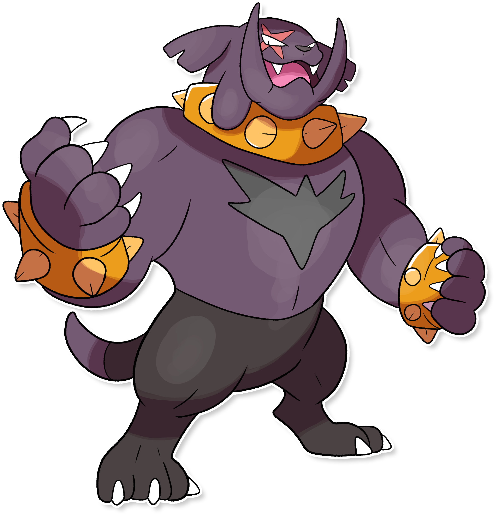

  

  

    

        
Class

        

          
Mastino

        

      

    

      
Types

      

        
        
      

    

    

      
Abilities

      

        <a href='' title="Moves flagged as being punch-based have 1.2x their base power for this Pokemon.  sucker punch is not flagged as punch-based; its original, Japanese name only means 'surprise attack'.">Iron-fist</a>
        
      

    

    

      
Hidden Ability

      

        
      

    

  

## Generali

=== "Descrizione Pokedex"
    ### Descrizione

    Nonostante l'aspetto ancora più feroce della sopra evoluzione, questo Pokémon mantiene lo stesso carattere docile e peccato.  
    Anche se molti sono spaventati dalle sue fattezze, è un compagno fidato che protegge il proprio allenatore anche a costo della vita, gettandosi nelle battaglie più pericolose a testa alta, colpendo nemici con poderosi pugni in grado di stordire anche gli avversari più temibili.  
    Gli spuntoni sul suo corpo sono fatti d'oro, con un grosso valore di mercato.  

    Per maggiori informazioni il [video completo](https://www.youtube.com/watch?v=Tazm64LAG7E&list=PLniAakFPn_t9I5zqlYAwZ_iSzJmgu5Nqd&index=14).

=== "Ispirazioni"

    ### Ispirazioni
    Le ispirazioni alla base di Mastinbull sono:
    
    - **Mastino Napoletano**;
    - **Nino Benvenuti** ex pugile e attore.

=== "Vincitore del contest"
    ### Vincitore

    Il Vincitore di Itia che ha dato origine a Mastinbull è **Emanuele**.

## Base Stats
<table style="width: 100%">
  <tbody style="width: 100%;">
    <tr style="display: flex; align-items: center;">
      <th style="color: #737373;" >HP</th>
      <td style="border-top: none; width: 70px">110</td>
      <td style="width: 100%; min-width: 450px; border-top: none;">
        

        

      </td>
    </tr>
    <tr style="display: flex; align-items: center;">
      <th style="color: #737373;">Attack</th>
      <td style="border-top: none; width: 70px">150</td>
      <td style="width: 100%; min-width: 450px; border-top: none;">
        

        

      </td>
    </tr>
    <tr style="display: flex; align-items: center;">
      <th style="color: #737373;">Defense</th>
      <td style="border-top: none; width: 70px">90</td>
      <td style="width: 100%; min-width: 450px; border-top: none;">
        

        

      </td>
    </tr>
    <tr style="display: flex; align-items: center;">
      <th style="color: #737373;">SP Attack</th>
      <td style="border-top: none; width: 70px">70</td>
      <td style="width: 100%; min-width: 450px; border-top: none;">
        

        

      </td>
    </tr>
    <tr style="display: flex; align-items: center;">
      <th style="color: #737373;">SP Defense</th>
      <td style="border-top: none; width: 70px">75</td>
      <td style="width: 100%; min-width: 450px; border-top: none;">
        

        

      </td>
    </tr>
    <tr style="display: flex; align-items: center;">
      <th style="color: #737373;">Speed</th>
      <td style="border-top: none; width: 70px">55</td>
      <td style="width: 100%; min-width: 450px; border-top: none;">
        

        

      </td>
    </tr>
  </tbody>
</table>

## Moveset

=== "Level Up Moves"
    | Level | Name | Power | Accuracy | PP | Type | Damage Class |
        | -- | -- | -- | -- | -- | -- | -- |
        
        

=== "Machine Moves"
    | Machine | Name | Power | Accuracy | PP | Type | Damage Class |
        | -- | -- | -- | -- | -- | -- | -- |
        
        
