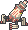
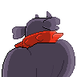

  ⬅️ <a href="https://avventureaditia.github.io/itia-wiki/pokemon/089-anelith/"> 089 - Anelith </a>
  <strong>090 - Mastinbull</strong> 
  
  <a href="https://avventureaditia.github.io/itia-wiki/pokemon/091-bencapu/"> 091 - Bencapu </a> ➡️

## Pokédex

=== "Tassonomia"
    

      
      

        

          
Class

          

            
Mastino

          

        

        

          
Types

          

            
            
          

        

        

          
Ability

          

            <a href='' title="Moves flagged as being punch-based have 1.2x their base power for this Pokemon.  sucker punch is not flagged as punch-based; its original, Japanese name only means 'surprise attack'.">Iron-fist</a>
          

        

        

          
Cry

          

            <audio controls>
              <source src="../../audio/mastinbull.mp3" type="audio/mpeg">
            </audio>
          

        

      

    

=== "Aspetto"
    

      
      

        

          
Height

          

            
1,77 m

          

        

        

          
Weight

          

            
54,22 kg

          

        

        

          
Pokédex Color

          

            
Nero

          

        

        

          
Shape

          

            
          

        

      

    

=== "Allevamento"
    

      
      

        

          

            
Catch rate

            

              
40

            

          

          

            
Gender Ratio

            

              
25.00%

              
/

              
75.00%

            

          

        

        

          

            
Egg Groups

            

              
Field and Fairy

            

          

          

            
Hatch Time

            

              
20 Cycles

            

          

        

        

          

            
Base experience yield

            

              
236

            

          

          

            
Leveling rate

            

              
Fast

            

          

        

        

          

            
Base friendship

            

              
70

            

          

          

            
EV yield

            

              
3 - Attack

            

          

        

      

    

## Generali

=== "Descrizione Pokedex"
    ### Descrizione

    Nonostante l'aspetto ancora più feroce della sopra evoluzione, questo Pokémon mantiene lo stesso carattere docile e peccato.  
    Anche se molti sono spaventati dalle sue fattezze, è un compagno fidato che protegge il proprio allenatore anche a costo della vita, gettandosi nelle battaglie più pericolose a testa alta, colpendo nemici con poderosi pugni in grado di stordire anche gli avversari più temibili.  
    Gli spuntoni sul suo corpo sono fatti d'oro, con un grosso valore di mercato.  

    Per maggiori informazioni il [video completo](https://www.youtube.com/watch?v=Tazm64LAG7E&list=PLniAakFPn_t9I5zqlYAwZ_iSzJmgu5Nqd&index=14).

=== "Ispirazioni"

    ### Ispirazioni
    Le ispirazioni alla base di Mastinbull sono:
    
    - **Mastino Napoletano**;
    - **Nino Benvenuti** ex pugile e attore.

=== "Vincitore del contest"
    ### Vincitore

    Il Vincitore di Itia che ha dato origine a Mastinbull è **Emanuele**.

## Base Stats
<table style="width: 100%">
  <tbody style="width: 100%;">
    <tr style="display: flex; align-items: center;">
      <th style="color: #737373;" >HP</th>
      <td style="border-top: none; width: 70px">110</td>
      <td style="width: 100%; min-width: 450px; border-top: none;">
        

        

      </td>
    </tr>
    <tr style="display: flex; align-items: center;">
      <th style="color: #737373;">Attack</th>
      <td style="border-top: none; width: 70px">150</td>
      <td style="width: 100%; min-width: 450px; border-top: none;">
        

        

      </td>
    </tr>
    <tr style="display: flex; align-items: center;">
      <th style="color: #737373;">Defense</th>
      <td style="border-top: none; width: 70px">90</td>
      <td style="width: 100%; min-width: 450px; border-top: none;">
        

        

      </td>
    </tr>
    <tr style="display: flex; align-items: center;">
      <th style="color: #737373;">SP Attack</th>
      <td style="border-top: none; width: 70px">70</td>
      <td style="width: 100%; min-width: 450px; border-top: none;">
        

        

      </td>
    </tr>
    <tr style="display: flex; align-items: center;">
      <th style="color: #737373;">SP Defense</th>
      <td style="border-top: none; width: 70px">75</td>
      <td style="width: 100%; min-width: 450px; border-top: none;">
        

        

      </td>
    </tr>
    <tr style="display: flex; align-items: center;">
      <th style="color: #737373;">Speed</th>
      <td style="border-top: none; width: 70px">55</td>
      <td style="width: 100%; min-width: 450px; border-top: none;">
        

        

      </td>
    </tr>
  </tbody>
</table>

## Aspetto di gioco

=== "Base"
    

      

        
      

      

        
      

    

=== "Shiny"
    

      

        
      

      

        
      

    

## Moveset

=== "Level Up Moves"
    | Level | Name | Power | Accuracy | PP | Type | Damage Class |
        | -- | -- | -- | -- | -- | -- | -- |
        
        

=== "Machine Moves"
    | Machine | Name | Power | Accuracy | PP | Type | Damage Class |
        | -- | -- | -- | -- | -- | -- | -- |
        
        
