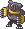
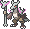
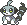

  ⬅️ <a href="https://avventureaditia.github.io/itia-wiki/pokemon/090-mastinbull/"> 090 - Mastinbull </a>
  <strong>091 - Bencapu</strong> 
  
  <a href="https://avventureaditia.github.io/itia-wiki/pokemon/092-spiritress/"> 092 - Spiritress </a> ➡️

  

  

    

        
Class

        

          
Stregonteschio

        

      

    

      
Types

      

        
        
      

    

    

      
Abilities

      

        <a href='' title="Moves cannot score critical hits against this Pokemon.  This ability functions identically to shell armor.">Battle-armor</a>
        
      

    

    

      
Hidden Ability

      

        
      

    

  

## Generali

=== "Descrizione Pokedex"
    ### Descrizione

    La costante cura per il teschio della propria madre ha portato i Marowak più devoti ad incontrare il suo spirito, ritrovando una propria pace interiore in grado di farli evolvere nuovamente.  
    I Bencapu portano sul proprio corpo i teschi di altri Marowak abbandonati, per poi darli ai Cubone rimasti orfani, per dare loro la forza e per fare loro da guida.  
    Il potere psichico tenuto nell'evoluzione serve per tenere lontano gli spiriti maligni e qualsiasi dolore legato alla perdita ormai lontana.  

    Per maggiori informazioni il [video completo](https://www.youtube.com/watch?v=Tazm64LAG7E&list=PLniAakFPn_t9I5zqlYAwZ_iSzJmgu5Nqd&index=14).

=== "Ispirazioni"

    ### Ispirazioni
    Le ispirazioni alla base di Bencapu sono:
    
    - **Rito delle anime pezzentelle**;
    - **Benandanti**.

=== "Vincitore del contest"
    ### Vincitore

    Il Vincitore di Itia che ha dato origine a Bencapu è **Salvatore**.

## Base Stats
<table style="width: 100%">
  <tbody style="width: 100%;">
    <tr style="display: flex; align-items: center;">
      <th style="color: #737373;" >HP</th>
      <td style="border-top: none; width: 70px">100</td>
      <td style="width: 100%; min-width: 450px; border-top: none;">
        

        

      </td>
    </tr>
    <tr style="display: flex; align-items: center;">
      <th style="color: #737373;">Attack</th>
      <td style="border-top: none; width: 70px">120</td>
      <td style="width: 100%; min-width: 450px; border-top: none;">
        

        

      </td>
    </tr>
    <tr style="display: flex; align-items: center;">
      <th style="color: #737373;">Defense</th>
      <td style="border-top: none; width: 70px">120</td>
      <td style="width: 100%; min-width: 450px; border-top: none;">
        

        

      </td>
    </tr>
    <tr style="display: flex; align-items: center;">
      <th style="color: #737373;">SP Attack</th>
      <td style="border-top: none; width: 70px">50</td>
      <td style="width: 100%; min-width: 450px; border-top: none;">
        

        

      </td>
    </tr>
    <tr style="display: flex; align-items: center;">
      <th style="color: #737373;">SP Defense</th>
      <td style="border-top: none; width: 70px">90</td>
      <td style="width: 100%; min-width: 450px; border-top: none;">
        

        

      </td>
    </tr>
    <tr style="display: flex; align-items: center;">
      <th style="color: #737373;">Speed</th>
      <td style="border-top: none; width: 70px">35</td>
      <td style="width: 100%; min-width: 450px; border-top: none;">
        

        

      </td>
    </tr>
  </tbody>
</table>

## Moveset

=== "Level Up Moves"
    | Level | Name | Power | Accuracy | PP | Type | Damage Class |
        | -- | -- | -- | -- | -- | -- | -- |
        
        

=== "Machine Moves"
    | Machine | Name | Power | Accuracy | PP | Type | Damage Class |
        | -- | -- | -- | -- | -- | -- | -- |
        
        
