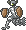
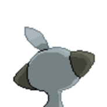
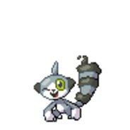
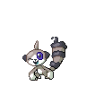

  ⬅️ <a href="https://avventureaditia.github.io/itia-wiki/pokemon/091-bencapu/"> 091 - Bencapu </a>
  <strong>092 - Spiritress</strong> 
  
  <a href="https://avventureaditia.github.io/itia-wiki/pokemon/093-lemoraid/"> 093 - Lemoraid </a> ➡️

## Pokédex

=== "Tassonomia"
    

      
      

        

          
Class

          

            
Desiderio

          

        

        

          
Types

          

            
          

        

        

          
Ability

          

            <a href='' title="This Pokemon's moves completely ignore abilities that could hinder or prevent their effect on the target.  For example, this Pokemon's moves ignore abilities that would fully negate them, such as water absorb; abilities that would prevent any of their effects, such as clear body, shell armor, or sticky hold; and abilities that grant any general protective benefit, such as simple, snow cloak, or thick fat.  If an ability could either hinder or help this Pokemon's moves, e.g. dry skin or unaware, the ability is ignored either way.  Abilities that do not fit this description, even if they could hinder moves in some other way, are not affected.  For example, cursed body only affects potential future uses of the move, while liquid ooze and shadow tag can only hinder a move's effect on the user.  This ablity cannot ignore type or form changes granted by abilities, for example color change or forecast; nor effects that were caused by abilities but are no longer tied to an ability, such as the rain from drizzle.  This ability cannot ignore multitype at all.  An ability ignored by this ability is only nullified while the move is being used.  For example, this Pokemon's moves can paralyze a Pokemon with limber, but Limber will activate and heal the paralysis immediately thereafter, and this Pokemon's spikes are not affected by this ability after they have been placed.  When this Pokemon enters battle, all participating trainers are notified that it has this ability.  This ability functions identically to teravolt and turboblaze.">Mold-breaker</a>
          

        

        

          
Cry

          

            <audio controls>
              <source src="../../audio/spiritress.mp3" type="audio/mpeg">
            </audio>
          

        

      

    

=== "Aspetto"
    

      
      

        

          
Height

          

            
0,93 m

          

        

        

          
Weight

          

            
12,33 kg

          

        

        

          
Pokédex Color

          

            
Grigio

          

        

        

          
Shape

          

            
          

        

      

    

=== "Allevamento"
    

      
      

        

          

            
Catch rate

            

              
195

            

          

          

            
Gender Ratio

            

              
50.00%

              
/

              
50.00%

            

          

        

        

          

            
Egg Groups

            

              
Field

            

          

          

            
Hatch Time

            

              
20 Cycles

            

          

        

        

          

            
Base experience yield

            

              
67

            

          

          

            
Leveling rate

            

              
Medium Fast

            

          

        

        

          

            
Base friendship

            

              
70

            

          

          

            
EV yield

            

              
1 - Attack

            

          

        

      

    

## Generali

=== "Descrizione Pokedex"
    ### Descrizione

    Si dice sia nato dalla volontà degli antichi abitanti di Itia nel voler avere stessi diritti dei potenti.  
    Si intrufola nelle case dei ricchi per dargli fastidio con la sua coda simile ad una nube che cancella addirittura le parole dai libri.  
    E’così agile in aria da dare quasi l'impressione di volare.  

    Per maggiori informazioni il [video completo](https://www.youtube.com/watch?v=vR_sYMvrWEE&list=PLniAakFPn_t9I5zqlYAwZ_iSzJmgu5Nqd&index=15).

=== "Ispirazioni"

    ### Ispirazioni
    Le ispirazioni alla base di Spiritress e della sua catena evolutiva sono:
    
    - **Lemures**;
    - **Lemuria**;
    - **Verba volant, Scripta Manent**;
    - **Dodici tavole**.

=== "Vincitore del contest"
    ### Vincitore

    Il Vincitore di Itia che ha dato origine a Spiritress e la sua catena evolutiva è **Rikky**.

## Base Stats
<table style="width: 100%">
  <tbody style="width: 100%;">
    <tr style="display: flex; align-items: center;">
      <th style="color: #737373;" >HP</th>
      <td style="border-top: none; width: 70px">40</td>
      <td style="width: 100%; min-width: 450px; border-top: none;">
        

        

      </td>
    </tr>
    <tr style="display: flex; align-items: center;">
      <th style="color: #737373;">Attack</th>
      <td style="border-top: none; width: 70px">65</td>
      <td style="width: 100%; min-width: 450px; border-top: none;">
        

        

      </td>
    </tr>
    <tr style="display: flex; align-items: center;">
      <th style="color: #737373;">Defense</th>
      <td style="border-top: none; width: 70px">40</td>
      <td style="width: 100%; min-width: 450px; border-top: none;">
        

        

      </td>
    </tr>
    <tr style="display: flex; align-items: center;">
      <th style="color: #737373;">SP Attack</th>
      <td style="border-top: none; width: 70px">35</td>
      <td style="width: 100%; min-width: 450px; border-top: none;">
        

        

      </td>
    </tr>
    <tr style="display: flex; align-items: center;">
      <th style="color: #737373;">SP Defense</th>
      <td style="border-top: none; width: 70px">35</td>
      <td style="width: 100%; min-width: 450px; border-top: none;">
        

        

      </td>
    </tr>
    <tr style="display: flex; align-items: center;">
      <th style="color: #737373;">Speed</th>
      <td style="border-top: none; width: 70px">80</td>
      <td style="width: 100%; min-width: 450px; border-top: none;">
        

        

      </td>
    </tr>
  </tbody>
</table>

## Aspetto di gioco

=== "Base"
    

      

        
      

      

        
      

    

=== "Shiny"
    

      

        
      

      

        
      

    

    

##Evolution Change
| Method | Item/Level/Note | Evolved Pokemon |
        | :--: | :--: | :--: |
        | Other | Level Up con Tavole | [Lemoraid](https://avventureaditia.github.io/itia-wiki/pokemon/093-lemoraid/) |
        

## Moveset

=== "Level Up Moves"
    | Level | Name | Power | Accuracy | PP | Type | Damage Class |
        | -- | -- | -- | -- | -- | -- | -- |
        
        

=== "Machine Moves"
    | Machine | Name | Power | Accuracy | PP | Type | Damage Class |
        | -- | -- | -- | -- | -- | -- | -- |
        
        
