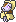
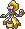

  ⬅️ <a href="https://avventureaditia.github.io/itia-wiki/pokemon/093-lemoraid/"> 093 - Lemoraid </a>
  <strong>094 - Shirf</strong> 
  
  <a href="https://avventureaditia.github.io/itia-wiki/pokemon/095-bouldwarf/"> 095 - Bouldwarf </a> ➡️

## Pokédex

=== "Tassonomia"
    

      
      

        

          
Class

          

            
Nano

          

        

        

          
Types

          

            
            
          

        

        

          
Ability

          

            <a href='' title="This Pokemon's moves have twice their usual effect chance.  An effect chance is a move's chance to inflict a status ailment, cause a stat change, or make the target flinch in addition to the move's main effect.  For example, flamethrower's chance of burning the target is doubled, but protect's chance of success and air cutter's increased critical hit rate are unaffected.  secret power is unaffected.">Serene-grace</a>
          

        

        

          
Cry

          

            <audio controls>
              <source src="../../audio/shirf.mp3" type="audio/mpeg">
            </audio>
          

        

      

    

=== "Aspetto"
    

      
      

        

          
Height

          

            
1,13 m

          

        

        

          
Weight

          

            
32,12 kg

          

        

        

          
Pokédex Color

          

            
Giallo

          

        

        

          
Shape

          

            
          

        

      

    

=== "Allevamento"
    

      
      

        

          

            
Catch rate

            

              
120

            

          

          

            
Gender Ratio

            

              
50.00%

              
/

              
50.00%

            

          

        

        

          

            
Egg Groups

            

              
Fairy and Human-Like

            

          

          

            
Hatch Time

            

              
25 Cycles

            

          

        

        

          

            
Base experience yield

            

              
76

            

          

          

            
Leveling rate

            

              
Medium Slow

            

          

        

        

          

            
Base friendship

            

              
70

            

          

          

            
EV yield

            

              
1 - Attack

            

          

        

      

    

## Generali

=== "Descrizione Pokedex"
    ### Descrizione

    Questo Pokémon è molto timido e non ama farsi vedere dagli esseri umani, e odia che il suo corpo si sporchi.  
    Di notte vaga tranquillamente nelle foreste, ma di giorno è sempre allerta e nel caso ha visti da lontano, qualcuno si immobilizza di colpo, sembrando una statua d'oro.  
    Tuttavia, è una tecnica poco efficace, poiché gli umani cercano di raccoglierla pensandosi un oggetto di valore.  
    Questo potere deriva dalla palla d'oro che tiene tra le mani sin dalla nascita.  

    Per maggiori informazioni il [video completo](https://www.youtube.com/watch?v=vR_sYMvrWEE&list=PLniAakFPn_t9I5zqlYAwZ_iSzJmgu5Nqd&index=15).

=== "Ispirazioni"

    ### Ispirazioni
    Le ispirazioni alla base di Shirf e della sua catena evolutiva sono:
    
    - **Lago delle Fate**;
    - **Fate friuliane**;
    - **Giacometta**.

=== "Vincitore del contest"
    ### Vincitore

    Il Vincitore di Itia che ha dato origine a Shirf e la sua catena evolutiva è **Marco Zeppeli**.

## Base Stats
<table style="width: 100%">
  <tbody style="width: 100%;">
    <tr style="display: flex; align-items: center;">
      <th style="color: #737373;" >HP</th>
      <td style="border-top: none; width: 70px">30</td>
      <td style="width: 100%; min-width: 450px; border-top: none;">
        

        

      </td>
    </tr>
    <tr style="display: flex; align-items: center;">
      <th style="color: #737373;">Attack</th>
      <td style="border-top: none; width: 70px">60</td>
      <td style="width: 100%; min-width: 450px; border-top: none;">
        

        

      </td>
    </tr>
    <tr style="display: flex; align-items: center;">
      <th style="color: #737373;">Defense</th>
      <td style="border-top: none; width: 70px">35</td>
      <td style="width: 100%; min-width: 450px; border-top: none;">
        

        

      </td>
    </tr>
    <tr style="display: flex; align-items: center;">
      <th style="color: #737373;">SP Attack</th>
      <td style="border-top: none; width: 70px">60</td>
      <td style="width: 100%; min-width: 450px; border-top: none;">
        

        

      </td>
    </tr>
    <tr style="display: flex; align-items: center;">
      <th style="color: #737373;">SP Defense</th>
      <td style="border-top: none; width: 70px">35</td>
      <td style="width: 100%; min-width: 450px; border-top: none;">
        

        

      </td>
    </tr>
    <tr style="display: flex; align-items: center;">
      <th style="color: #737373;">Speed</th>
      <td style="border-top: none; width: 70px">40</td>
      <td style="width: 100%; min-width: 450px; border-top: none;">
        

        

      </td>
    </tr>
  </tbody>
</table>

## Aspetto di gioco

=== "Base"
    

      

        
      

      

        
      

    

=== "Shiny"
    

      

        
      

      

        
      

    

    

##Evolution Change
| Method | Item/Level/Note | Evolved Pokemon |
        | :--: | :--: | :--: |
        | Other | Utilizza 15 volte la mossa Palleggio | [Bouldwarf](https://avventureaditia.github.io/itia-wiki/pokemon/095-bouldwarf/) |
        

## Moveset

=== "Level Up Moves"
    | Level | Name | Power | Accuracy | PP | Type | Damage Class |
        | -- | -- | -- | -- | -- | -- | -- |
        
        

=== "Machine Moves"
    | Machine | Name | Power | Accuracy | PP | Type | Damage Class |
        | -- | -- | -- | -- | -- | -- | -- |
        
        
