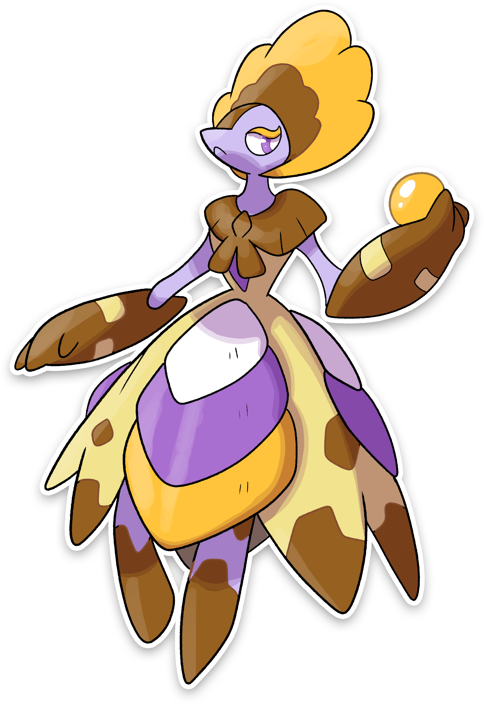

  

  

    

        
Class

        

          
Nano

        

      

    

      
Types

      

        
        
      

    

    

      
Abilities

      

        <a href='' title="This Pokemon's moves have twice their usual effect chance.  An effect chance is a move's chance to inflict a status ailment, cause a stat change, or make the target flinch in addition to the move's main effect.  For example, flamethrower's chance of burning the target is doubled, but protect's chance of success and air cutter's increased critical hit rate are unaffected.  secret power is unaffected.">Serene-grace</a>
        
      

    

    

      
Hidden Ability

      

        
      

    

  

## Generali

=== "Descrizione Pokedex"
    ### Descrizione

    L'evoluzione gli ha donato una grande forza distruttiva che adopera per andare alla ricerca di oro con il quale adornare il suo corpo e realizzare delle piccole palle dorate da regalare ai piccoli Shirf appena nati.  
    Non ha più paura di sporcarsi; infatti, passa la maggior parte del suo tempo nelle grotte a scavare, accumulando grossi tesori e proteggendo i piccoli.  
    Si diverte a giocare con gli umani, che tentano in tutti i modi di rubargli la palla che tiene in mano.  
    Chi ci riesce diventa il suo allenatore.   

    Per maggiori informazioni il [video completo](https://www.youtube.com/watch?v=vR_sYMvrWEE&list=PLniAakFPn_t9I5zqlYAwZ_iSzJmgu5Nqd&index=15).

=== "Ispirazioni"

    ### Ispirazioni
    Le ispirazioni alla base di Shirf e della sua catena evolutiva sono:
    
    - **Lago delle Fate**;
    - **Fate friuliane**;
    - **Giacometta**.

=== "Vincitore del contest"
    ### Vincitore

    Il Vincitore di Itia che ha dato origine a Shirf e la sua catena evolutiva è **Marco Zeppeli**.

## Base Stats
<table style="width: 100%">
  <tbody style="width: 100%;">
    <tr style="display: flex; align-items: center;">
      <th style="color: #737373;" >HP</th>
      <td style="border-top: none; width: 70px">60</td>
      <td style="width: 100%; min-width: 450px; border-top: none;">
        

        

      </td>
    </tr>
    <tr style="display: flex; align-items: center;">
      <th style="color: #737373;">Attack</th>
      <td style="border-top: none; width: 70px">100</td>
      <td style="width: 100%; min-width: 450px; border-top: none;">
        

        

      </td>
    </tr>
    <tr style="display: flex; align-items: center;">
      <th style="color: #737373;">Defense</th>
      <td style="border-top: none; width: 70px">65</td>
      <td style="width: 100%; min-width: 450px; border-top: none;">
        

        

      </td>
    </tr>
    <tr style="display: flex; align-items: center;">
      <th style="color: #737373;">SP Attack</th>
      <td style="border-top: none; width: 70px">90</td>
      <td style="width: 100%; min-width: 450px; border-top: none;">
        

        

      </td>
    </tr>
    <tr style="display: flex; align-items: center;">
      <th style="color: #737373;">SP Defense</th>
      <td style="border-top: none; width: 70px">65</td>
      <td style="width: 100%; min-width: 450px; border-top: none;">
        

        

      </td>
    </tr>
    <tr style="display: flex; align-items: center;">
      <th style="color: #737373;">Speed</th>
      <td style="border-top: none; width: 70px">60</td>
      <td style="width: 100%; min-width: 450px; border-top: none;">
        

        

      </td>
    </tr>
  </tbody>
</table>

## Moveset

=== "Level Up Moves"
    | Level | Name | Power | Accuracy | PP | Type | Damage Class |
        | -- | -- | -- | -- | -- | -- | -- |
        
        

=== "Machine Moves"
    | Machine | Name | Power | Accuracy | PP | Type | Damage Class |
        | -- | -- | -- | -- | -- | -- | -- |
        
        
