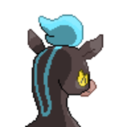
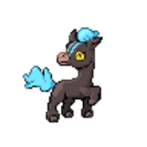
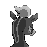

  ⬅️ <a href="https://avventureaditia.github.io/itia-wiki/pokemon/095-bouldwarf/"> 095 - Bouldwarf </a>
  <strong>096 - Palhorse</strong> 
  
  <a href="https://avventureaditia.github.io/itia-wiki/pokemon/097-paltelhorse/"> 097 - Paltelhorse </a> ➡️

## Pokédex

=== "Tassonomia"
    

      
      

        

          
Class

          

            
Sprint

          

        

        

          
Types

          

            
            
          

        

        

          
Ability

          

            <a href='' title="This Pokemon is always successful fleeing from wild battles, even if trapped by a move or ability.">Run-away</a>
          

        

        

          
Cry

          

            <audio controls>
              <source src="../../audio/palhorse.mp3" type="audio/mpeg">
            </audio>
          

        

      

    

=== "Aspetto"
    

      
      

        

          
Height

          

            
0,90 m

          

        

        

          
Weight

          

            
33,40 kg

          

        

        

          
Pokédex Color

          

            
Blu

          

        

        

          
Shape

          

            
          

        

      

    

=== "Allevamento"
    

      
      

        

          

            
Catch rate

            

              
190

            

          

          

            
Gender Ratio

            

              
50.00%

              
/

              
50.00%

            

          

        

        

          

            
Egg Groups

            

              
Field

            

          

          

            
Hatch Time

            

              
20 Cycles

            

          

        

        

          

            
Base experience yield

            

              
82

            

          

          

            
Leveling rate

            

              
Medium Fast

            

          

        

        

          

            
Base friendship

            

              
70

            

          

          

            
EV yield

            

              
1 - Speed

            

          

        

      

    

## Generali

=== "Descrizione Pokedex"
    ### Descrizione

    I Palhorse sono dei piccoli cavalli molto amati nella regione di Itia, ma sono anche molto competitivi.   
    In passato venivano usati per delle gare in alcune parti del territorio, per accaparrarsi terreni e guerre dove vi erano divisioni interne.   
    Proprio per questo motivo esistono vari esemplari di questa specie, ognuna con un colore diverso, allevate nelle varie zone.   
    Quelle di oggi sono i discendenti di quegli antichi Pokémon che ora vengono trattati con gentilezza.   

    Per maggiori informazioni il [video completo](https://www.youtube.com/watch?v=vR_sYMvrWEE&list=PLniAakFPn_t9I5zqlYAwZ_iSzJmgu5Nqd&index=15).

=== "Ispirazioni"

    ### Ispirazioni
    Le ispirazioni alla base di Palhorse e della sua catena evolutiva sono:
    
    - Il **palio**.

=== "Vincitore del contest"
    ### Vincitore

    Il Vincitore di Itia che ha dato origine a Palhorse e la sua catena evolutiva è **TepigGabrix**.

## Base Stats
<table style="width: 100%">
  <tbody style="width: 100%;">
    <tr style="display: flex; align-items: center;">
      <th style="color: #737373;" >HP</th>
      <td style="border-top: none; width: 70px">50</td>
      <td style="width: 100%; min-width: 450px; border-top: none;">
        

        

      </td>
    </tr>
    <tr style="display: flex; align-items: center;">
      <th style="color: #737373;">Attack</th>
      <td style="border-top: none; width: 70px">85</td>
      <td style="width: 100%; min-width: 450px; border-top: none;">
        

        

      </td>
    </tr>
    <tr style="display: flex; align-items: center;">
      <th style="color: #737373;">Defense</th>
      <td style="border-top: none; width: 70px">55</td>
      <td style="width: 100%; min-width: 450px; border-top: none;">
        

        

      </td>
    </tr>
    <tr style="display: flex; align-items: center;">
      <th style="color: #737373;">SP Attack</th>
      <td style="border-top: none; width: 70px">55</td>
      <td style="width: 100%; min-width: 450px; border-top: none;">
        

        

      </td>
    </tr>
    <tr style="display: flex; align-items: center;">
      <th style="color: #737373;">SP Defense</th>
      <td style="border-top: none; width: 70px">65</td>
      <td style="width: 100%; min-width: 450px; border-top: none;">
        

        

      </td>
    </tr>
    <tr style="display: flex; align-items: center;">
      <th style="color: #737373;">Speed</th>
      <td style="border-top: none; width: 70px">90</td>
      <td style="width: 100%; min-width: 450px; border-top: none;">
        

        

      </td>
    </tr>
  </tbody>
</table>

## Aspetto di gioco

=== "Base"
    

      

        
      

      

        
      

    

=== "Shiny"
    

      

        
      

      

        
      

    

    

##Evolution Change
| Method | Item/Level/Note | Evolved Pokemon |
        | :--: | :--: | :--: |
        | Level Up | 30 | [Paltelhorse](https://avventureaditia.github.io/itia-wiki/pokemon/097-paltelhorse/) |
        

## Moveset

=== "Level Up Moves"
    | Level | Name | Power | Accuracy | PP | Type | Damage Class |
        | -- | -- | -- | -- | -- | -- | -- |
        
        

=== "Machine Moves"
    | Machine | Name | Power | Accuracy | PP | Type | Damage Class |
        | -- | -- | -- | -- | -- | -- | -- |
        
        
