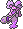

  ⬅️ <a href="https://avventureaditia.github.io/itia-wiki/pokemon/098-cire/"> 098 - Cire </a>
  <strong>099 - Ciricea</strong> 
  
  <a href="https://avventureaditia.github.io/itia-wiki/pokemon/100-melodough/"> 100 - Melodough </a> ➡️

## Pokédex

=== "Tassonomia"
    

      
      

        

          
Class

          

            
Maleficio

          

        

        

          
Types

          

            
            
          

        

        

          
Ability

          

            <a href='' title="This Pokemon's contact moves have a 30% chance of poisoning the target with each hit.  This counts as an extra effect for the purposes of shield dust.  This ability takes effect before mummy.">Poison-touch</a>
          

        

        

          
Cry

          

            <audio controls>
              <source src="../../audio/ciricea.mp3" type="audio/mpeg">
            </audio>
          

        

      

    

=== "Aspetto"
    

      
      

        

          
Height

          

            
1,67 m

          

        

        

          
Weight

          

            
52,33 kg

          

        

        

          
Pokédex Color

          

            
Viola

          

        

        

          
Shape

          

            
          

        

      

    

=== "Allevamento"
    

      
      

        

          

            
Catch rate

            

              
40

            

          

          

            
Gender Ratio

            

              
00.00%

              
/

              
100.00%

            

          

        

        

          

            
Egg Groups

            

              
Fairy and Human-Like

            

          

          

            
Hatch Time

            

              
20 Cycles

            

          

        

        

          

            
Base experience yield

            

              
177

            

          

          

            
Leveling rate

            

              
Medium Fast

            

          

        

        

          

            
Base friendship

            

              
70

            

          

          

            
EV yield

            

              
2 - Sp.Attack

            

          

        

      

    

## Generali

=== "Descrizione Pokedex"
    ### Descrizione

    A differenza della sua evoluzione, piuttosto che ingannare gli umani, Ciricea predilige averli sempre al proprio fianco.  
    Va alla continua ricerca di allenatori forti, per poi attirarli a sé con incantesimi e pozioni prodotte col suo veleno, per poi trasformarli in piccoli esseri simili ai Lechonk, costretti a seguirla fino alla fine del sortilegio.   

    Per maggiori informazioni il [video completo](https://www.youtube.com/watch?v=STFNtPND_C4&list=PLniAakFPn_t9I5zqlYAwZ_iSzJmgu5Nqd&index=18).

=== "Ispirazioni"

    ### Ispirazioni
    Le ispirazioni alla base di Cire e della sua catena evolutiva sono:
    
    - La maga **Circe** e i suoi **poteri**.

=== "Vincitore del contest"
    ### Vincitore

    Il Vincitore di Itia che ha dato origine a Cire e la sua catena evolutiva è **Gabry-taz**.

## Base Stats
<table style="width: 100%">
  <tbody style="width: 100%;">
    <tr style="display: flex; align-items: center;">
      <th style="color: #737373;" >HP</th>
      <td style="border-top: none; width: 70px">65</td>
      <td style="width: 100%; min-width: 450px; border-top: none;">
        

        

      </td>
    </tr>
    <tr style="display: flex; align-items: center;">
      <th style="color: #737373;">Attack</th>
      <td style="border-top: none; width: 70px">60</td>
      <td style="width: 100%; min-width: 450px; border-top: none;">
        

        

      </td>
    </tr>
    <tr style="display: flex; align-items: center;">
      <th style="color: #737373;">Defense</th>
      <td style="border-top: none; width: 70px">75</td>
      <td style="width: 100%; min-width: 450px; border-top: none;">
        

        

      </td>
    </tr>
    <tr style="display: flex; align-items: center;">
      <th style="color: #737373;">SP Attack</th>
      <td style="border-top: none; width: 70px">115</td>
      <td style="width: 100%; min-width: 450px; border-top: none;">
        

        

      </td>
    </tr>
    <tr style="display: flex; align-items: center;">
      <th style="color: #737373;">SP Defense</th>
      <td style="border-top: none; width: 70px">110</td>
      <td style="width: 100%; min-width: 450px; border-top: none;">
        

        

      </td>
    </tr>
    <tr style="display: flex; align-items: center;">
      <th style="color: #737373;">Speed</th>
      <td style="border-top: none; width: 70px">64</td>
      <td style="width: 100%; min-width: 450px; border-top: none;">
        

        

      </td>
    </tr>
  </tbody>
</table>

## Aspetto di gioco

=== "Base"
    

      

        
      

      

        
      

    

=== "Shiny"
    

      

        
      

      

        
      

    

## Moveset

=== "Level Up Moves"
    | Level | Name | Power | Accuracy | PP | Type | Damage Class |
        | -- | -- | -- | -- | -- | -- | -- |
        
        

=== "Machine Moves"
    | Machine | Name | Power | Accuracy | PP | Type | Damage Class |
        | -- | -- | -- | -- | -- | -- | -- |
        
        
