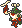

  ⬅️ <a href="https://avventureaditia.github.io/itia-wiki/pokemon/099-ciricea/"> 099 - Ciricea </a>
  <strong>100 - Melodough</strong> 
  
  <a href="https://avventureaditia.github.io/itia-wiki/pokemon/101-melostache/"> 101 - Melostache </a> ➡️

## Pokédex

=== "Tassonomia"
    

      
      

        

          
Class

          

            
Burla

          

        

        

          
Types

          

            
          

        

        

          
Ability

          

            <a href='' title="Turns the bearer's normal-type moves into fairy moves.  Moves changed by this ability have 1.3x their power.">Pixilate</a>
          

        

        

          
Cry

          

            <audio controls>
              <source src="../../audio/melodough.mp3" type="audio/mpeg">
            </audio>
          

        

      

    

=== "Aspetto"
    

      
      

        

          
Height

          

            
0,87 m

          

        

        

          
Weight

          

            
29,39 kg

          

        

        

          
Pokédex Color

          

            
Verde

          

        

        

          
Shape

          

            
          

        

      

    

=== "Allevamento"
    

      
      

        

          

            
Catch rate

            

              
120

            

          

          

            
Gender Ratio

            

              
50.00%

              
/

              
50.00%

            

          

        

        

          

            
Egg Groups

            

              
Fairy and Human-Like

            

          

          

            
Hatch Time

            

              
20 Cycles

            

          

        

        

          

            
Base experience yield

            

              
67

            

          

          

            
Leveling rate

            

              
Medium Fast

            

          

        

        

          

            
Base friendship

            

              
70

            

          

          

            
EV yield

            

              
1 - Speed

            

          

        

      

    

## Generali

=== "Descrizione Pokedex"
    ### Descrizione

    I Melodough hanno un'indole dispettosa e tendono a fare scherzi al domani e Pokémon, ma sempre a buon fine.  
    Questi scherzi molto spesso prevedono il cospargere le vittime con una polvere simile a farina che se bagnata rende i movimenti lenti e il corpo appiccicoso.  
    Il loro corpo è composto da una sostanza simile ad un impasto che può allungarsi a piacimento alterando le loro corde vocali. Possono imitare qualsiasi suono e qualsiasi voce.   

    Per maggiori informazioni il [video completo](https://www.youtube.com/watch?v=STFNtPND_C4&list=PLniAakFPn_t9I5zqlYAwZ_iSzJmgu5Nqd&index=18).

=== "Ispirazioni"

    ### Ispirazioni
    Le ispirazioni alla base di Melodough e della sua catena evolutiva sono:
    
    - **Pizza**;
    - **L’acronico Viva Verdi**;
    - **Vittorio Emanuele II**;
    - **Giuseppe Verdi**;
    - **Tricolore**.

=== "Vincitore del contest"
    ### Vincitori

    I Vincitori di Itia che hanno dato origine a Melodough e la sua catena evolutiva sono **Lik** e **Torre**.

## Base Stats
<table style="width: 100%">
  <tbody style="width: 100%;">
    <tr style="display: flex; align-items: center;">
      <th style="color: #737373;" >HP</th>
      <td style="border-top: none; width: 70px">40</td>
      <td style="width: 100%; min-width: 450px; border-top: none;">
        

        

      </td>
    </tr>
    <tr style="display: flex; align-items: center;">
      <th style="color: #737373;">Attack</th>
      <td style="border-top: none; width: 70px">45</td>
      <td style="width: 100%; min-width: 450px; border-top: none;">
        

        

      </td>
    </tr>
    <tr style="display: flex; align-items: center;">
      <th style="color: #737373;">Defense</th>
      <td style="border-top: none; width: 70px">55</td>
      <td style="width: 100%; min-width: 450px; border-top: none;">
        

        

      </td>
    </tr>
    <tr style="display: flex; align-items: center;">
      <th style="color: #737373;">SP Attack</th>
      <td style="border-top: none; width: 70px">55</td>
      <td style="width: 100%; min-width: 450px; border-top: none;">
        

        

      </td>
    </tr>
    <tr style="display: flex; align-items: center;">
      <th style="color: #737373;">SP Defense</th>
      <td style="border-top: none; width: 70px">65</td>
      <td style="width: 100%; min-width: 450px; border-top: none;">
        

        

      </td>
    </tr>
    <tr style="display: flex; align-items: center;">
      <th style="color: #737373;">Speed</th>
      <td style="border-top: none; width: 70px">60</td>
      <td style="width: 100%; min-width: 450px; border-top: none;">
        

        

      </td>
    </tr>
  </tbody>
</table>

## Aspetto di gioco

=== "Base"
    

      

        
      

      

        
      

    

=== "Shiny"
    

      

        
      

      

        
      

    

    

##Evolution Change
| Method | Item/Level/Note | Evolved Pokemon |
        | :--: | :--: | :--: |
        | Other | Level Up con la mossa Rapigiro | [Melostache](https://avventureaditia.github.io/itia-wiki/pokemon/101-melostache/) |
        

## Moveset

=== "Level Up Moves"
    | Level | Name | Power | Accuracy | PP | Type | Damage Class |
        | -- | -- | -- | -- | -- | -- | -- |
        
        

=== "Machine Moves"
    | Machine | Name | Power | Accuracy | PP | Type | Damage Class |
        | -- | -- | -- | -- | -- | -- | -- |
        
        
