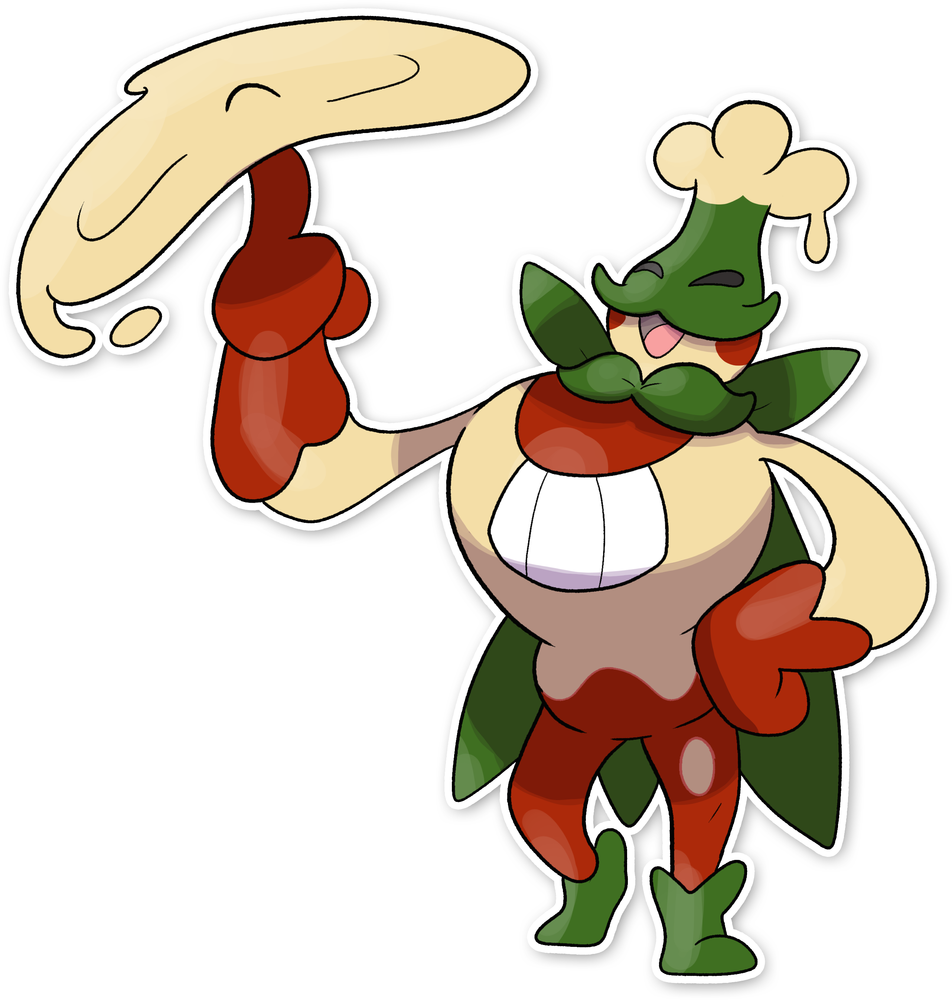

  

  

    

        
Class

        

          
Impasto

        

      

    

      
Types

      

        
        
      

    

    

      
Abilities

      

        <a href='' title="Turns the bearer's normal-type moves into fairy moves.  Moves changed by this ability have 1.3x their power.">Pixilate</a>
        
      

    

    

      
Hidden Ability

      

        
      

    

  

## Generali

=== "Descrizione Pokedex"
    ### Descrizione

    Come i Melodough, anche i Melostache amano la musica e gli scherzi, ma sono molto più esigenti e si rifiutano di sprecare le loro elaborate burle su chi non ritengono degni.  
    Il materiale che compone i loro baffi è molto ambito tra i cuochi di Itia per il suo sapore unico.  
    Sulla sua testa crescono delle palle di impasto che estrae per lanciarle gli avversari, oppure per creare dei piatti molto rinomati nella regione.  
    Una volta staccate le palle, ricrescono immediatamente.   

    Per maggiori informazioni il [video completo](https://www.youtube.com/watch?v=STFNtPND_C4&list=PLniAakFPn_t9I5zqlYAwZ_iSzJmgu5Nqd&index=18).

=== "Ispirazioni"

    ### Ispirazioni
    Le ispirazioni alla base di Melodough e della sua catena evolutiva sono:
    
    - **Pizza**;
    - **L’acronico Viva Verdi**;
    - **Vittorio Emanuele II**;
    - **Giuseppe Verdi**;
    - **Tricolore**.

=== "Vincitore del contest"
    ### Vincitori

    I Vincitori di Itia che hanno dato origine a Melodough e la sua catena evolutiva sono **Lik** e **Torre**.

## Base Stats
<table style="width: 100%">
  <tbody style="width: 100%;">
    <tr style="display: flex; align-items: center;">
      <th style="color: #737373;" >HP</th>
      <td style="border-top: none; width: 70px">75</td>
      <td style="width: 100%; min-width: 450px; border-top: none;">
        

        

      </td>
    </tr>
    <tr style="display: flex; align-items: center;">
      <th style="color: #737373;">Attack</th>
      <td style="border-top: none; width: 70px">50</td>
      <td style="width: 100%; min-width: 450px; border-top: none;">
        

        

      </td>
    </tr>
    <tr style="display: flex; align-items: center;">
      <th style="color: #737373;">Defense</th>
      <td style="border-top: none; width: 70px">75</td>
      <td style="width: 100%; min-width: 450px; border-top: none;">
        

        

      </td>
    </tr>
    <tr style="display: flex; align-items: center;">
      <th style="color: #737373;">SP Attack</th>
      <td style="border-top: none; width: 70px">90</td>
      <td style="width: 100%; min-width: 450px; border-top: none;">
        

        

      </td>
    </tr>
    <tr style="display: flex; align-items: center;">
      <th style="color: #737373;">SP Defense</th>
      <td style="border-top: none; width: 70px">90</td>
      <td style="width: 100%; min-width: 450px; border-top: none;">
        

        

      </td>
    </tr>
    <tr style="display: flex; align-items: center;">
      <th style="color: #737373;">Speed</th>
      <td style="border-top: none; width: 70px">100</td>
      <td style="width: 100%; min-width: 450px; border-top: none;">
        

        

      </td>
    </tr>
  </tbody>
</table>

## Moveset

=== "Level Up Moves"
    | Level | Name | Power | Accuracy | PP | Type | Damage Class |
        | -- | -- | -- | -- | -- | -- | -- |
        
        

=== "Machine Moves"
    | Machine | Name | Power | Accuracy | PP | Type | Damage Class |
        | -- | -- | -- | -- | -- | -- | -- |
        
        
