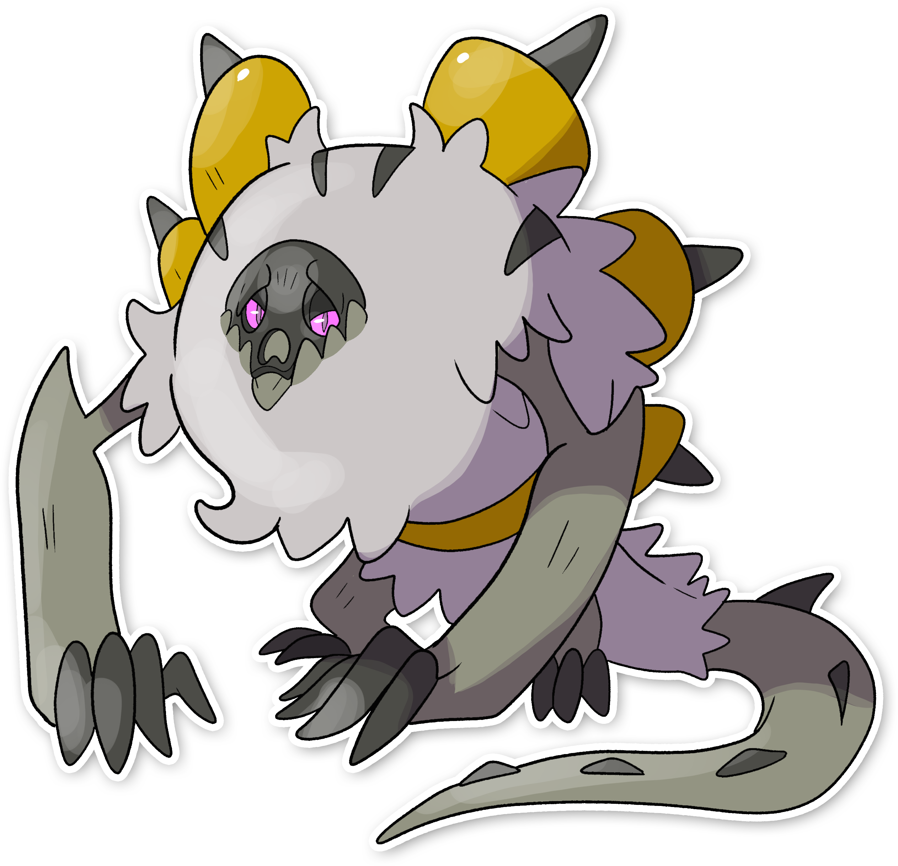

  

  

    

        
Class

        

          
Intruso

        

      

    

      
Types

      

        
        
      

    

    

      
Abilities

      

        <a href='' title="When any of this Pokemon's stats are lowered, its Attack rises by two stages.  If multiple stats are lowered at once, this ability takes effect with each stat lowered.">Defiant</a>
        
      

    

    

      
Hidden Ability

      

        
      

    

  

## Generali

=== "Descrizione Pokedex"
    ### Descrizione

    L'evoluzione ha reso il Pokemon più forte, tanto da riuscire finalmente a controllare il proprio sguardo letale.  
    Ora sugli occhi cresce una sorta di patina nera che può bastare e alzare a piacimento per attivare e disattivare il proprio potere a seconda dei casi, o semplicemente bloccare la vittima, confonderla o portarla allo stremo.  
    Raramente usa lo sguardo per terminare la vita degli avversari in un solo colpo.   

    Per maggiori informazioni il [video completo](https://www.youtube.com/watch?v=STFNtPND_C4&list=PLniAakFPn_t9I5zqlYAwZ_iSzJmgu5Nqd&index=18).

=== "Ispirazioni"

    ### Ispirazioni
    Le ispirazioni alla base di Tuly e della sua catena evolutiva sono:
    
    - **Mamuthones**;
    - **Scultone**.

=== "Vincitore del contest"
    ### Vincitore

    Il Vincitore di Itia che ha dato origine a Tuly e la sua catena evolutiva è **Adro**.

## Base Stats
<table style="width: 100%">
  <tbody style="width: 100%;">
    <tr style="display: flex; align-items: center;">
      <th style="color: #737373;" >HP</th>
      <td style="border-top: none; width: 70px">80</td>
      <td style="width: 100%; min-width: 450px; border-top: none;">
        

        

      </td>
    </tr>
    <tr style="display: flex; align-items: center;">
      <th style="color: #737373;">Attack</th>
      <td style="border-top: none; width: 70px">110</td>
      <td style="width: 100%; min-width: 450px; border-top: none;">
        

        

      </td>
    </tr>
    <tr style="display: flex; align-items: center;">
      <th style="color: #737373;">Defense</th>
      <td style="border-top: none; width: 70px">100</td>
      <td style="width: 100%; min-width: 450px; border-top: none;">
        

        

      </td>
    </tr>
    <tr style="display: flex; align-items: center;">
      <th style="color: #737373;">SP Attack</th>
      <td style="border-top: none; width: 70px">70</td>
      <td style="width: 100%; min-width: 450px; border-top: none;">
        

        

      </td>
    </tr>
    <tr style="display: flex; align-items: center;">
      <th style="color: #737373;">SP Defense</th>
      <td style="border-top: none; width: 70px">80</td>
      <td style="width: 100%; min-width: 450px; border-top: none;">
        

        

      </td>
    </tr>
    <tr style="display: flex; align-items: center;">
      <th style="color: #737373;">Speed</th>
      <td style="border-top: none; width: 70px">35</td>
      <td style="width: 100%; min-width: 450px; border-top: none;">
        

        

      </td>
    </tr>
  </tbody>
</table>

## Moveset

=== "Level Up Moves"
    | Level | Name | Power | Accuracy | PP | Type | Damage Class |
        | -- | -- | -- | -- | -- | -- | -- |
        
        

=== "Machine Moves"
    | Machine | Name | Power | Accuracy | PP | Type | Damage Class |
        | -- | -- | -- | -- | -- | -- | -- |
        
        
