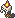

  ⬅️ <a href="https://avventureaditia.github.io/itia-wiki/pokemon/106-pyrandle/"> 106 - Pyrandle </a>
  <strong>107 - Coondle</strong> 
  
  <a href="https://avventureaditia.github.io/itia-wiki/pokemon/108-pyrcharoia/"> 108 - Pyrcharoia </a> ➡️

  

  

    

        
Class

        

          
Cera

        

      

    

        
Class

        

          
Cera

        

      

    

      
Types

      

        
        
      

    

    

      
Abilities

      

        <a href='' title="Whenever a move makes contact with this Pokemon, the move's user has a 30% chance of being burned.  Overworld: If any Pokemon in the party has this ability, each egg in the party has its hatch counter decreased by 2 (rather than 1) each step cycle, making eggs hatch roughly twice as quickly.  This effect does not stack if multiple Pokemon have this ability or magma armor.">Flame-body</a>
        
      

    

    

      
Hidden Ability

      

        
      

    

  

## Generali

=== "Descrizione Pokedex"
    ### Descrizione

    I Pyrandle, una volta per assimilata abbastanza cera, formano il loro bozzolo evolvendosi in Coondle.   
    La fiamma sulla sommità funge da termoregolatore in modo che possano mantenersi caldi all'interno del bozzolo.   
    Tuttavia, questo è un problema per la maggior parte della specie che, soprattutto di notte, vengono avvistati dai predatori anche da lunghe distanze per via delle diverse fiammelle.   
    È compito dei Pyrcharoia proteggerli.   

    Per maggiori informazioni il [video completo](https://www.youtube.com/watch?v=dBFk8Srgjpw&list=PLniAakFPn_t9I5zqlYAwZ_iSzJmgu5Nqd&index=16).

=== "Ispirazioni"

    ### Ispirazioni
    Le ispirazioni alla base di Pyrandle e della sua catena evolutiva sono:
    
    - **Candele romane**;
    - **Pirausta**;
    - **Brahmaea europaea**.

=== "Vincitore del contest"
    ### Vincitore

    Il Vincitore di Itia che ha dato origine a Pyrandle e la sua catena evolutiva è **Marco**.

## Base Stats
<table style="width: 100%">
  <tbody style="width: 100%;">
    <tr style="display: flex; align-items: center;">
      <th style="color: #737373;" >HP</th>
      <td style="border-top: none; width: 70px">55</td>
      <td style="width: 100%; min-width: 450px; border-top: none;">
        

        

      </td>
    </tr>
    <tr style="display: flex; align-items: center;">
      <th style="color: #737373;">Attack</th>
      <td style="border-top: none; width: 70px">50</td>
      <td style="width: 100%; min-width: 450px; border-top: none;">
        

        

      </td>
    </tr>
    <tr style="display: flex; align-items: center;">
      <th style="color: #737373;">Defense</th>
      <td style="border-top: none; width: 70px">80</td>
      <td style="width: 100%; min-width: 450px; border-top: none;">
        

        

      </td>
    </tr>
    <tr style="display: flex; align-items: center;">
      <th style="color: #737373;">SP Attack</th>
      <td style="border-top: none; width: 70px">65</td>
      <td style="width: 100%; min-width: 450px; border-top: none;">
        

        

      </td>
    </tr>
    <tr style="display: flex; align-items: center;">
      <th style="color: #737373;">SP Defense</th>
      <td style="border-top: none; width: 70px">80</td>
      <td style="width: 100%; min-width: 450px; border-top: none;">
        

        

      </td>
    </tr>
    <tr style="display: flex; align-items: center;">
      <th style="color: #737373;">Speed</th>
      <td style="border-top: none; width: 70px">42</td>
      <td style="width: 100%; min-width: 450px; border-top: none;">
        

        

      </td>
    </tr>
  </tbody>
</table>

##Evolution Change
| Method | Item/Level/Note | Evolved Pokemon |
        | :--: | :--: | :--: |
        | Item | Fire Stone | [Pyrcharoia](https://avventureaditia.github.io/itia-wiki/pokemon/108-pyrcharoia/) |
        

## Moveset

=== "Level Up Moves"
    | Level | Name | Power | Accuracy | PP | Type | Damage Class |
        | -- | -- | -- | -- | -- | -- | -- |
        
        

=== "Machine Moves"
    | Machine | Name | Power | Accuracy | PP | Type | Damage Class |
        | -- | -- | -- | -- | -- | -- | -- |
        
        
