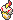
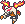
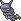
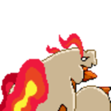
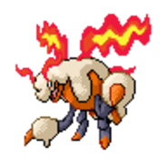
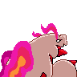
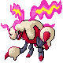

  ⬅️ <a href="https://avventureaditia.github.io/itia-wiki/pokemon/107-coondle/"> 107 - Coondle </a>
  <strong>108 - Pyrcharoia</strong> 
  
  <a href="https://avventureaditia.github.io/itia-wiki/pokemon/109-catergon/"> 109 - Catergon </a> ➡️

## Pokédex

=== "Tassonomia"
    

      
      

        

          
Class

          

            
Cerape

          

        

        

          
Types

          

            
            
          

        

        

          
Ability

          

            <a href='' title="Whenever a move makes contact with this Pokemon, the move's user has a 30% chance of being burned.  Overworld: If any Pokemon in the party has this ability, each egg in the party has its hatch counter decreased by 2 (rather than 1) each step cycle, making eggs hatch roughly twice as quickly.  This effect does not stack if multiple Pokemon have this ability or magma armor.">Flame-body</a>
          

        

        

          
Cry

          

            <audio controls>
              <source src="../../audio/pyrcharoia.mp3" type="audio/mpeg">
            </audio>
          

        

      

    

=== "Aspetto"
    

      
      

        

          
Height

          

            
1,45 m

          

        

        

          
Weight

          

            
37,92 kg

          

        

        

          
Pokédex Color

          

            
Rosso

          

        

        

          
Shape

          

            
          

        

      

    

=== "Allevamento"
    

      
      

        

          

            
Catch rate

            

              
30

            

          

          

            
Gender Ratio

            

              
50.00%

              
/

              
50.00%

            

          

        

        

          

            
Egg Groups

            

              
Bug

            

          

          

            
Hatch Time

            

              
20 Cycles

            

          

        

        

          

            
Base experience yield

            

              
225

            

          

          

            
Leveling rate

            

              
Medium Slow

            

          

        

        

          

            
Base friendship

            

              
70

            

          

          

            
EV yield

            

              
2 - Sp.Attack / 1 - Speed

            

          

        

      

    

## Generali

=== "Descrizione Pokedex"
    ### Descrizione

    Questo Pokémon si dice che sia noto dalle fiamme e che lì sia cresciuto.   
    In antichità veniva spesso confuso con Pokemon Draghi per via del suo aspetto e delle sue fiamme abbaglianti.   
    La luce che produce attrae altri Pokemon coleottero che finiscono per essere le sue prede.   
    Essi abitano ovunque ci sono fiamme e luci abbaglianti.
    Il motivo della loro ossessione per esse è ancora un mistero.   
    Vigilano giorno e notte sui Coondle in attesa dell'evoluzione.   

    Per maggiori informazioni il [video completo](https://www.youtube.com/watch?v=dBFk8Srgjpw&list=PLniAakFPn_t9I5zqlYAwZ_iSzJmgu5Nqd&index=16).

=== "Ispirazioni"

    ### Ispirazioni
    Le ispirazioni alla base di Pyrandle e della sua catena evolutiva sono:
    
    - **Candele romane**;
    - **Pirausta**;
    - **Brahmaea europaea**.

=== "Vincitore del contest"
    ### Vincitore

    Il Vincitore di Itia che ha dato origine a Pyrandle e la sua catena evolutiva è **Marco**.

## Base Stats
<table style="width: 100%">
  <tbody style="width: 100%;">
    <tr style="display: flex; align-items: center;">
      <th style="color: #737373;" >HP</th>
      <td style="border-top: none; width: 70px">75</td>
      <td style="width: 100%; min-width: 450px; border-top: none;">
        

        

      </td>
    </tr>
    <tr style="display: flex; align-items: center;">
      <th style="color: #737373;">Attack</th>
      <td style="border-top: none; width: 70px">70</td>
      <td style="width: 100%; min-width: 450px; border-top: none;">
        

        

      </td>
    </tr>
    <tr style="display: flex; align-items: center;">
      <th style="color: #737373;">Defense</th>
      <td style="border-top: none; width: 70px">80</td>
      <td style="width: 100%; min-width: 450px; border-top: none;">
        

        

      </td>
    </tr>
    <tr style="display: flex; align-items: center;">
      <th style="color: #737373;">SP Attack</th>
      <td style="border-top: none; width: 70px">105</td>
      <td style="width: 100%; min-width: 450px; border-top: none;">
        

        

      </td>
    </tr>
    <tr style="display: flex; align-items: center;">
      <th style="color: #737373;">SP Defense</th>
      <td style="border-top: none; width: 70px">80</td>
      <td style="width: 100%; min-width: 450px; border-top: none;">
        

        

      </td>
    </tr>
    <tr style="display: flex; align-items: center;">
      <th style="color: #737373;">Speed</th>
      <td style="border-top: none; width: 70px">90</td>
      <td style="width: 100%; min-width: 450px; border-top: none;">
        

        

      </td>
    </tr>
  </tbody>
</table>

## Aspetto di gioco

=== "Base"
    

      

        
      

      

        
      

    

=== "Shiny"
    

      

        
      

      

        
      

    

## Moveset

=== "Level Up Moves"
    | Level | Name | Power | Accuracy | PP | Type | Damage Class |
        | -- | -- | -- | -- | -- | -- | -- |
        
        

=== "Machine Moves"
    | Machine | Name | Power | Accuracy | PP | Type | Damage Class |
        | -- | -- | -- | -- | -- | -- | -- |
        
        
