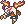

  ⬅️ <a href="https://avventureaditia.github.io/itia-wiki/pokemon/108-pyrcharoia/"> 108 - Pyrcharoia </a>
  <strong>109 - Catergon</strong> 
  
  <a href="https://avventureaditia.github.io/itia-wiki/pokemon/110-draglight/"> 110 - Draglight </a> ➡️

## Pokédex

=== "Tassonomia"
    

      
      

        

          
Class

          

            
Larva

          

        

        

          
Types

          

            
            
          

        

        

          
Ability

          

            <a href='' title="Strengthens biting moves to 1.5x their power.">Strong-jaw</a>
          

        

        

          
Cry

          

            <audio controls>
              <source src="../../audio/catergon.mp3" type="audio/mpeg">
            </audio>
          

        

      

    

=== "Aspetto"
    

      
      

        

          
Height

          

            
0,45 m

          

        

        

          
Weight

          

            
6,23 kg

          

        

        

          
Pokédex Color

          

            
Viola

          

        

        

          
Shape

          

            
          

        

      

    

=== "Allevamento"
    

      
      

        

          

            
Catch rate

            

              
75

            

          

          

            
Gender Ratio

            

              
50.00%

              
/

              
50.00%

            

          

        

        

          

            
Egg Groups

            

              
Bug and Dragon

            

          

          

            
Hatch Time

            

              
20 Cycles

            

          

        

        

          

            
Base experience yield

            

              
78

            

          

          

            
Leveling rate

            

              
Medium Slow

            

          

        

        

          

            
Base friendship

            

              
70

            

          

          

            
EV yield

            

              
1 - Attack / 1 - Speed

            

          

        

      

    

## Generali

=== "Descrizione Pokedex"
    ### Descrizione

    Nella forma base, i Catergon non sono ancora pronti per combattere, così usano il loro casco per riuscire ad intimidire i Pokémon che gli recano disturbo.   
    Se ciò non fosse abbastanza, userebbero la luce della loro emessa per accecare nemici o per chiedere aiuto ai propri simili.   
    Non si muovono molto e preferiscono stare appesi a testa in giù sui rami degli alberi, anche grazie alla loro coda simile ad un uncino.   

    Per maggiori informazioni il [video completo](https://www.youtube.com/watch?v=dBFk8Srgjpw&list=PLniAakFPn_t9I5zqlYAwZ_iSzJmgu5Nqd&index=16).

=== "Ispirazioni"

    ### Ispirazioni
    Le ispirazioni alla base di Catergon e della sua catena evolutiva sono:
    
    - **Lucciola Lampiris**;
    - **Anfesibena**;
    - **Libellule**.

=== "Vincitore del contest"
    ### Vincitore

    Il Vincitore di Itia che ha dato origine a Catergon e la sua catena evolutiva è **Raffaele**.
    

## Base Stats
<table style="width: 100%">
  <tbody style="width: 100%;">
    <tr style="display: flex; align-items: center;">
      <th style="color: #737373;" >HP</th>
      <td style="border-top: none; width: 70px">55</td>
      <td style="width: 100%; min-width: 450px; border-top: none;">
        

        

      </td>
    </tr>
    <tr style="display: flex; align-items: center;">
      <th style="color: #737373;">Attack</th>
      <td style="border-top: none; width: 70px">85</td>
      <td style="width: 100%; min-width: 450px; border-top: none;">
        

        

      </td>
    </tr>
    <tr style="display: flex; align-items: center;">
      <th style="color: #737373;">Defense</th>
      <td style="border-top: none; width: 70px">55</td>
      <td style="width: 100%; min-width: 450px; border-top: none;">
        

        

      </td>
    </tr>
    <tr style="display: flex; align-items: center;">
      <th style="color: #737373;">SP Attack</th>
      <td style="border-top: none; width: 70px">50</td>
      <td style="width: 100%; min-width: 450px; border-top: none;">
        

        

      </td>
    </tr>
    <tr style="display: flex; align-items: center;">
      <th style="color: #737373;">SP Defense</th>
      <td style="border-top: none; width: 70px">55</td>
      <td style="width: 100%; min-width: 450px; border-top: none;">
        

        

      </td>
    </tr>
    <tr style="display: flex; align-items: center;">
      <th style="color: #737373;">Speed</th>
      <td style="border-top: none; width: 70px">60</td>
      <td style="width: 100%; min-width: 450px; border-top: none;">
        

        

      </td>
    </tr>
  </tbody>
</table>

## Aspetto di gioco

=== "Base"
    

      

        
      

      

        
      

    

=== "Shiny"
    

      

        
      

      

        
      

    

    

##Evolution Change
| Method | Item/Level/Note | Evolved Pokemon |
        | :--: | :--: | :--: |
        | Item | Shiny Stone | [Draglight](https://avventureaditia.github.io/itia-wiki/pokemon/110-draglight/) |
        

## Moveset

=== "Level Up Moves"
    | Level | Name | Power | Accuracy | PP | Type | Damage Class |
        | -- | -- | -- | -- | -- | -- | -- |
        
        

=== "Machine Moves"
    | Machine | Name | Power | Accuracy | PP | Type | Damage Class |
        | -- | -- | -- | -- | -- | -- | -- |
        
        
