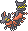

  ⬅️ <a href="https://avventureaditia.github.io/itia-wiki/pokemon/110-draglight/"> 110 - Draglight </a>
  <strong>111 - Comfey di Itia</strong> 
  
  <a href="https://avventureaditia.github.io/itia-wiki/pokemon/112-aphroring/"> 112 - Aphroring </a> ➡️

  

  

    

        
Class

        

          
Collana

        

      

    

      
Types

      

        
        
      

    

    

      
Abilities

      

        <a href='' title="This Pokemon's healing moves have their priority increased by 3.">Triage</a>
        
      

    

    

      
Hidden Ability

      

        
      

    

  

## Generali

=== "Descrizione Pokedex"
    ### Descrizione

    Si dice che confida di Itia siano giunti dalla regione tropicale come Alola durante le navigazioni, rimanendo privi di fiori.  
    Durante i numerosi i viaggi in mare, hanno iniziato a collezionare materiali di origine marina come gusci di conchiglia e perle, sviluppando nuovi poteri psichici.  
    Sono diventati un amuleto di portafortuna tra i marinai che li indossano al collo, soprattutto quando è in corso una tempesta.
    I poteri curativi del Pokémon calmano la mente di chi lo porta e restituiscono forza fisica.  

    Per maggiori informazioni il [video completo](https://www.youtube.com/watch?v=YRDewCmTPrE&list=PLniAakFPn_t9I5zqlYAwZ_iSzJmgu5Nqd&index=17).

=== "Ispirazioni"

    ### Ispirazioni
    Le ispirazioni alla base di Comfey e della sua catena evolutiva sono:
    
    - **Occhio di Venere (o occhio di Santa Lucia)*;
    - **Venere di Botticelli**;
    - **Pettine di Venere**.

=== "Vincitore del contest"
    ### Vincitore

    Il Vincitore di Itia che ha dato origine a Comfey e la sua catena evolutiva è **Valentilly**.

## Base Stats
<table style="width: 100%">
  <tbody style="width: 100%;">
    <tr style="display: flex; align-items: center;">
      <th style="color: #737373;" >HP</th>
      <td style="border-top: none; width: 70px">51</td>
      <td style="width: 100%; min-width: 450px; border-top: none;">
        

        

      </td>
    </tr>
    <tr style="display: flex; align-items: center;">
      <th style="color: #737373;">Attack</th>
      <td style="border-top: none; width: 70px">52</td>
      <td style="width: 100%; min-width: 450px; border-top: none;">
        

        

      </td>
    </tr>
    <tr style="display: flex; align-items: center;">
      <th style="color: #737373;">Defense</th>
      <td style="border-top: none; width: 70px">90</td>
      <td style="width: 100%; min-width: 450px; border-top: none;">
        

        

      </td>
    </tr>
    <tr style="display: flex; align-items: center;">
      <th style="color: #737373;">SP Attack</th>
      <td style="border-top: none; width: 70px">82</td>
      <td style="width: 100%; min-width: 450px; border-top: none;">
        

        

      </td>
    </tr>
    <tr style="display: flex; align-items: center;">
      <th style="color: #737373;">SP Defense</th>
      <td style="border-top: none; width: 70px">110</td>
      <td style="width: 100%; min-width: 450px; border-top: none;">
        

        

      </td>
    </tr>
    <tr style="display: flex; align-items: center;">
      <th style="color: #737373;">Speed</th>
      <td style="border-top: none; width: 70px">100</td>
      <td style="width: 100%; min-width: 450px; border-top: none;">
        

        

      </td>
    </tr>
  </tbody>
</table>

##Evolution Change
| Method | Item/Level/Note | Evolved Pokemon |
        | :--: | :--: | :--: |
        | Other | Per felicità con Squama bella | [Aphroring](https://avventureaditia.github.io/itia-wiki/pokemon/112-aphroring/) |
        

## Moveset

=== "Level Up Moves"
    | Level | Name | Power | Accuracy | PP | Type | Damage Class |
        | -- | -- | -- | -- | -- | -- | -- |
        
        

=== "Machine Moves"
    | Machine | Name | Power | Accuracy | PP | Type | Damage Class |
        | -- | -- | -- | -- | -- | -- | -- |
        
        
