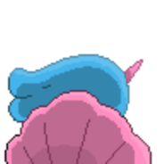
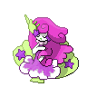

  ⬅️ <a href="https://avventureaditia.github.io/itia-wiki/pokemon/111-comfey-itia/"> 111 - Comfey di Itia </a>
  <strong>112 - Aphroring</strong> 
  
  <a href="https://avventureaditia.github.io/itia-wiki/pokemon/113-clauncher-itia/"> 113 - Clauncher di Itia </a> ➡️

## Pokédex

=== "Tassonomia"
    

      
      

        

          
Class

          

            
Madreperla

          

        

        

          
Types

          

            
            
          

        

        

          
Ability

          

            <a href='' title="This Pokemon's healing moves have their priority increased by 3.">Triage</a>
          

        

        

          
Cry

          

            <audio controls>
              <source src="../../audio/aphroring.mp3" type="audio/mpeg">
            </audio>
          

        

      

    

=== "Aspetto"
    

      
      

        

          
Height

          

            
1,25 m

          

        

        

          
Weight

          

            
24,16 kg

          

        

        

          
Pokédex Color

          

            
Blu

          

        

        

          
Shape

          

            
          

        

      

    

=== "Allevamento"
    

      
      

        

          

            
Catch rate

            

              
40

            

          

          

            
Gender Ratio

            

              
25.00%

              
/

              
75.00%

            

          

        

        

          

            
Egg Groups

            

              
Water 1 and Human-Like

            

          

          

            
Hatch Time

            

              
20 Cycles

            

          

        

        

          

            
Base experience yield

            

              
236

            

          

          

            
Leveling rate

            

              
Fast

            

          

        

        

          

            
Base friendship

            

              
70

            

          

          

            
EV yield

            

              
3 - Sp.Defense

            

          

        

      

    

## Generali

=== "Descrizione Pokedex"
    ### Descrizione

    Quando i Comfey trovano una particolare conchiglia, si evolvono in Aphroring, definita come la benedizione dei mari.  
    Regala le sue perle ai viaggiatori di buon cuore, promettendo loro una navigazione sicura e priva di pericoli.  
    È raro avvistarli, poiché schivi e molto timidi, ma non perdono l'occasione di manifestarsi per aiutare marinai in pericolo e vittime di naufragi.  
    La loro voce scaccia via ogni paura e usano la loro conchiglia come appoggio per i naufraghi al fine di trasportarli in un luogo sicuro.  

    Per maggiori informazioni il [video completo](https://www.youtube.com/watch?v=YRDewCmTPrE&list=PLniAakFPn_t9I5zqlYAwZ_iSzJmgu5Nqd&index=17).

=== "Ispirazioni"

    ### Ispirazioni
    Le ispirazioni alla base di Comfey e della sua catena evolutiva sono:
    
    - **Occhio di Venere (o occhio di Santa Lucia)*;
    - **Venere di Botticelli**;
    - **Pettine di Venere**.

=== "Vincitore del contest"
    ### Vincitore

    Il Vincitore di Itia che ha dato origine a Comfey e la sua catena evolutiva è **Valentilly**.
    

## Base Stats
<table style="width: 100%">
  <tbody style="width: 100%;">
    <tr style="display: flex; align-items: center;">
      <th style="color: #737373;" >HP</th>
      <td style="border-top: none; width: 70px">81</td>
      <td style="width: 100%; min-width: 450px; border-top: none;">
        

        

      </td>
    </tr>
    <tr style="display: flex; align-items: center;">
      <th style="color: #737373;">Attack</th>
      <td style="border-top: none; width: 70px">52</td>
      <td style="width: 100%; min-width: 450px; border-top: none;">
        

        

      </td>
    </tr>
    <tr style="display: flex; align-items: center;">
      <th style="color: #737373;">Defense</th>
      <td style="border-top: none; width: 70px">100</td>
      <td style="width: 100%; min-width: 450px; border-top: none;">
        

        

      </td>
    </tr>
    <tr style="display: flex; align-items: center;">
      <th style="color: #737373;">SP Attack</th>
      <td style="border-top: none; width: 70px">102</td>
      <td style="width: 100%; min-width: 450px; border-top: none;">
        

        

      </td>
    </tr>
    <tr style="display: flex; align-items: center;">
      <th style="color: #737373;">SP Defense</th>
      <td style="border-top: none; width: 70px">120</td>
      <td style="width: 100%; min-width: 450px; border-top: none;">
        

        

      </td>
    </tr>
    <tr style="display: flex; align-items: center;">
      <th style="color: #737373;">Speed</th>
      <td style="border-top: none; width: 70px">110</td>
      <td style="width: 100%; min-width: 450px; border-top: none;">
        

        

      </td>
    </tr>
  </tbody>
</table>

## Aspetto di gioco

=== "Base"
    

      

        
      

      

        
      

    

=== "Shiny"
    

      

        
      

      

        
      

    

## Moveset

=== "Level Up Moves"
    | Level | Name | Power | Accuracy | PP | Type | Damage Class |
        | -- | -- | -- | -- | -- | -- | -- |
        
        

=== "Machine Moves"
    | Machine | Name | Power | Accuracy | PP | Type | Damage Class |
        | -- | -- | -- | -- | -- | -- | -- |
        
        
