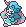

  ⬅️ <a href="https://avventureaditia.github.io/itia-wiki/pokemon/112-aphroring/"> 112 - Aphroring </a>
  <strong>113 - Clauncher di Itia</strong> 
  
  <a href="https://avventureaditia.github.io/itia-wiki/pokemon/114-shrimitzer/"> 114 - Shrimitzer </a> ➡️

  

  

    

        
Class

        

          
Mira

        

      

    

      
Types

      

        
        
      

    

    

      
Abilities

      

        <a href='' title="This Pokemon inflicts triple damage with critical hits, rather than the usual double damage.">Sniper</a>
        
      

    

    

      
Hidden Ability

      

        
      

    

  

## Generali

=== "Descrizione Pokedex"
    ### Descrizione

    Arrivati da una lontana regione, i Clauncher di Itia hanno trovato pane per i loro denti.  
    Continue lotte per il territorio più una forte regione basata sulla pesca, hanno portato questo Pokémon a sviluppare altri sistemi di difesa, indurendo il proprio corpo e creando un veleno che stordisce e paralizza i nemici.  
    Proprio per questo cambiamento, il Pokémon non è più commestibile, anche se con alcuni trattamenti si riesce a ricavarne ancora qualche piatto.  
    Si riuniscono in gruppo.  

    Per maggiori informazioni il [video completo](https://www.youtube.com/watch?v=YRDewCmTPrE&list=PLniAakFPn_t9I5zqlYAwZ_iSzJmgu5Nqd&index=17).

=== "Ispirazioni"

    ### Ispirazioni
    Le ispirazioni alla base di Clauncher e della sua catena evolutiva sono:
    
    - **Gambero Rosso della Louisiana*;
    - **Mafia**;
    - **Gambero Rosso di Mazara**.

=== "Vincitore del contest"
    ### Vincitori

    I Vincitori di Itia che hanno dato origine a Clauncher e la sua catena evolutiva sono **Crub** e **Demetrio**.

## Base Stats
<table style="width: 100%">
  <tbody style="width: 100%;">
    <tr style="display: flex; align-items: center;">
      <th style="color: #737373;" >HP</th>
      <td style="border-top: none; width: 70px">50</td>
      <td style="width: 100%; min-width: 450px; border-top: none;">
        

        

      </td>
    </tr>
    <tr style="display: flex; align-items: center;">
      <th style="color: #737373;">Attack</th>
      <td style="border-top: none; width: 70px">53</td>
      <td style="width: 100%; min-width: 450px; border-top: none;">
        

        

      </td>
    </tr>
    <tr style="display: flex; align-items: center;">
      <th style="color: #737373;">Defense</th>
      <td style="border-top: none; width: 70px">63</td>
      <td style="width: 100%; min-width: 450px; border-top: none;">
        

        

      </td>
    </tr>
    <tr style="display: flex; align-items: center;">
      <th style="color: #737373;">SP Attack</th>
      <td style="border-top: none; width: 70px">58</td>
      <td style="width: 100%; min-width: 450px; border-top: none;">
        

        

      </td>
    </tr>
    <tr style="display: flex; align-items: center;">
      <th style="color: #737373;">SP Defense</th>
      <td style="border-top: none; width: 70px">62</td>
      <td style="width: 100%; min-width: 450px; border-top: none;">
        

        

      </td>
    </tr>
    <tr style="display: flex; align-items: center;">
      <th style="color: #737373;">Speed</th>
      <td style="border-top: none; width: 70px">44</td>
      <td style="width: 100%; min-width: 450px; border-top: none;">
        

        

      </td>
    </tr>
  </tbody>
</table>

##Evolution Change
| Method | Item/Level/Note | Evolved Pokemon |
        | :--: | :--: | :--: |
        | Level Up | 38 | [Shrimitzer](https://avventureaditia.github.io/itia-wiki/pokemon/114-shrimitzer/) |
        

## Moveset

=== "Level Up Moves"
    | Level | Name | Power | Accuracy | PP | Type | Damage Class |
        | -- | -- | -- | -- | -- | -- | -- |
        
        

=== "Machine Moves"
    | Machine | Name | Power | Accuracy | PP | Type | Damage Class |
        | -- | -- | -- | -- | -- | -- | -- |
        
        
