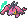
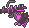
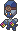
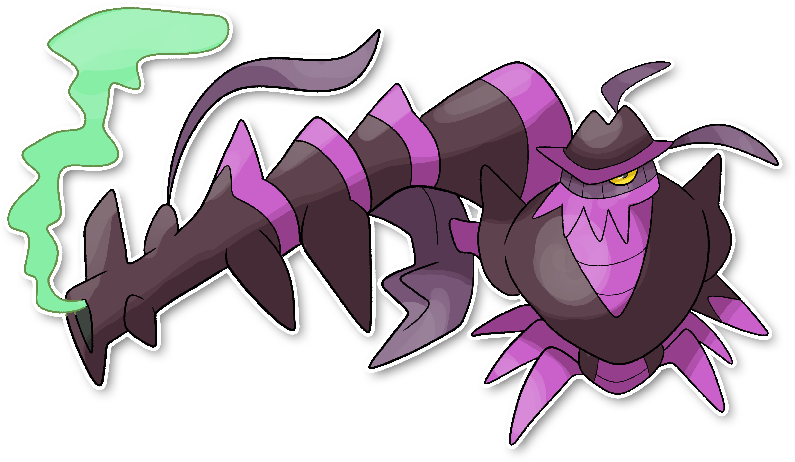

  ⬅️ <a href="https://avventureaditia.github.io/itia-wiki/pokemon/113-clauncher-itia/"> 113 - Clauncher di Itia </a>
  <strong>114 - Shrimitzer</strong> 
  
  <a href="https://avventureaditia.github.io/itia-wiki/pokemon/115-elgyem-itia/"> 115 - Elgyem di Itia </a> ➡️

## Pokédex

=== "Tassonomia"
    

      
      

        

          
Class

          

            
Mira

          

        

        

          
Types

          

            
            
          

        

        

          
Ability

          

            <a href='' title="This Pokemon inflicts triple damage with critical hits, rather than the usual double damage.">Sniper</a>
          

        

        

          
Cry

          

            <audio controls>
              <source src="../../audio/shrimitzer.mp3" type="audio/mpeg">
            </audio>
          

        

      

    

=== "Aspetto"
    

      
      

        

          
Height

          

            
0,93 m

          

        

        

          
Weight

          

            
33,41 kg

          

        

        

          
Pokédex Color

          

            
Viola

          

        

        

          
Shape

          

            
          

        

      

    

=== "Allevamento"
    

      
      

        

          

            
Catch rate

            

              
55

            

          

          

            
Gender Ratio

            

              
50.00%

              
/

              
50.00%

            

          

        

        

          

            
Egg Groups

            

              
Monster and Field

            

          

          

            
Hatch Time

            

              
15 Cycles

            

          

        

        

          

            
Base experience yield

            

              
100

            

          

          

            
Leveling rate

            

              
Slow

            

          

        

        

          

            
Base friendship

            

              
70

            

          

          

            
EV yield

            

              
2 - Sp.Attack

            

          

        

      

    

## Generali

=== "Descrizione Pokedex"
    ### Descrizione

    Gli Shrimitzer sono creature estremamente vendicative e rancorose.  
    Passano la loro vita a cacciare chiunque osi prendersela con i Clauncher o tenti di mangiarli, sparando potenti getti di veleno dall’enorme chela che posseggono.  
    Il loro corpo è resistentissimo, temprato per affrontare le lotte più lunghe e durature.  
    Dotati soprattutto di una mira infallibile, che gli permettono di essere temibili soprattutto dalla lunga distanza.  
    Generalmente questa specie si divide in gruppi, tanti Clauncher guidati da un solo Shrimitzer che li protegge.  

    Per maggiori informazioni il [video completo](https://www.youtube.com/watch?v=YRDewCmTPrE&list=PLniAakFPn_t9I5zqlYAwZ_iSzJmgu5Nqd&index=17).

=== "Ispirazioni"

    ### Ispirazioni
    Le ispirazioni alla base di Clauncher e della sua catena evolutiva sono:
    
    - **Gambero Rosso della Louisiana*;
    - **Mafia**;
    - **Gambero Rosso di Mazara**.

=== "Vincitore del contest"
    ### Vincitori

    I Vincitori di Itia che hanno dato origine a Clauncher e la sua catena evolutiva sono **Crub** e **Demetrio**.

## Base Stats
<table style="width: 100%">
  <tbody style="width: 100%;">
    <tr style="display: flex; align-items: center;">
      <th style="color: #737373;" >HP</th>
      <td style="border-top: none; width: 70px">71</td>
      <td style="width: 100%; min-width: 450px; border-top: none;">
        

        

      </td>
    </tr>
    <tr style="display: flex; align-items: center;">
      <th style="color: #737373;">Attack</th>
      <td style="border-top: none; width: 70px">73</td>
      <td style="width: 100%; min-width: 450px; border-top: none;">
        

        

      </td>
    </tr>
    <tr style="display: flex; align-items: center;">
      <th style="color: #737373;">Defense</th>
      <td style="border-top: none; width: 70px">89</td>
      <td style="width: 100%; min-width: 450px; border-top: none;">
        

        

      </td>
    </tr>
    <tr style="display: flex; align-items: center;">
      <th style="color: #737373;">SP Attack</th>
      <td style="border-top: none; width: 70px">120</td>
      <td style="width: 100%; min-width: 450px; border-top: none;">
        

        

      </td>
    </tr>
    <tr style="display: flex; align-items: center;">
      <th style="color: #737373;">SP Defense</th>
      <td style="border-top: none; width: 70px">88</td>
      <td style="width: 100%; min-width: 450px; border-top: none;">
        

        

      </td>
    </tr>
    <tr style="display: flex; align-items: center;">
      <th style="color: #737373;">Speed</th>
      <td style="border-top: none; width: 70px">59</td>
      <td style="width: 100%; min-width: 450px; border-top: none;">
        

        

      </td>
    </tr>
  </tbody>
</table>

## Moveset

=== "Level Up Moves"
    | Level | Name | Power | Accuracy | PP | Type | Damage Class |
        | -- | -- | -- | -- | -- | -- | -- |
        
        

=== "Machine Moves"
    | Machine | Name | Power | Accuracy | PP | Type | Damage Class |
        | -- | -- | -- | -- | -- | -- | -- |
        
        
