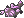
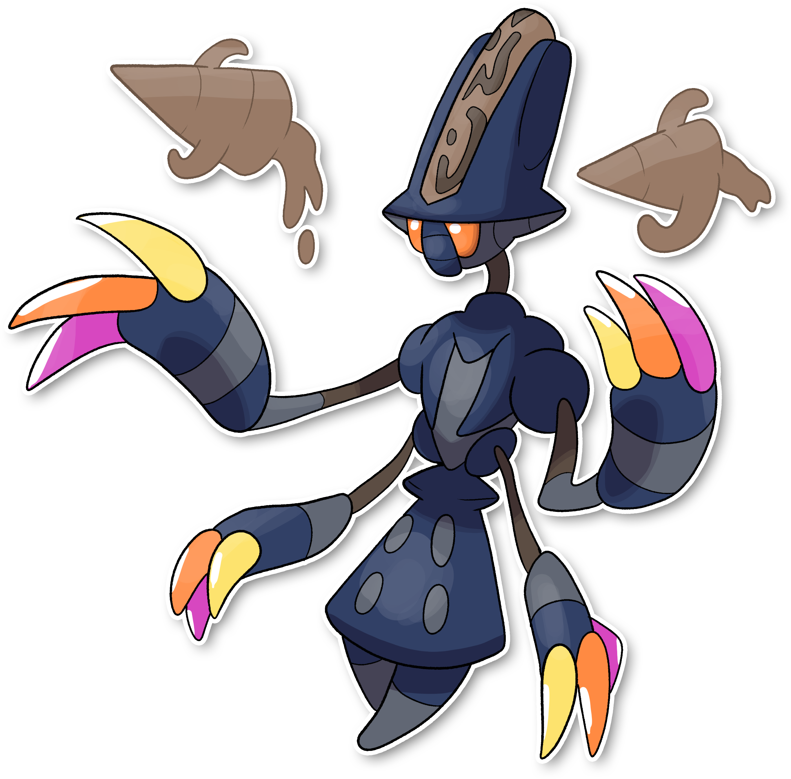

  ⬅️ <a href="https://avventureaditia.github.io/itia-wiki/pokemon/116-beheeyem-itia/"> 116 - Beheeyem di Itia </a>
  <strong>117 - Uefeeyoo</strong> 
  
  <a href="https://avventureaditia.github.io/itia-wiki/pokemon/118-dunsparce-itia/"> 118 - Dunsparce di Itia </a> ➡️

  

  

    

        
Class

        

          
Simbolo

        

      

    

      
Types

      

        
        
      

    

    

      
Abilities

      

        <a href='' title="This Pokemon's Speed is doubled during a sandstorm, and it does not take sandstorm damage, regardless of type.">Sand-rush</a>
        
      

    

    

      
Hidden Ability

      

        
      

    

  

## Generali

=== "Descrizione Pokedex"
    ### Descrizione

    Questi Pokémon sono in cima alla Scala gerarchica all'interno del nido, ma solo un'esemplare sarà il capofamiglia, ossia colui che comanderà tutta la Colonia.  
    Gli altri esemplari avranno il compito di difendere il nido da qualsiasi ostilità.  
    Sono Pokemon estremamente potenti, in grado di creare forti terremoti usando solo il 20% dei loro poteri psichici.  
    Cercano il più possibile di nascondere la Colonia agli occhi degli umani.  
    Grandi illusioni e barriere che non facciano avvicinare nessun essere vivente.  
    Creano trivelle di terra che usano per scavare più velocemente.  

    Per maggiori informazioni il [video completo](https://www.youtube.com/watch?v=YRDewCmTPrE&list=PLniAakFPn_t9I5zqlYAwZ_iSzJmgu5Nqd&index=17).

=== "Ispirazioni"

    ### Ispirazioni
    Le ispirazioni alla base di Elgyem e della sua catena evolutiva sono:
    
    - **Avvistamenti ufo sul Monte Musinè**.

=== "Vincitore del contest"
    ### Vincitore

    Il Vincitore di Itia che ha dato origine a Elgyem e la sua catena evolutiva è **Metalord**.
    

## Base Stats
<table style="width: 100%">
  <tbody style="width: 100%;">
    <tr style="display: flex; align-items: center;">
      <th style="color: #737373;" >HP</th>
      <td style="border-top: none; width: 70px">75</td>
      <td style="width: 100%; min-width: 450px; border-top: none;">
        

        

      </td>
    </tr>
    <tr style="display: flex; align-items: center;">
      <th style="color: #737373;">Attack</th>
      <td style="border-top: none; width: 70px">145</td>
      <td style="width: 100%; min-width: 450px; border-top: none;">
        

        

      </td>
    </tr>
    <tr style="display: flex; align-items: center;">
      <th style="color: #737373;">Defense</th>
      <td style="border-top: none; width: 70px">105</td>
      <td style="width: 100%; min-width: 450px; border-top: none;">
        

        

      </td>
    </tr>
    <tr style="display: flex; align-items: center;">
      <th style="color: #737373;">SP Attack</th>
      <td style="border-top: none; width: 70px">105</td>
      <td style="width: 100%; min-width: 450px; border-top: none;">
        

        

      </td>
    </tr>
    <tr style="display: flex; align-items: center;">
      <th style="color: #737373;">SP Defense</th>
      <td style="border-top: none; width: 70px">85</td>
      <td style="width: 100%; min-width: 450px; border-top: none;">
        

        

      </td>
    </tr>
    <tr style="display: flex; align-items: center;">
      <th style="color: #737373;">Speed</th>
      <td style="border-top: none; width: 70px">50</td>
      <td style="width: 100%; min-width: 450px; border-top: none;">
        

        

      </td>
    </tr>
  </tbody>
</table>

## Moveset

=== "Level Up Moves"
    | Level | Name | Power | Accuracy | PP | Type | Damage Class |
        | -- | -- | -- | -- | -- | -- | -- |
        
        

=== "Machine Moves"
    | Machine | Name | Power | Accuracy | PP | Type | Damage Class |
        | -- | -- | -- | -- | -- | -- | -- |
        
        
