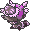
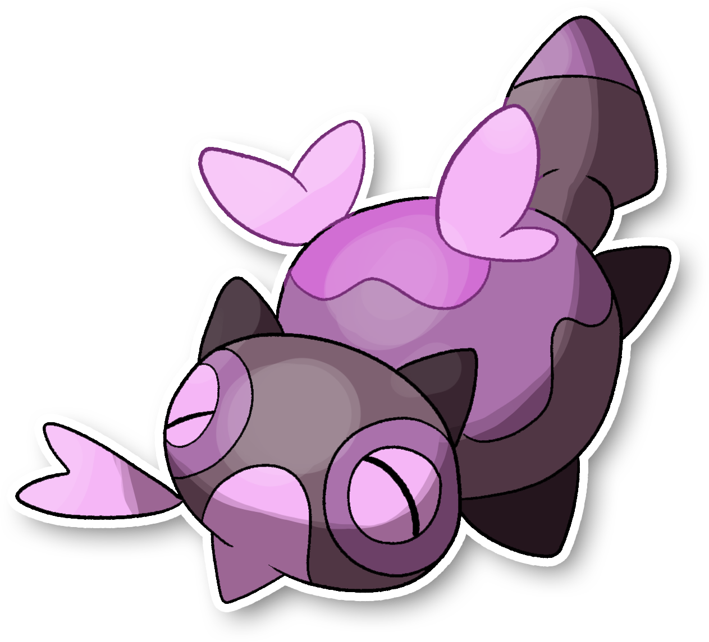

  ⬅️ <a href="https://avventureaditia.github.io/itia-wiki/pokemon/117-uefeeyoo/"> 117 - Uefeeyoo </a>
  <strong>118 - Dunsparce di Itia</strong> 
  
  <a href="https://avventureaditia.github.io/itia-wiki/pokemon/119-aclinsparce/"> 119 - Aclinsparce </a> ➡️

## Pokédex

=== "Tassonomia"
    

      
      

        

          
Class

          

            
Falsaserpe

          

        

        

          
Types

          

            
          

        

        

          
Ability

          

            <a href='' title="This Pokemon's Speed rises one stage with each hit from a damaging dark-, ghost-, or bug-type move.">Rattled</a>
          

        

        

          
Cry

          

            <audio controls>
              <source src="../../audio/dunsparce-itia.mp3" type="audio/mpeg">
            </audio>
          

        

      

    

=== "Aspetto"
    

      
      

        

          
Height

          

            
1,40 m

          

        

        

          
Weight

          

            
12,53 kg

          

        

        

          
Pokédex Color

          

            
Viola

          

        

        

          
Shape

          

            
          

        

      

    

=== "Allevamento"
    

      
      

        

          

            
Catch rate

            

              
190

            

          

          

            
Gender Ratio

            

              
50.00%

              
/

              
50.00%

            

          

        

        

          

            
Egg Groups

            

              
Field

            

          

          

            
Hatch Time

            

              
20 Cycles

            

          

        

        

          

            
Base experience yield

            

              
145

            

          

          

            
Leveling rate

            

              
Medium Fast

            

          

        

        

          

            
Base friendship

            

              
50

            

          

          

            
EV yield

            

              
1 - HP

            

          

        

      

    

## Generali

=== "Descrizione Pokedex"
    ### Descrizione

    Questi Pokémon sono in cima alla Scala gerarchica all'interno del nido, ma solo un'esemplare sarà il capofamiglia, ossia colui che comanderà tutta la Colonia.  
    Gli altri esemplari avranno il compito di difendere il nido da qualsiasi ostilità.  
    Sono Pokemon estremamente potenti, in grado di creare forti terremoti usando solo il 20% dei loro poteri psichici.  
    Cercano il più possibile di nascondere la Colonia agli occhi degli umani.  
    Grandi illusioni e barriere che non facciano avvicinare nessun essere vivente.  
    Creano trivelle di terra che usano per scavare più velocemente.  

    Per maggiori informazioni il [video completo](https://www.youtube.com/watch?v=YRDewCmTPrE&list=PLniAakFPn_t9I5zqlYAwZ_iSzJmgu5Nqd&index=17).

=== "Ispirazioni"

    ### Ispirazioni
    Le ispirazioni alla base di Dunsparce e della sua catena evolutiva sono:
    
    - **Biscia d'acqua**;
    - **Drago di Terni**;
    - **Mandragola della Valtellina**;
    - **Gargoyle del Duomo di Milano**;
    - **Brighella**;
    - **Magalasso**.

=== "Vincitore del contest"
    ### Vincitore

    Il Vincitore di Itia che ha dato origine a Dunsparce e la sua catena evolutiva è **Franci**.

## Base Stats
<table style="width: 100%">
  <tbody style="width: 100%;">
    <tr style="display: flex; align-items: center;">
      <th style="color: #737373;" >HP</th>
      <td style="border-top: none; width: 70px">100</td>
      <td style="width: 100%; min-width: 450px; border-top: none;">
        

        

      </td>
    </tr>
    <tr style="display: flex; align-items: center;">
      <th style="color: #737373;">Attack</th>
      <td style="border-top: none; width: 70px">65</td>
      <td style="width: 100%; min-width: 450px; border-top: none;">
        

        

      </td>
    </tr>
    <tr style="display: flex; align-items: center;">
      <th style="color: #737373;">Defense</th>
      <td style="border-top: none; width: 70px">70</td>
      <td style="width: 100%; min-width: 450px; border-top: none;">
        

        

      </td>
    </tr>
    <tr style="display: flex; align-items: center;">
      <th style="color: #737373;">SP Attack</th>
      <td style="border-top: none; width: 70px">70</td>
      <td style="width: 100%; min-width: 450px; border-top: none;">
        

        

      </td>
    </tr>
    <tr style="display: flex; align-items: center;">
      <th style="color: #737373;">SP Defense</th>
      <td style="border-top: none; width: 70px">65</td>
      <td style="width: 100%; min-width: 450px; border-top: none;">
        

        

      </td>
    </tr>
    <tr style="display: flex; align-items: center;">
      <th style="color: #737373;">Speed</th>
      <td style="border-top: none; width: 70px">45</td>
      <td style="width: 100%; min-width: 450px; border-top: none;">
        

        

      </td>
    </tr>
  </tbody>
</table>

##Evolution Change
| Method | Item/Level/Note | Evolved Pokemon |
        | :--: | :--: | :--: |
        | Other | Level Up conoscendo la mossa Ipertrapano | [Aclinsparce](https://avventureaditia.github.io/itia-wiki/pokemon/119-aclinsparce/) |
        

## Moveset

=== "Level Up Moves"
    | Level | Name | Power | Accuracy | PP | Type | Damage Class |
        | -- | -- | -- | -- | -- | -- | -- |
        
        

=== "Machine Moves"
    | Machine | Name | Power | Accuracy | PP | Type | Damage Class |
        | -- | -- | -- | -- | -- | -- | -- |
        
        
