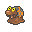

  ⬅️ <a href="https://avventureaditia.github.io/itia-wiki/pokemon/119-aclinsparce/"> 119 - Aclinsparce </a>
  <strong>120 - Slugma di Itia</strong> 
  
  <a href="https://avventureaditia.github.io/itia-wiki/pokemon/121-magcargo-itia/"> 121 - Magcargo di Itia </a> ➡️

## Pokédex

=== "Tassonomia"
    

      
      

        

          
Class

          

            
Lumaca

          

        

        

          
Types

          

            
          

        

        

          
Ability

          

            <a href='' title="This Pokemon is immune to fire-type moves.  Once this Pokemon has been hit by a Fire move, its own Fire moves will inflict 1.5x as much damage until it leaves battle.  This ability has no effect while the Pokemon is frozen.  The Fire damage bonus is retained even if the Pokemon is frozen and thawed or the ability is lost or disabled.  Fire moves will ignore this Pokemon's substitute.  This ability takes effect even on non-damaging moves, i.e. will o wisp.">Flash-fire</a>
          

        

        

          
Cry

          

            <audio controls>
              <source src="../../audio/slugma-itia.mp3" type="audio/mpeg">
            </audio>
          

        

      

    

=== "Aspetto"
    

      
      

        

          
Height

          

            
0,71 m

          

        

        

          
Weight

          

            
35,35 kg

          

        

        

          
Pokédex Color

          

            
Marrone

          

        

        

          
Shape

          

            
          

        

      

    

=== "Allevamento"
    

      
      

        

          

            
Catch rate

            

              
190

            

          

          

            
Gender Ratio

            

              
50.20%

              
/

              
49.80%

            

          

        

        

          

            
Egg Groups

            

              
Amorphous

            

          

          

            
Hatch Time

            

              
20 Cycles

            

          

        

        

          

            
Base experience yield

            

              
50

            

          

          

            
Leveling rate

            

              
Medium Fast

            

          

        

        

          

            
Base friendship

            

              
70

            

          

          

            
EV yield

            

              
1 - Defense

            

          

        

      

    

## Generali

=== "Descrizione Pokedex"
    ### Descrizione

    Slugma ospita dentro di sé i Pokémon di tipo Coleottero, a cui permette di scavare cunicoli nel suo corpo.  
    Può rigenerare in qualsiasi momento i danni fatti da questi ultimi, se sono troppo gravi, semplicemente mangiando della terra che andrà a tappare i buchi creati dagli inquilini.  
    Molti Pokémon coleottero tendono ad affidare le proprie larve agli Slugma, poiché facilmente mimetizzabili in ogni tipo di terreno.
    Sono particolarmente amici con i Durant.  

    Per maggiori informazioni il [video completo](https://www.youtube.com/watch?v=YRDewCmTPrE&list=PLniAakFPn_t9I5zqlYAwZ_iSzJmgu5Nqd&index=17).

=== "Ispirazioni"

    ### Ispirazioni
    Le ispirazioni alla base di Slugma e della sua catena evolutiva sono:
    
    - **Lumaca Helix Maxima**;
    - **Energia rinnovabile**;
    - **Computer Olivetti M21**;
    - **Marrocca**;
    - **Formicaio**.

=== "Vincitore del contest"
    ### Vincitore

    Il Vincitore di Itia che ha dato origine a Slugma e la sua catena evolutiva è **Spettrosio**.

## Base Stats
<table style="width: 100%">
  <tbody style="width: 100%;">
    <tr style="display: flex; align-items: center;">
      <th style="color: #737373;" >HP</th>
      <td style="border-top: none; width: 70px">40</td>
      <td style="width: 100%; min-width: 450px; border-top: none;">
        

        

      </td>
    </tr>
    <tr style="display: flex; align-items: center;">
      <th style="color: #737373;">Attack</th>
      <td style="border-top: none; width: 70px">70</td>
      <td style="width: 100%; min-width: 450px; border-top: none;">
        

        

      </td>
    </tr>
    <tr style="display: flex; align-items: center;">
      <th style="color: #737373;">Defense</th>
      <td style="border-top: none; width: 70px">40</td>
      <td style="width: 100%; min-width: 450px; border-top: none;">
        

        

      </td>
    </tr>
    <tr style="display: flex; align-items: center;">
      <th style="color: #737373;">SP Attack</th>
      <td style="border-top: none; width: 70px">40</td>
      <td style="width: 100%; min-width: 450px; border-top: none;">
        

        

      </td>
    </tr>
    <tr style="display: flex; align-items: center;">
      <th style="color: #737373;">SP Defense</th>
      <td style="border-top: none; width: 70px">40</td>
      <td style="width: 100%; min-width: 450px; border-top: none;">
        

        

      </td>
    </tr>
    <tr style="display: flex; align-items: center;">
      <th style="color: #737373;">Speed</th>
      <td style="border-top: none; width: 70px">20</td>
      <td style="width: 100%; min-width: 450px; border-top: none;">
        

        

      </td>
    </tr>
  </tbody>
</table>

## Aspetto di gioco

=== "Base"
    

      

        
      

      

        
      

    

=== "Shiny"
    

      

        
      

      

        
      

    

##Evolution Change
| Method | Item/Level/Note | Evolved Pokemon |
        | :--: | :--: | :--: |
        | Level Up | 20 | [Magcargo Itia](https://avventureaditia.github.io/itia-wiki/pokemon/121-magcargo-itia/) |
        

## Moveset

=== "Level Up Moves"
    | Level | Name | Power | Accuracy | PP | Type | Damage Class |
        | -- | -- | -- | -- | -- | -- | -- |
        
        

=== "Machine Moves"
    | Machine | Name | Power | Accuracy | PP | Type | Damage Class |
        | -- | -- | -- | -- | -- | -- | -- |
        
        
