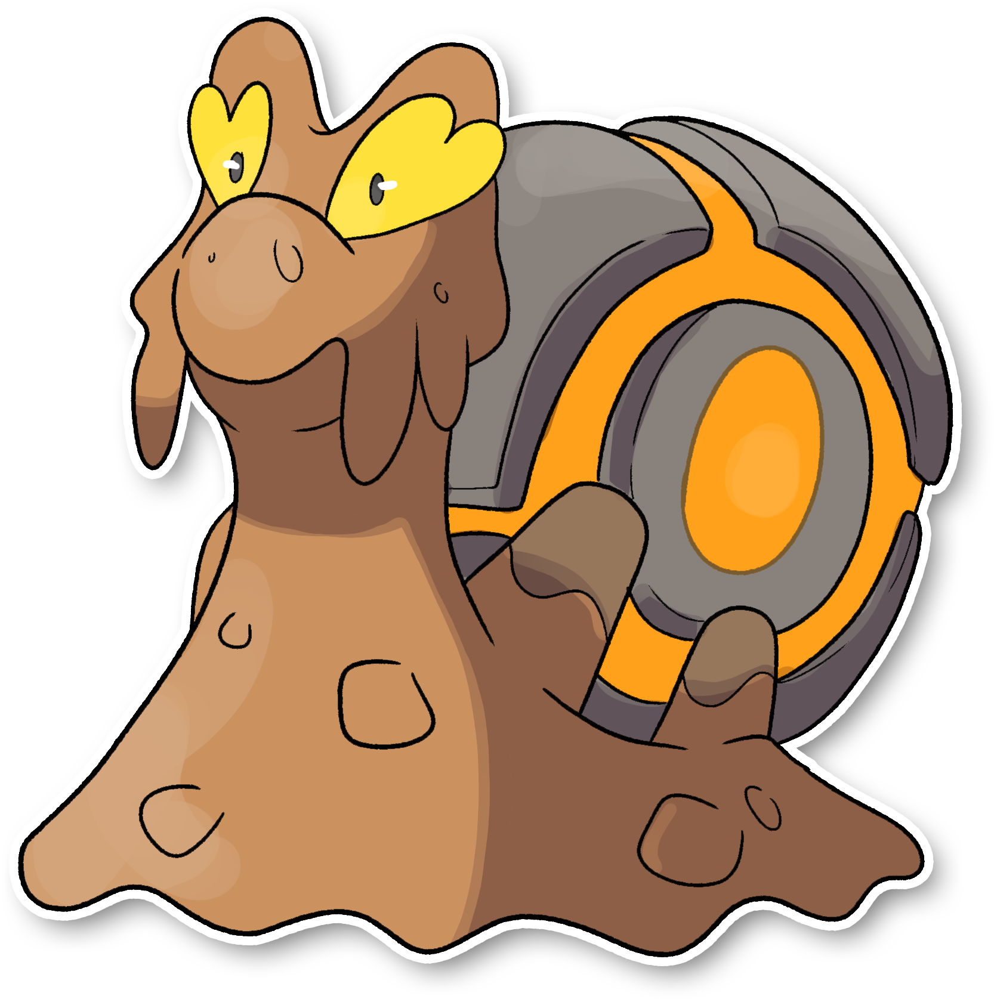

  ⬅️ <a href="https://avventureaditia.github.io/itia-wiki/pokemon/120-slugma-itia/"> 120 - Slugma di Itia </a>
  <strong>121 - Magcargo di Itia</strong> 
  
  <a href="https://avventureaditia.github.io/itia-wiki/pokemon/122-aspershell/"> 122 - Aspershell </a> ➡️

## Pokédex

=== "Tassonomia"
    

      
      

        

          
Class

          

            
Lumaca

          

        

        

          
Types

          

            
            
          

        

        

          
Ability

          

            <a href='' title="This Pokemon is immune to fire-type moves.  Once this Pokemon has been hit by a Fire move, its own Fire moves will inflict 1.5x as much damage until it leaves battle.  This ability has no effect while the Pokemon is frozen.  The Fire damage bonus is retained even if the Pokemon is frozen and thawed or the ability is lost or disabled.  Fire moves will ignore this Pokemon's substitute.  This ability takes effect even on non-damaging moves, i.e. will o wisp.">Flash-fire</a>
          

        

        

          
Cry

          

            <audio controls>
              <source src="../../audio/magcargo-itia.mp3" type="audio/mpeg">
            </audio>
          

        

      

    

=== "Aspetto"
    

      
      

        

          
Height

          

            
0,83 m

          

        

        

          
Weight

          

            
55,53 kg

          

        

        

          
Pokédex Color

          

            
Marrone

          

        

        

          
Shape

          

            
          

        

      

    

=== "Allevamento"
    

      
      

        

          

            
Catch rate

            

              
75

            

          

          

            
Gender Ratio

            

              
50.20%

              
/

              
49.80%

            

          

        

        

          

            
Egg Groups

            

              
Amorphous

            

          

          

            
Hatch Time

            

              
20 Cycles

            

          

        

        

          

            
Base experience yield

            

              
144

            

          

          

            
Leveling rate

            

              
Medium Fast

            

          

        

        

          

            
Base friendship

            

              
70

            

          

          

            
EV yield

            

              
2 - Defense

            

          

        

      

    

## Generali

=== "Descrizione Pokedex"
    ### Descrizione

    I Durant, che alloggiano nel corpo di Slugma, periodicamente perdono pezzi della loro corazza durante la muta.  
    Questi elementi non vengono persi, ma assorbiti a poco a poco dal Pokémon che li utilizza per rafforzarsi ed evolversi, diventando Magcargo.  
    Il guscio dei Magcargo è resistentissimo e garantisce una maggiore difesa del Pokemon coleottero, che possono dormire sonni tranquilli.
    Essendo un ex tipo fuoco, il Pokémon conserva ancora la capacità di annullare e assorbire il calore.  
    Questa capacità deriva dalla particolare colla di terra che produce.  

    Per maggiori informazioni il [video completo](https://www.youtube.com/watch?v=YRDewCmTPrE&list=PLniAakFPn_t9I5zqlYAwZ_iSzJmgu5Nqd&index=17).

=== "Ispirazioni"

    ### Ispirazioni
    Le ispirazioni alla base di Slugma e della sua catena evolutiva sono:
    
    - **Lumaca Helix Maxima**;
    - **Energia rinnovabile**;
    - **Computer Olivetti M21**;
    - **Marrocca**;
    - **Formicaio**.

=== "Vincitore del contest"
    ### Vincitore

    Il Vincitore di Itia che ha dato origine a Slugma e la sua catena evolutiva è **Spettrosio**.

## Base Stats
<table style="width: 100%">
  <tbody style="width: 100%;">
    <tr style="display: flex; align-items: center;">
      <th style="color: #737373;" >HP</th>
      <td style="border-top: none; width: 70px">60</td>
      <td style="width: 100%; min-width: 450px; border-top: none;">
        

        

      </td>
    </tr>
    <tr style="display: flex; align-items: center;">
      <th style="color: #737373;">Attack</th>
      <td style="border-top: none; width: 70px">90</td>
      <td style="width: 100%; min-width: 450px; border-top: none;">
        

        

      </td>
    </tr>
    <tr style="display: flex; align-items: center;">
      <th style="color: #737373;">Defense</th>
      <td style="border-top: none; width: 70px">120</td>
      <td style="width: 100%; min-width: 450px; border-top: none;">
        

        

      </td>
    </tr>
    <tr style="display: flex; align-items: center;">
      <th style="color: #737373;">SP Attack</th>
      <td style="border-top: none; width: 70px">50</td>
      <td style="width: 100%; min-width: 450px; border-top: none;">
        

        

      </td>
    </tr>
    <tr style="display: flex; align-items: center;">
      <th style="color: #737373;">SP Defense</th>
      <td style="border-top: none; width: 70px">80</td>
      <td style="width: 100%; min-width: 450px; border-top: none;">
        

        

      </td>
    </tr>
    <tr style="display: flex; align-items: center;">
      <th style="color: #737373;">Speed</th>
      <td style="border-top: none; width: 70px">30</td>
      <td style="width: 100%; min-width: 450px; border-top: none;">
        

        

      </td>
    </tr>
  </tbody>
</table>

##Evolution Change
| Method | Item/Level/Note | Evolved Pokemon |
        | :--: | :--: | :--: |
        | Other | Vince 10 battaglie con Durant in squadra | [Aspershell](https://avventureaditia.github.io/itia-wiki/pokemon/122-aspershell/) |
        

## Moveset

=== "Level Up Moves"
    | Level | Name | Power | Accuracy | PP | Type | Damage Class |
        | -- | -- | -- | -- | -- | -- | -- |
        
        

=== "Machine Moves"
    | Machine | Name | Power | Accuracy | PP | Type | Damage Class |
        | -- | -- | -- | -- | -- | -- | -- |
        
        
