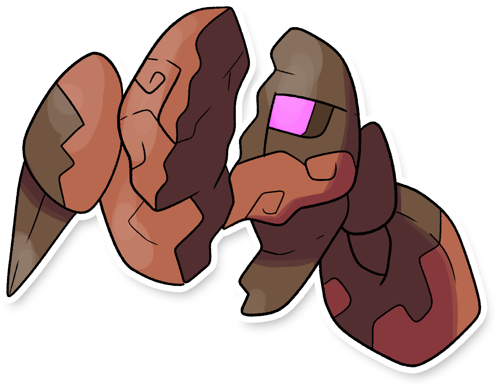

  

  

    

        
Class

        

          
Doppiatesta

        

      

    

      
Types

      

        
        
      

    

    

      
Abilities

      

        <a href='' title="This Pokemon has half the usual weight for its species.">Light-metal</a>
        
      

    

    

      
Hidden Ability

      

        
      

    

  

## Generali

=== "Descrizione Pokedex"
    ### Descrizione

    Questo Pokémon venne creato ed alimentato da un'energia sconosciuta da un vicino impero di Itia per vendicare il proprio re caduto in battaglia proprio contro la regione.  
    Ne furono costruiti più esemplari, ma essendo solamente dei prototipi non erano molto abili nei combattimenti.  
    Infatti l'aspetto che vediamo ai giorni nostri è il risultato della guerra nella quale venivano distrutti delle potenti palle di cannone sotto a difesa del territorio.  
    Si possono trovare spesso sepolti sui fondali marini, in attesa di ricevere nuovi ordini e tornare a combattere.  

    Per maggiori informazioni il [video completo](https://www.youtube.com/watch?v=_tnKWPvesjQ&list=PLniAakFPn_t9I5zqlYAwZ_iSzJmgu5Nqd&index=19).

=== "Ispirazioni"

    ### Ispirazioni
    Le ispirazioni alla base di Coppwin e della sua catena evolutiva sono:
    
    - **I bronzi di Riace**;
    - **Il visconte dimezzato**.

=== "Vincitore del contest"
    ### Vincitore

    Il Vincitore di Itia che ha dato origine a Coppwin e la sua catena evolutiva è **Marcodarwing**.

## Base Stats
<table style="width: 100%">
  <tbody style="width: 100%;">
    <tr style="display: flex; align-items: center;">
      <th style="color: #737373;" >HP</th>
      <td style="border-top: none; width: 70px">37</td>
      <td style="width: 100%; min-width: 450px; border-top: none;">
        

        

      </td>
    </tr>
    <tr style="display: flex; align-items: center;">
      <th style="color: #737373;">Attack</th>
      <td style="border-top: none; width: 70px">44</td>
      <td style="width: 100%; min-width: 450px; border-top: none;">
        

        

      </td>
    </tr>
    <tr style="display: flex; align-items: center;">
      <th style="color: #737373;">Defense</th>
      <td style="border-top: none; width: 70px">86</td>
      <td style="width: 100%; min-width: 450px; border-top: none;">
        

        

      </td>
    </tr>
    <tr style="display: flex; align-items: center;">
      <th style="color: #737373;">SP Attack</th>
      <td style="border-top: none; width: 70px">24</td>
      <td style="width: 100%; min-width: 450px; border-top: none;">
        

        

      </td>
    </tr>
    <tr style="display: flex; align-items: center;">
      <th style="color: #737373;">SP Defense</th>
      <td style="border-top: none; width: 70px">86</td>
      <td style="width: 100%; min-width: 450px; border-top: none;">
        

        

      </td>
    </tr>
    <tr style="display: flex; align-items: center;">
      <th style="color: #737373;">Speed</th>
      <td style="border-top: none; width: 70px">23</td>
      <td style="width: 100%; min-width: 450px; border-top: none;">
        

        

      </td>
    </tr>
  </tbody>
</table>

##Evolution Change
| Method | Item/Level/Note | Evolved Pokemon |
        | :--: | :--: | :--: |
        | Level Up | 33 | [Oxible](https://avventureaditia.github.io/itia-wiki/pokemon/124-oxible/) |
        

## Moveset

=== "Level Up Moves"
    | Level | Name | Power | Accuracy | PP | Type | Damage Class |
        | -- | -- | -- | -- | -- | -- | -- |
        
        

=== "Machine Moves"
    | Machine | Name | Power | Accuracy | PP | Type | Damage Class |
        | -- | -- | -- | -- | -- | -- | -- |
        
        
