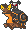
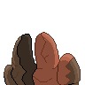
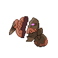
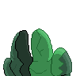
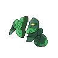

  ⬅️ <a href="https://avventureaditia.github.io/itia-wiki/pokemon/122-aspershell/"> 122 - Aspershell </a>
  <strong>123 - Coppwin</strong> 
  
  <a href="https://avventureaditia.github.io/itia-wiki/pokemon/124-oxible/"> 124 - Oxible </a> ➡️

## Pokédex

=== "Tassonomia"
    

      
      

        

          
Class

          

            
Doppiatesta

          

        

        

          
Types

          

            
            
          

        

        

          
Ability

          

            <a href='' title="This Pokemon has half the usual weight for its species.">Light-metal</a>
          

        

        

          
Cry

          

            <audio controls>
              <source src="../../audio/coppwin.mp3" type="audio/mpeg">
            </audio>
          

        

      

    

=== "Aspetto"
    

      
      

        

          
Height

          

            
1,23 m

          

        

        

          
Weight

          

            
234,21 kg

          

        

        

          
Pokédex Color

          

            
Viola

          

        

        

          
Shape

          

            
          

        

      

    

=== "Allevamento"
    

      
      

        

          

            
Catch rate

            

              
70

            

          

          

            
Gender Ratio

            

              
Sconosciuto

            

          

        

        

          

            
Egg Groups

            

              
Amorphous and Monster

            

          

          

            
Hatch Time

            

              
30 Cycles

            

          

        

        

          

            
Base experience yield

            

              
127

            

          

          

            
Leveling rate

            

              
Medium Slow

            

          

        

        

          

            
Base friendship

            

              
70

            

          

          

            
EV yield

            

              
1 - Defense / 1 - Sp.Defense

            

          

        

      

    

## Generali

=== "Descrizione Pokedex"
    ### Descrizione

    Questo Pokémon venne creato ed alimentato da un'energia sconosciuta da un vicino impero di Itia per vendicare il proprio re caduto in battaglia proprio contro la regione.  
    Ne furono costruiti più esemplari, ma essendo solamente dei prototipi non erano molto abili nei combattimenti.  
    Infatti l'aspetto che vediamo ai giorni nostri è il risultato della guerra nella quale venivano distrutti delle potenti palle di cannone sotto a difesa del territorio.  
    Si possono trovare spesso sepolti sui fondali marini, in attesa di ricevere nuovi ordini e tornare a combattere.  

    Per maggiori informazioni il [video completo](https://www.youtube.com/watch?v=_tnKWPvesjQ&list=PLniAakFPn_t9I5zqlYAwZ_iSzJmgu5Nqd&index=19).

=== "Ispirazioni"

    ### Ispirazioni
    Le ispirazioni alla base di Coppwin e della sua catena evolutiva sono:
    
    - **I bronzi di Riace**;
    - **Il visconte dimezzato**.

=== "Vincitore del contest"
    ### Vincitore

    Il Vincitore di Itia che ha dato origine a Coppwin e la sua catena evolutiva è **Marcodarwing**.

## Base Stats
<table style="width: 100%">
  <tbody style="width: 100%;">
    <tr style="display: flex; align-items: center;">
      <th style="color: #737373;" >HP</th>
      <td style="border-top: none; width: 70px">37</td>
      <td style="width: 100%; min-width: 450px; border-top: none;">
        

        

      </td>
    </tr>
    <tr style="display: flex; align-items: center;">
      <th style="color: #737373;">Attack</th>
      <td style="border-top: none; width: 70px">44</td>
      <td style="width: 100%; min-width: 450px; border-top: none;">
        

        

      </td>
    </tr>
    <tr style="display: flex; align-items: center;">
      <th style="color: #737373;">Defense</th>
      <td style="border-top: none; width: 70px">86</td>
      <td style="width: 100%; min-width: 450px; border-top: none;">
        

        

      </td>
    </tr>
    <tr style="display: flex; align-items: center;">
      <th style="color: #737373;">SP Attack</th>
      <td style="border-top: none; width: 70px">24</td>
      <td style="width: 100%; min-width: 450px; border-top: none;">
        

        

      </td>
    </tr>
    <tr style="display: flex; align-items: center;">
      <th style="color: #737373;">SP Defense</th>
      <td style="border-top: none; width: 70px">86</td>
      <td style="width: 100%; min-width: 450px; border-top: none;">
        

        

      </td>
    </tr>
    <tr style="display: flex; align-items: center;">
      <th style="color: #737373;">Speed</th>
      <td style="border-top: none; width: 70px">23</td>
      <td style="width: 100%; min-width: 450px; border-top: none;">
        

        

      </td>
    </tr>
  </tbody>
</table>

## Aspetto di gioco

=== "Base"
    

      

        
      

      

        
      

    

=== "Shiny"
    

      

        
      

      

        
      

    

    

##Evolution Change
| Method | Item/Level/Note | Evolved Pokemon |
        | :--: | :--: | :--: |
        | Level Up | 33 | [Oxible](https://avventureaditia.github.io/itia-wiki/pokemon/124-oxible/) |
        

## Moveset

=== "Level Up Moves"
    | Level | Name | Power | Accuracy | PP | Type | Damage Class |
        | -- | -- | -- | -- | -- | -- | -- |
        
        

=== "Machine Moves"
    | Machine | Name | Power | Accuracy | PP | Type | Damage Class |
        | -- | -- | -- | -- | -- | -- | -- |
        
        
