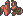
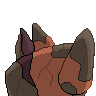
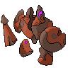
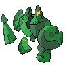

  ⬅️ <a href="https://avventureaditia.github.io/itia-wiki/pokemon/123-coppwin/"> 123 - Coppwin </a>
  <strong>124 - Oxible</strong> 
  
  <a href="https://avventureaditia.github.io/itia-wiki/pokemon/125-wishwashi-itia/"> 125 - Wishwashi</a> ➡️

## Pokédex

=== "Tassonomia"
    

      
      

        

          
Class

          

            
Multivia

          

        

        

          
Types

          

            
            
          

        

        

          
Ability

          

            <a href='' title="This Pokemon has half the usual weight for its species.">Light-metal</a>
          

        

        

          
Cry

          

            <audio controls>
              <source src="../../audio/oxible.mp3" type="audio/mpeg">
            </audio>
          

        

      

    

=== "Aspetto"
    

      
      

        

          
Height

          

            
1,98 m

          

        

        

          
Weight

          

            
400,00 kg

          

        

        

          
Pokédex Color

          

            
Viola

          

        

        

          
Shape

          

            
          

        

      

    

=== "Allevamento"
    

      
      

        

          

            
Catch rate

            

              
40

            

          

          

            
Gender Ratio

            

              
Sconosciuto

            

          

        

        

          

            
Egg Groups

            

              
Amorphous and Monster

            

          

          

            
Hatch Time

            

              
30 Cycles

            

          

        

        

          

            
Base experience yield

            

              
236

            

          

          

            
Leveling rate

            

              
Medium Slow

            

          

        

        

          

            
Base friendship

            

              
70

            

          

          

            
EV yield

            

              
1 - Defense / 2 - Sp.Defense

            

          

        

      

    

## Generali

=== "Descrizione Pokedex"
    ### Descrizione

    Sono il risultato di vari esperimenti in altrettativo di rafforzare i deboli copwin e realizzare dei guerrieri abbastanza potenti da resistere a qualsiasi attacco.  
    Tuttavia, il suo aspetto e oggi sfigurato, risultato sempre dall'antico assalto che ha rovinato il suo corpo originale.  
    Per questo motivo non riesce a sfoderare in campo la sua potenza originaria, rimanendo comunque molto abile e pericoloso.  
    Si dice che l'origine fosse completo, con arti che collegavano al corpo sia le armi superiori che gli arti inferiori.  

    Per maggiori informazioni il [video completo](https://www.youtube.com/watch?v=_tnKWPvesjQ&list=PLniAakFPn_t9I5zqlYAwZ_iSzJmgu5Nqd&index=19).

=== "Ispirazioni"

    ### Ispirazioni
    Le ispirazioni alla base di Coppwin e della sua catena evolutiva sono:
    
    - **I bronzi di Riace**;
    - **Il visconte dimezzato**.

=== "Vincitore del contest"
    ### Vincitore

    Il Vincitore di Itia che ha dato origine a Coppwin e la sua catena evolutiva è **Marcodarwing**.

## Base Stats
<table style="width: 100%">
  <tbody style="width: 100%;">
    <tr style="display: flex; align-items: center;">
      <th style="color: #737373;" >HP</th>
      <td style="border-top: none; width: 70px">57</td>
      <td style="width: 100%; min-width: 450px; border-top: none;">
        

        

      </td>
    </tr>
    <tr style="display: flex; align-items: center;">
      <th style="color: #737373;">Attack</th>
      <td style="border-top: none; width: 70px">109</td>
      <td style="width: 100%; min-width: 450px; border-top: none;">
        

        

      </td>
    </tr>
    <tr style="display: flex; align-items: center;">
      <th style="color: #737373;">Defense</th>
      <td style="border-top: none; width: 70px">116</td>
      <td style="width: 100%; min-width: 450px; border-top: none;">
        

        

      </td>
    </tr>
    <tr style="display: flex; align-items: center;">
      <th style="color: #737373;">SP Attack</th>
      <td style="border-top: none; width: 70px">44</td>
      <td style="width: 100%; min-width: 450px; border-top: none;">
        

        

      </td>
    </tr>
    <tr style="display: flex; align-items: center;">
      <th style="color: #737373;">SP Defense</th>
      <td style="border-top: none; width: 70px">116</td>
      <td style="width: 100%; min-width: 450px; border-top: none;">
        

        

      </td>
    </tr>
    <tr style="display: flex; align-items: center;">
      <th style="color: #737373;">Speed</th>
      <td style="border-top: none; width: 70px">33</td>
      <td style="width: 100%; min-width: 450px; border-top: none;">
        

        

      </td>
    </tr>
  </tbody>
</table>

## Aspetto di gioco

=== "Base"
    

      

        
      

      

        
      

    

=== "Shiny"
    

      

        
      

      

        
      

    

    

## Moveset

=== "Level Up Moves"
    | Level | Name | Power | Accuracy | PP | Type | Damage Class |
        | -- | -- | -- | -- | -- | -- | -- |
        
        

=== "Machine Moves"
    | Machine | Name | Power | Accuracy | PP | Type | Damage Class |
        | -- | -- | -- | -- | -- | -- | -- |
        
        
