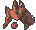
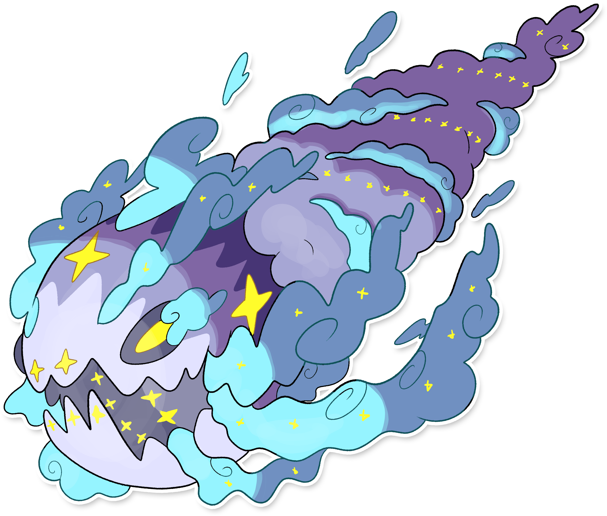

  ⬅️ <a href="https://avventureaditia.github.io/itia-wiki/pokemon/124-oxible/"> 124 - Oxible </a>
  <strong>125 - Wishwashi</strong> 
  
  <a href="https://avventureaditia.github.io/itia-wiki/pokemon/126-helioptile-itia/"> 126 - Helioptile di Itia </a> ➡️

## Aspetto

=== "Forma Base"
    ### Forma Base
    

      
      

        

            
Class

            

              
Cometa

            

          

        

          
Types

          

            
            
          

        

        

          
Abilities

          

            <a href='' title="If this Pokemon is a wishiwashi and level 20 or above, then when it enters battle and at the start of each turn, it becomes Schooling Form if its HP is 25% or higher and Solo Form otherwise.  This ability cannot be replaced, copied, or nullified.">Schooling</a>
          

        

        

          
Hidden Ability

          

          

        

      

    

=== "Forma Alternativa"
    ### Forma Cumulonembo
    

      
      

        

            
Class

            

              
Cometa

            

          

        

          
Types

          

            
            
          

        

        

          
Abilities

          

            <a href='' title="If this Pokemon is a wishiwashi and level 20 or above, then when it enters battle and at the start of each turn, it becomes Schooling Form if its HP is 25% or higher and Solo Form otherwise.  This ability cannot be replaced, copied, or nullified.">Schooling</a>        
          

        

        

          
Hidden Ability

          
          
          

        

      

    

## Generali

=== "Descrizione Pokedex"
    ### Descrizione

    I Wishwashi amano muoversi continuamente nel cielo, soprattutto di notte.  
    Il materiale che compone la parte gassosa dei loro corpi è malleabile e cambia continuamente forma.  
    Per questo motivo, molto spesso da terra sembra di vedere nuvole con forme che ricordano figure riconducibili ad oggetti o esseri viventi.  
    Di notte si divertono a rincorrersi e i loro occhi gialli, con la velocità dei movimenti che ottengono giocando sono erroneamente visti come stelle cadenti da chi li osserva da lontano, in questi casi è tradizione esprimere un desiderio.  
    Quando si sentono in pericolo i Wishwashi chiamano a raccolta i loro simili, diventando una creatura all'apparenza spaventosa.  
    Questo aspetto ricorda un'enorme meteora in procinto di cadere sulla terra, seminando il panico a chiunque lo avvisi da lontano.  
    In passato la vista di questa enorme creatura era presagio di sventure e calamità imminenti, mentre oggi presagisce solamente l'arrivo di tempeste e forti grandinate create dal Pokémon stesso per spaventare i predatori e chiunque lo minacci.  

    Per maggiori informazioni il [video completo](https://www.youtube.com/watch?v=_tnKWPvesjQ&list=PLniAakFPn_t9I5zqlYAwZ_iSzJmgu5Nqd&index=19).

=== "Ispirazioni"

    ### Ispirazioni
    Le ispirazioni alla base di Wishwashi sono:
    
    - **Principe delle Nuvole**;
    - **Leggenda del Caligo**;
    - **Fata Morgana**;
    - **Nubi lenticolari**;
    - **Costellazione dei Pesci**;
    - **Notte di San Lorenzo**;
    - **Almanacco perpetuo di Rutilio Benincasa**.

=== "Vincitore del contest"
    ### Vincitori

    I Vincitori di Itia che hanno dato origine a Wishwashi sono: **Blueraven**, **Chocokoala**, **Leo** e **Cristian**.

## Base Stats

=== "Forma Base"
    ### Forma Base
    <table style="width: 100%">
      <tbody style="width: 100%;">
        <tr style="display: flex; align-items: center;">
          <th style="color: #737373;" >HP</th>
          <td style="border-top: none; width: 70px">45</td>
          <td style="width: 100%; min-width: 450px; border-top: none;">
            

            

          </td>
        </tr>
        <tr style="display: flex; align-items: center;">
          <th style="color: #737373;">Attack</th>
          <td style="border-top: none; width: 70px">25</td>
          <td style="width: 100%; min-width: 450px; border-top: none;">
            

            

          </td>
        </tr>
        <tr style="display: flex; align-items: center;">
          <th style="color: #737373;">Defense</th>
          <td style="border-top: none; width: 70px">20</td>
          <td style="width: 100%; min-width: 450px; border-top: none;">
            

            

          </td>
        </tr>
        <tr style="display: flex; align-items: center;">
          <th style="color: #737373;">SP Attack</th>
          <td style="border-top: none; width: 70px">40</td>
          <td style="width: 100%; min-width: 450px; border-top: none;">
            

            

          </td>
        </tr>
        <tr style="display: flex; align-items: center;">
          <th style="color: #737373;">SP Defense</th>
          <td style="border-top: none; width: 70px">20</td>
          <td style="width: 100%; min-width: 450px; border-top: none;">
            

            

          </td>
        </tr>
        <tr style="display: flex; align-items: center;">
          <th style="color: #737373;">Speed</th>
          <td style="border-top: none; width: 70px">40</td>
          <td style="width: 100%; min-width: 450px; border-top: none;">
            

            

          </td>
        </tr>
      </tbody>
    </table>

=== "Forma Alternativa"
    ### Forma Cumulonembo
    <table style="width: 100%">
      <tbody style="width: 100%;">
        <tr style="display: flex; align-items: center;">
          <th style="color: #737373;" >HP</th>
          <td style="border-top: none; width: 70px">70</td>
          <td style="width: 100%; min-width: 450px; border-top: none;">
            

            

          </td>
        </tr>
        <tr style="display: flex; align-items: center;">
          <th style="color: #737373;">Attack</th>
          <td style="border-top: none; width: 70px">140</td>
          <td style="width: 100%; min-width: 450px; border-top: none;">
            

            

          </td>
        </tr>
        <tr style="display: flex; align-items: center;">
          <th style="color: #737373;">Defense</th>
          <td style="border-top: none; width: 70px">130</td>
          <td style="width: 100%; min-width: 450px; border-top: none;">
            

            

          </td>
        </tr>
        <tr style="display: flex; align-items: center;">
          <th style="color: #737373;">SP Attack</th>
          <td style="border-top: none; width: 70px">130</td>
          <td style="width: 100%; min-width: 450px; border-top: none;">
            

            

          </td>
        </tr>
        <tr style="display: flex; align-items: center;">
          <th style="color: #737373;">SP Defense</th>
          <td style="border-top: none; width: 70px">130</td>
          <td style="width: 100%; min-width: 450px; border-top: none;">
            

            

          </td>
        </tr>
        <tr style="display: flex; align-items: center;">
          <th style="color: #737373;">Speed</th>
          <td style="border-top: none; width: 70px">20</td>
          <td style="width: 100%; min-width: 450px; border-top: none;">
            

            

          </td>
        </tr>
      </tbody>
    </table>

## Moveset

=== "Level Up Moves"
    | Level | Name | Power | Accuracy | PP | Type | Damage Class |
        | -- | -- | -- | -- | -- | -- | -- |
        
        

=== "Machine Moves"
    | Machine | Name | Power | Accuracy | PP | Type | Damage Class |
        | -- | -- | -- | -- | -- | -- | -- |
        
        
