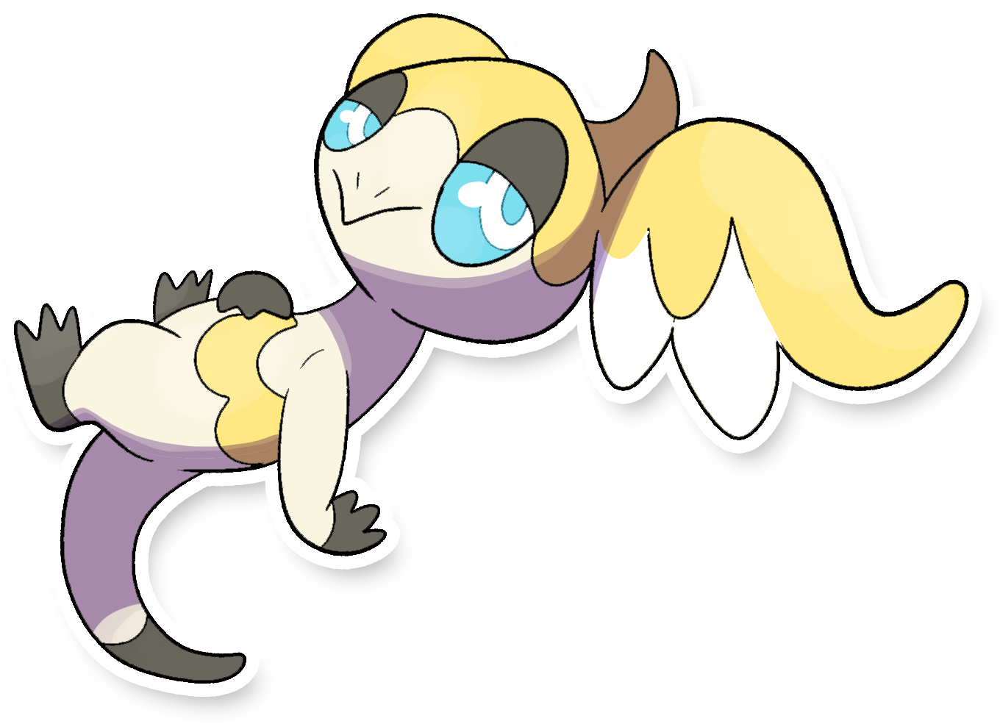

  

  

    

        
Class

        

          
Levitazione

        

      

    

        
Class

        

          
Multivia

        

      

    

      
Types

      

        
        
      

    

    

      
Abilities

      

        <a href='' title="During strong sunlight, this Pokemon has 1.5x its Special Attack but takes 1/8 of its maximum HP in damage after each turn.">Solar-power</a>
        
      

    

    

      
Hidden Ability

      

        
      

    

  

## Generali

=== "Descrizione Pokedex"
    ### Descrizione

    Questa particolare forma assunta da Helioptile di Itia vive indisturbata nei cieli.  
    Passa la maggior parte del suo tempo a mangiare nuvole ad alta quota e quando si avvicina di più a terraferma porta con sé una brezza leggera che presagisce l'arrivo della bella stagione.  
    Per questo motivo è una specie di Pokémon molto amata dal popolo contadino sin dall'antichità vengono venduti souvenir che lo rappresentano molto apprezzati dai turisti.  
    Per difendersi emette flebili scariche elettriche dal suo corpo.  

    Per maggiori informazioni il [video completo](https://www.youtube.com/watch?v=_tnKWPvesjQ&list=PLniAakFPn_t9I5zqlYAwZ_iSzJmgu5Nqd&index=19).

=== "Ispirazioni"

    ### Ispirazioni
    Le ispirazioni alla base di Helioptile e della sua catena evolutiva sono:
    
    - **La rosa dei venti**;
    - **I venti che imperversano sul territorio italiano**;
    - **Angioletti di Raffaele**;
    - **Giove**.

=== "Vincitore del contest"
    ### Vincitore

    Il Vincitore di Itia che ha dato origine a Helioptile e la sua catena evolutiva è **Federico**.

## Base Stats
<table style="width: 100%">
  <tbody style="width: 100%;">
    <tr style="display: flex; align-items: center;">
      <th style="color: #737373;" >HP</th>
      <td style="border-top: none; width: 70px">44</td>
      <td style="width: 100%; min-width: 450px; border-top: none;">
        

        

      </td>
    </tr>
    <tr style="display: flex; align-items: center;">
      <th style="color: #737373;">Attack</th>
      <td style="border-top: none; width: 70px">61</td>
      <td style="width: 100%; min-width: 450px; border-top: none;">
        

        

      </td>
    </tr>
    <tr style="display: flex; align-items: center;">
      <th style="color: #737373;">Defense</th>
      <td style="border-top: none; width: 70px">33</td>
      <td style="width: 100%; min-width: 450px; border-top: none;">
        

        

      </td>
    </tr>
    <tr style="display: flex; align-items: center;">
      <th style="color: #737373;">SP Attack</th>
      <td style="border-top: none; width: 70px">38</td>
      <td style="width: 100%; min-width: 450px; border-top: none;">
        

        

      </td>
    </tr>
    <tr style="display: flex; align-items: center;">
      <th style="color: #737373;">SP Defense</th>
      <td style="border-top: none; width: 70px">43</td>
      <td style="width: 100%; min-width: 450px; border-top: none;">
        

        

      </td>
    </tr>
    <tr style="display: flex; align-items: center;">
      <th style="color: #737373;">Speed</th>
      <td style="border-top: none; width: 70px">70</td>
      <td style="width: 100%; min-width: 450px; border-top: none;">
        

        

      </td>
    </tr>
  </tbody>
</table>

##Evolution Change
| Method | Item/Level/Note | Evolved Pokemon |
        | :--: | :--: | :--: |
        | Level Up | 30 | [Heliolisk Itia](https://avventureaditia.github.io/itia-wiki/pokemon/127-heliolisk-itia/) |
        

## Moveset

=== "Level Up Moves"
    | Level | Name | Power | Accuracy | PP | Type | Damage Class |
        | -- | -- | -- | -- | -- | -- | -- |
        
        

=== "Machine Moves"
    | Machine | Name | Power | Accuracy | PP | Type | Damage Class |
        | -- | -- | -- | -- | -- | -- | -- |
        
        
