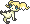

  ⬅️ <a href="https://avventureaditia.github.io/itia-wiki/pokemon/125-wishwashi-itia/"> 125 - Wishwashi </a>
  <strong>126 - Helioptile di Itia</strong> 
  
  <a href="https://avventureaditia.github.io/itia-wiki/pokemon/127-heliolisk-itia/"> 127 - Heliolisk di Itia </a> ➡️

## Pokédex

=== "Tassonomia"
    

      
      

        

          
Class

          

            
Levitazione

          

        

        

          
Types

          

            
            
          

        

        

          
Ability

          

            <a href='' title="During strong sunlight, this Pokemon has 1.5x its Special Attack but takes 1/8 of its maximum HP in damage after each turn.">Solar-power</a>
          

        

        

          
Cry

          

            <audio controls>
              <source src="../../audio/helioptile-itia.mp3" type="audio/mpeg">
            </audio>
          

        

      

    

=== "Aspetto"
    

      
      

        

          
Height

          

            
0,50 m

          

        

        

          
Weight

          

            
6,00 kg

          

        

        

          
Pokédex Color

          

            
Giallo

          

        

        

          
Shape

          

            
          

        

      

    

=== "Allevamento"
    

      
      

        

          

            
Catch rate

            

              
120

            

          

          

            
Gender Ratio

            

              
50.00%

              
/

              
50.00%

            

          

        

        

          

            
Egg Groups

            

              
Monster and Flying

            

          

          

            
Hatch Time

            

              
30 Cycles

            

          

        

        

          

            
Base experience yield

            

              
58

            

          

          

            
Leveling rate

            

              
Slow

            

          

        

        

          

            
Base friendship

            

              
70

            

          

          

            
EV yield

            

              
1 - Speed

            

          

        

      

    

## Generali

=== "Descrizione Pokedex"
    ### Descrizione

    Questa particolare forma assunta da Helioptile di Itia vive indisturbata nei cieli.  
    Passa la maggior parte del suo tempo a mangiare nuvole ad alta quota e quando si avvicina di più a terraferma porta con sé una brezza leggera che presagisce l'arrivo della bella stagione.  
    Per questo motivo è una specie di Pokémon molto amata dal popolo contadino sin dall'antichità vengono venduti souvenir che lo rappresentano molto apprezzati dai turisti.  
    Per difendersi emette flebili scariche elettriche dal suo corpo.  

    Per maggiori informazioni il [video completo](https://www.youtube.com/watch?v=_tnKWPvesjQ&list=PLniAakFPn_t9I5zqlYAwZ_iSzJmgu5Nqd&index=19).

=== "Ispirazioni"

    ### Ispirazioni
    Le ispirazioni alla base di Helioptile e della sua catena evolutiva sono:
    
    - **La rosa dei venti**;
    - **I venti che imperversano sul territorio italiano**;
    - **Angioletti di Raffaele**;
    - **Giove**.

=== "Vincitore del contest"
    ### Vincitore

    Il Vincitore di Itia che ha dato origine a Helioptile e la sua catena evolutiva è **Federico**.

## Base Stats
<table style="width: 100%">
  <tbody style="width: 100%;">
    <tr style="display: flex; align-items: center;">
      <th style="color: #737373;" >HP</th>
      <td style="border-top: none; width: 70px">44</td>
      <td style="width: 100%; min-width: 450px; border-top: none;">
        

        

      </td>
    </tr>
    <tr style="display: flex; align-items: center;">
      <th style="color: #737373;">Attack</th>
      <td style="border-top: none; width: 70px">61</td>
      <td style="width: 100%; min-width: 450px; border-top: none;">
        

        

      </td>
    </tr>
    <tr style="display: flex; align-items: center;">
      <th style="color: #737373;">Defense</th>
      <td style="border-top: none; width: 70px">33</td>
      <td style="width: 100%; min-width: 450px; border-top: none;">
        

        

      </td>
    </tr>
    <tr style="display: flex; align-items: center;">
      <th style="color: #737373;">SP Attack</th>
      <td style="border-top: none; width: 70px">38</td>
      <td style="width: 100%; min-width: 450px; border-top: none;">
        

        

      </td>
    </tr>
    <tr style="display: flex; align-items: center;">
      <th style="color: #737373;">SP Defense</th>
      <td style="border-top: none; width: 70px">43</td>
      <td style="width: 100%; min-width: 450px; border-top: none;">
        

        

      </td>
    </tr>
    <tr style="display: flex; align-items: center;">
      <th style="color: #737373;">Speed</th>
      <td style="border-top: none; width: 70px">70</td>
      <td style="width: 100%; min-width: 450px; border-top: none;">
        

        

      </td>
    </tr>
  </tbody>
</table>

## Aspetto di gioco

=== "Base"
    

      

        
      

      

        
      

    

=== "Shiny"
    

      

        
      

      

        
      

    

##Evolution Change
| Method | Item/Level/Note | Evolved Pokemon |
        | :--: | :--: | :--: |
        | Level Up | 30 | [Heliolisk Itia](https://avventureaditia.github.io/itia-wiki/pokemon/127-heliolisk-itia/) |
        

## Moveset

=== "Level Up Moves"
    | Level | Name | Power | Accuracy | PP | Type | Damage Class |
        | -- | -- | -- | -- | -- | -- | -- |
        
        

=== "Machine Moves"
    | Machine | Name | Power | Accuracy | PP | Type | Damage Class |
        | -- | -- | -- | -- | -- | -- | -- |
        
        
