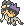

  ⬅️ <a href="https://avventureaditia.github.io/itia-wiki/pokemon/127-heliolisk-itia/"> 127 - Heliolisk di Itia </a>
  <strong>128 - Heliopiter</strong> 
  
  <a href="https://avventureaditia.github.io/itia-wiki/pokemon/129-pairgon/"> 129 - Pairgon </a> ➡️

## Pokédex

=== "Tassonomia"
    

      
      

        

          
Class

          

            
Burrasca

          

        

        

          
Types

          

            
            
          

        

        

          
Ability

          

            <a href='' title="During strong sunlight, this Pokemon has 1.5x its Special Attack but takes 1/8 of its maximum HP in damage after each turn.">Solar-power</a>
          

        

        

          
Cry

          

            <audio controls>
              <source src="../../audio/heliopiter.mp3" type="audio/mpeg">
            </audio>
          

        

      

    

=== "Aspetto"
    

      
      

        

          
Height

          

            
1,82 m

          

        

        

          
Weight

          

            
32,11 kg

          

        

        

          
Pokédex Color

          

            
Giallo

          

        

        

          
Shape

          

            
          

        

      

    

=== "Allevamento"
    

      
      

        

          

            
Catch rate

            

              
30

            

          

          

            
Gender Ratio

            

              
50.00%

              
/

              
50.00%

            

          

        

        

          

            
Egg Groups

            

              
Monster and Flying

            

          

          

            
Hatch Time

            

              
30 Cycles

            

          

        

        

          

            
Base experience yield

            

              
236

            

          

          

            
Leveling rate

            

              
Slow

            

          

        

        

          

            
Base friendship

            

              
70

            

          

          

            
EV yield

            

              
3 - Speed

            

          

        

      

    

## Generali

=== "Descrizione Pokedex"
    ### Descrizione

    È talmente potente che i marinai hanno dovuto stravolgere la rosa dei 20 per monitorare i suoi scatti d'ira.  
    Questo Pokémon, infatti, è in grado di alterare le condizioni atmosferiche delle zone in cui vive, causando forti correnti burrascose e nuvole temporalesche.  
    Se è adirato, scaglia fulmine dalle piume che circondano la testa, che è in grado di indirizzare verso i nemici con una precisione millimetrica, utilizzando l'organo luminoso che ha sulla coda, che funge da mirino.  
    Lo si vede planare nei cieli alla ricerca di nuvole cariche di elettricità da divorare.  

    Per maggiori informazioni il [video completo](https://www.youtube.com/watch?v=_tnKWPvesjQ&list=PLniAakFPn_t9I5zqlYAwZ_iSzJmgu5Nqd&index=19).

=== "Ispirazioni"

    ### Ispirazioni
    Le ispirazioni alla base di Helioptile e della sua catena evolutiva sono:
    
    - **La rosa dei venti**;
    - **I venti che imperversano sul territorio italiano**;
    - **Angioletti di Raffaele**;
    - **Giove**.

=== "Vincitore del contest"
    ### Vincitore

    Il Vincitore di Itia che ha dato origine a Helioptile e la sua catena evolutiva è **Federico**.

## Base Stats
<table style="width: 100%">
  <tbody style="width: 100%;">
    <tr style="display: flex; align-items: center;">
      <th style="color: #737373;" >HP</th>
      <td style="border-top: none; width: 70px">72</td>
      <td style="width: 100%; min-width: 450px; border-top: none;">
        

        

      </td>
    </tr>
    <tr style="display: flex; align-items: center;">
      <th style="color: #737373;">Attack</th>
      <td style="border-top: none; width: 70px">139</td>
      <td style="width: 100%; min-width: 450px; border-top: none;">
        

        

      </td>
    </tr>
    <tr style="display: flex; align-items: center;">
      <th style="color: #737373;">Defense</th>
      <td style="border-top: none; width: 70px">72</td>
      <td style="width: 100%; min-width: 450px; border-top: none;">
        

        

      </td>
    </tr>
    <tr style="display: flex; align-items: center;">
      <th style="color: #737373;">SP Attack</th>
      <td style="border-top: none; width: 70px">55</td>
      <td style="width: 100%; min-width: 450px; border-top: none;">
        

        

      </td>
    </tr>
    <tr style="display: flex; align-items: center;">
      <th style="color: #737373;">SP Defense</th>
      <td style="border-top: none; width: 70px">104</td>
      <td style="width: 100%; min-width: 450px; border-top: none;">
        

        

      </td>
    </tr>
    <tr style="display: flex; align-items: center;">
      <th style="color: #737373;">Speed</th>
      <td style="border-top: none; width: 70px">139</td>
      <td style="width: 100%; min-width: 450px; border-top: none;">
        

        

      </td>
    </tr>
  </tbody>
</table>

## Moveset

=== "Level Up Moves"
    | Level | Name | Power | Accuracy | PP | Type | Damage Class |
        | -- | -- | -- | -- | -- | -- | -- |
        
        

=== "Machine Moves"
    | Machine | Name | Power | Accuracy | PP | Type | Damage Class |
        | -- | -- | -- | -- | -- | -- | -- |
        
        
