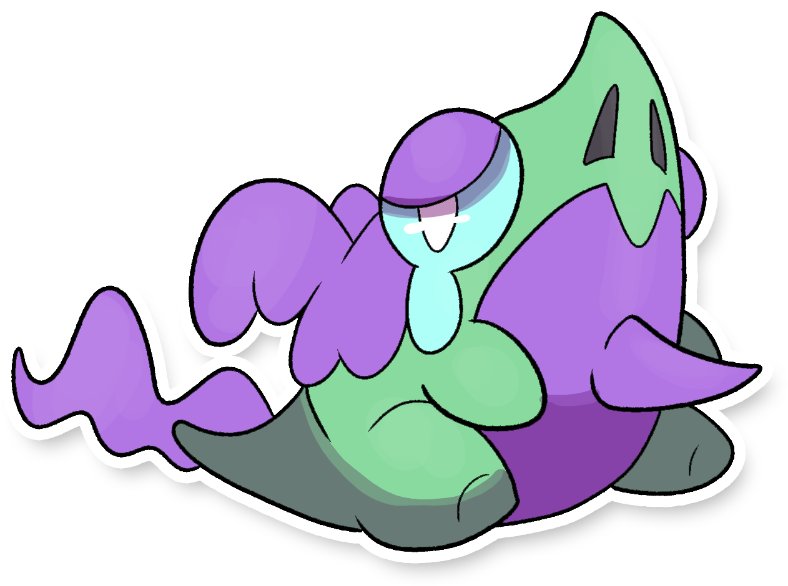

  

  

    

        
Class

        

          
Pena

        

      

    

      
Types

      

        
        
      

    

    

      
Abilities

      

        <a href='' title="Whenever a Pokemon would heal after hitting this Pokemon with a leeching move like absorb, it instead loses as many HP as it would usually gain.  dream eater is unaffected.">Liquid-ooze</a>
        
      

    

    

      
Hidden Ability

      

        
      

    

  

## Generali

=== "Descrizione Pokedex"
    ### Descrizione

    Questa piccola creatura sembra essere costantemente in pena per via del grosso pungiglione che spunta la sua gola.  
    Quest'ultimo, infatti, pare non essere parte integrante del suo corpo, ma il risultato dello scontro con un grosso Pokémon coleottero che lo ha infilzato provocando la fuoriuscita di una sostanza altamente viscosa e tossica che ha donato alla creatura il tipo veleno.  
    Nonostante ciò, è mansuete docile e la presenza di un allenatore in gamba al suo fianco è in grado di alleviare il dolore fino a quasi farlo scomparire.  

    Per maggiori informazioni il [video completo](https://www.youtube.com/watch?v=_tnKWPvesjQ&list=PLniAakFPn_t9I5zqlYAwZ_iSzJmgu5Nqd&index=19).

=== "Ispirazioni"

    ### Ispirazioni
    Le ispirazioni alla base di Pairgon e della sua catena evolutiva sono:
    
    - **Drago del buriano**;
    - **Spada nella roccia**;
    - **Zona della Maremma**;
    - **Drago del lago d'Orta**.

=== "Vincitore del contest"
    ### Vincitori

    I Vincitori di Itia che hanno dato origine a Pairgon e la sua catena evolutiva sono **Michele** e **NuggetMaster**.

## Base Stats
<table style="width: 100%">
  <tbody style="width: 100%;">
    <tr style="display: flex; align-items: center;">
      <th style="color: #737373;" >HP</th>
      <td style="border-top: none; width: 70px">75</td>
      <td style="width: 100%; min-width: 450px; border-top: none;">
        

        

      </td>
    </tr>
    <tr style="display: flex; align-items: center;">
      <th style="color: #737373;">Attack</th>
      <td style="border-top: none; width: 70px">35</td>
      <td style="width: 100%; min-width: 450px; border-top: none;">
        

        

      </td>
    </tr>
    <tr style="display: flex; align-items: center;">
      <th style="color: #737373;">Defense</th>
      <td style="border-top: none; width: 70px">45</td>
      <td style="width: 100%; min-width: 450px; border-top: none;">
        

        

      </td>
    </tr>
    <tr style="display: flex; align-items: center;">
      <th style="color: #737373;">SP Attack</th>
      <td style="border-top: none; width: 70px">65</td>
      <td style="width: 100%; min-width: 450px; border-top: none;">
        

        

      </td>
    </tr>
    <tr style="display: flex; align-items: center;">
      <th style="color: #737373;">SP Defense</th>
      <td style="border-top: none; width: 70px">55</td>
      <td style="width: 100%; min-width: 450px; border-top: none;">
        

        

      </td>
    </tr>
    <tr style="display: flex; align-items: center;">
      <th style="color: #737373;">Speed</th>
      <td style="border-top: none; width: 70px">45</td>
      <td style="width: 100%; min-width: 450px; border-top: none;">
        

        

      </td>
    </tr>
  </tbody>
</table>

##Evolution Change
| Method | Item/Level/Note | Evolved Pokemon |
        | :--: | :--: | :--: |
        | Level Up | 26 | [Asgon](https://avventureaditia.github.io/itia-wiki/pokemon/130-asgon/) |
        

## Moveset

=== "Level Up Moves"
    | Level | Name | Power | Accuracy | PP | Type | Damage Class |
        | -- | -- | -- | -- | -- | -- | -- |
        
        

=== "Machine Moves"
    | Machine | Name | Power | Accuracy | PP | Type | Damage Class |
        | -- | -- | -- | -- | -- | -- | -- |
        
        
