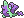
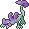
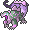
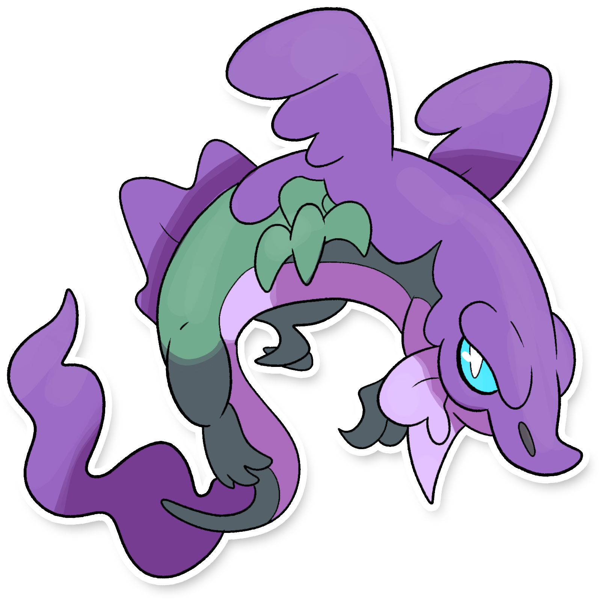
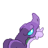
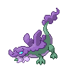
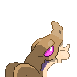
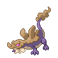

  ⬅️ <a href="https://avventureaditia.github.io/itia-wiki/pokemon/129-pairgon/"> 129 - Pairgon </a>
  <strong>130 - Asgon</strong> 
  
  <a href="https://avventureaditia.github.io/itia-wiki/pokemon/131-dragargon/"> 131 - Dragargon </a> ➡️

## Pokédex

=== "Tassonomia"
    

      
      

        

          
Class

          

            
Pena

          

        

        

          
Types

          

            
            
          

        

        

          
Ability

          

            <a href='' title="Whenever a Pokemon would heal after hitting this Pokemon with a leeching move like absorb, it instead loses as many HP as it would usually gain.  dream eater is unaffected.">Liquid-ooze</a>
          

        

        

          
Cry

          

            <audio controls>
              <source src="../../audio/asgon.mp3" type="audio/mpeg">
            </audio>
          

        

      

    

=== "Aspetto"
    

      
      

        

          
Height

          

            
1,10 m

          

        

        

          
Weight

          

            
103,11 kg

          

        

        

          
Pokédex Color

          

            
Viola

          

        

        

          
Shape

          

            
          

        

      

    

=== "Allevamento"
    

      
      

        

          

            
Catch rate

            

              
35

            

          

          

            
Gender Ratio

            

              
50.00%

              
/

              
50.00%

            

          

        

        

          

            
Egg Groups

            

              
Dragon

            

          

          

            
Hatch Time

            

              
40 Cycles

            

          

        

        

          

            
Base experience yield

            

              
147

            

          

          

            
Leveling rate

            

              
Slow

            

          

        

        

          

            
Base friendship

            

              
35

            

          

          

            
EV yield

            

              
2 - Sp.Attack

            

          

        

      

    

## Generali

=== "Descrizione Pokedex"
    ### Descrizione

    Con l'aiuto del proprio allenatore, i Pairgon evolvono in Asgon, il veleno sul corpo aumenta, ma ora sono in grado di controllarlo e avere una maggiore soglia del dolore, riducendo la sofferenza al minimo.  
    Sono agili e scattanti e al loro passaggio rilasciano pozzi di veleno in grado di correre qualsiasi cosa.  
    Purtroppo, proprio per questa caratteristica, sono ancora considerati pericolosi per l'uomo se non opportunamente tenuti costantemente sotto controllo.  

    Per maggiori informazioni il [video completo](https://www.youtube.com/watch?v=_tnKWPvesjQ&list=PLniAakFPn_t9I5zqlYAwZ_iSzJmgu5Nqd&index=19).

=== "Ispirazioni"

    ### Ispirazioni
    Le ispirazioni alla base di Pairgon e della sua catena evolutiva sono:
    
    - **Drago del buriano**;
    - **Spada nella roccia**;
    - **Zona della Maremma**;
    - **Drago del lago d'Orta**.

=== "Vincitore del contest"
    ### Vincitori

    I Vincitori di Itia che hanno dato origine a Pairgon e la sua catena evolutiva sono **Michele** e **NuggetMaster**.

## Base Stats
<table style="width: 100%">
  <tbody style="width: 100%;">
    <tr style="display: flex; align-items: center;">
      <th style="color: #737373;" >HP</th>
      <td style="border-top: none; width: 70px">95</td>
      <td style="width: 100%; min-width: 450px; border-top: none;">
        

        

      </td>
    </tr>
    <tr style="display: flex; align-items: center;">
      <th style="color: #737373;">Attack</th>
      <td style="border-top: none; width: 70px">45</td>
      <td style="width: 100%; min-width: 450px; border-top: none;">
        

        

      </td>
    </tr>
    <tr style="display: flex; align-items: center;">
      <th style="color: #737373;">Defense</th>
      <td style="border-top: none; width: 70px">66</td>
      <td style="width: 100%; min-width: 450px; border-top: none;">
        

        

      </td>
    </tr>
    <tr style="display: flex; align-items: center;">
      <th style="color: #737373;">SP Attack</th>
      <td style="border-top: none; width: 70px">90</td>
      <td style="width: 100%; min-width: 450px; border-top: none;">
        

        

      </td>
    </tr>
    <tr style="display: flex; align-items: center;">
      <th style="color: #737373;">SP Defense</th>
      <td style="border-top: none; width: 70px">62</td>
      <td style="width: 100%; min-width: 450px; border-top: none;">
        

        

      </td>
    </tr>
    <tr style="display: flex; align-items: center;">
      <th style="color: #737373;">Speed</th>
      <td style="border-top: none; width: 70px">65</td>
      <td style="width: 100%; min-width: 450px; border-top: none;">
        

        

      </td>
    </tr>
  </tbody>
</table>

## Aspetto di gioco

=== "Base"
    

      

        
      

      

        
      

    

=== "Shiny"
    

      

        
      

      

        
      

    

    

##Evolution Change
| Method | Item/Level/Note | Evolved Pokemon |
        | :--: | :--: | :--: |
        | Level Up | 48 | [Dragargon](https://avventureaditia.github.io/itia-wiki/pokemon/131-dragargon/) |
        

## Moveset

=== "Level Up Moves"
    | Level | Name | Power | Accuracy | PP | Type | Damage Class |
        | -- | -- | -- | -- | -- | -- | -- |
        
        

=== "Machine Moves"
    | Machine | Name | Power | Accuracy | PP | Type | Damage Class |
        | -- | -- | -- | -- | -- | -- | -- |
        
        
