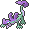

  ⬅️ <a href="https://avventureaditia.github.io/itia-wiki/pokemon/130-asgon/"> 130 - Asgon </a>
  <strong>131 - Dragargon</strong> 
  
  <a href="https://avventureaditia.github.io/itia-wiki/pokemon/132-papplin/"> 132 - Papplin </a> ➡️

## Pokédex

=== "Tassonomia"
    

      
      

        

          
Class

          

            
Mezzofango

          

        

        

          
Types

          

            
            
          

        

        

          
Ability

          

            <a href='' title="Whenever a Pokemon would heal after hitting this Pokemon with a leeching move like absorb, it instead loses as many HP as it would usually gain.  dream eater is unaffected.">Liquid-ooze</a>
          

        

        

          
Cry

          

            <audio controls>
              <source src="../../audio/dragargon.mp3" type="audio/mpeg">
            </audio>
          

        

      

    

=== "Aspetto"
    

      
      

        

          
Height

          

            
1,83 m

          

        

        

          
Weight

          

            
145,22 kg

          

        

        

          
Pokédex Color

          

            
Viola

          

        

        

          
Shape

          

            
          

        

      

    

=== "Allevamento"
    

      
      

        

          

            
Catch rate

            

              
30

            

          

          

            
Gender Ratio

            

              
50.00%

              
/

              
50.00%

            

          

        

        

          

            
Egg Groups

            

              
Dragon

            

          

          

            
Hatch Time

            

              
40 Cycles

            

          

        

        

          

            
Base experience yield

            

              
270

            

          

          

            
Leveling rate

            

              
Slow

            

          

        

        

          

            
Base friendship

            

              
35

            

          

          

            
EV yield

            

              
3 - Sp.Attack

            

          

        

      

    

## Generali

=== "Descrizione Pokedex"
    ### Descrizione

    Il continuo supporto e allenamento a fianco del proprio partner hanno portato Asgon a raggiungere lo stadio finale, divenendo una creatura completamente nuova.  
    La forza di volontà del Pokémon ha fatto sì che il veleno venga rigettato dal corpo allontanandolo dagli organi vitali.  
    Relegandolo alla coda ora è in grado di essere controllato a piacimento.  
    Sul proprio corpo presenta i segni della corrosione del veleno, segno della lunga battaglia che ha dovuto affrontare per essere finalmente liberato dalla sofferenza avuto in passato.  

    Per maggiori informazioni il [video completo](https://www.youtube.com/watch?v=_tnKWPvesjQ&list=PLniAakFPn_t9I5zqlYAwZ_iSzJmgu5Nqd&index=19).

=== "Ispirazioni"

    ### Ispirazioni
    Le ispirazioni alla base di Pairgon e della sua catena evolutiva sono:
    
    - **Drago del buriano**;
    - **Spada nella roccia**;
    - **Zona della Maremma**;
    - **Drago del lago d'Orta**.

=== "Vincitore del contest"
    ### Vincitori

    I Vincitori di Itia che hanno dato origine a Pairgon e la sua catena evolutiva sono **Michele** e **NuggetMaster**.

## Base Stats
<table style="width: 100%">
  <tbody style="width: 100%;">
    <tr style="display: flex; align-items: center;">
      <th style="color: #737373;" >HP</th>
      <td style="border-top: none; width: 70px">125</td>
      <td style="width: 100%; min-width: 450px; border-top: none;">
        

        

      </td>
    </tr>
    <tr style="display: flex; align-items: center;">
      <th style="color: #737373;">Attack</th>
      <td style="border-top: none; width: 70px">75</td>
      <td style="width: 100%; min-width: 450px; border-top: none;">
        

        

      </td>
    </tr>
    <tr style="display: flex; align-items: center;">
      <th style="color: #737373;">Defense</th>
      <td style="border-top: none; width: 70px">86</td>
      <td style="width: 100%; min-width: 450px; border-top: none;">
        

        

      </td>
    </tr>
    <tr style="display: flex; align-items: center;">
      <th style="color: #737373;">SP Attack</th>
      <td style="border-top: none; width: 70px">135</td>
      <td style="width: 100%; min-width: 450px; border-top: none;">
        

        

      </td>
    </tr>
    <tr style="display: flex; align-items: center;">
      <th style="color: #737373;">SP Defense</th>
      <td style="border-top: none; width: 70px">92</td>
      <td style="width: 100%; min-width: 450px; border-top: none;">
        

        

      </td>
    </tr>
    <tr style="display: flex; align-items: center;">
      <th style="color: #737373;">Speed</th>
      <td style="border-top: none; width: 70px">87</td>
      <td style="width: 100%; min-width: 450px; border-top: none;">
        

        

      </td>
    </tr>
  </tbody>
</table>

## Moveset

=== "Level Up Moves"
    | Level | Name | Power | Accuracy | PP | Type | Damage Class |
        | -- | -- | -- | -- | -- | -- | -- |
        
        

=== "Machine Moves"
    | Machine | Name | Power | Accuracy | PP | Type | Damage Class |
        | -- | -- | -- | -- | -- | -- | -- |
        
        
