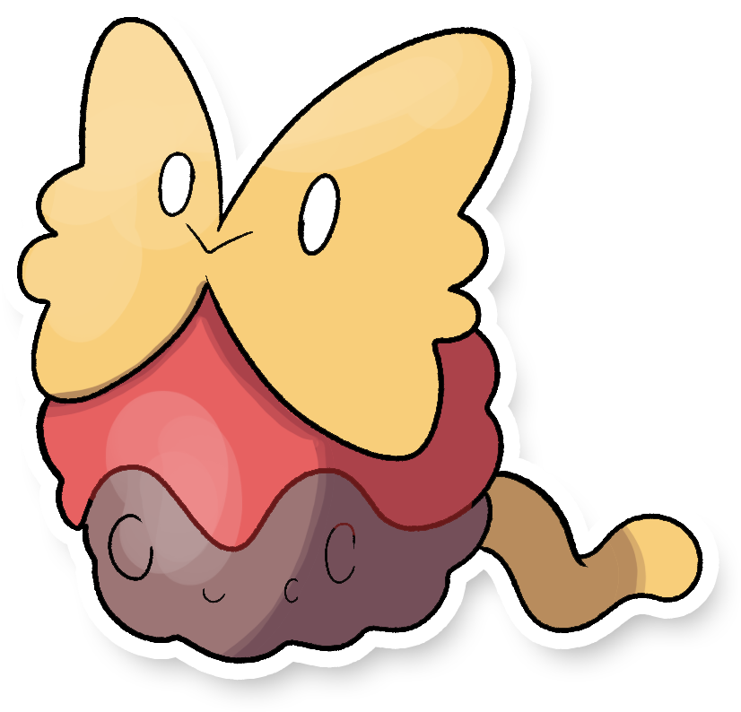

  

  

    

        
Class

        

          
Polpeterra

        

      

    

      
Types

      

        
        
      

    

    

      
Abilities

      

        <a href='' title="Protects allies against moves that affect their mental state.">Aroma-veil</a>
        
      

    

    

      
Hidden Ability

      

        
      

    

  

## Generali

=== "Descrizione Pokedex"
    ### Descrizione

    Forma convergente di Applin, questo piccolo Pokémon sembra essere un piccolo verme che ha deciso di proteggere il proprio corpo con un sottile stato di terra tenuto unito dal materiale viscoso di colore rosso che produce.  
    Considerato quasi una mascotte per tutta la regione di Itia, i cuochi di tutta la regione preparano dei piatti che ricordano il suo aspetto.
    Fortunatamente nessuno ha per ora mangiato per sbaglio i Papplin che nonostante producano un odore evitante, non sono commestibili.  

    Per maggiori informazioni il [video completo](https://www.youtube.com/watch?v=_tnKWPvesjQ&list=PLniAakFPn_t9I5zqlYAwZ_iSzJmgu5Nqd&index=19).

=== "Ispirazioni"

    ### Ispirazioni
    Le ispirazioni alla base di Papplin e della sua catena evolutiva sono:
    
    - **Dadrake prima di andare a dormire** (va palesemente a dormire troppo tardi (ti vogliamo bene lo stesso)).

=== "Vincitore del contest"
    ### Non esattamente

    Il creatore di Papplin e della sua catena evolutiva è **Dadrake**.
    

## Base Stats
<table style="width: 100%">
  <tbody style="width: 100%;">
    <tr style="display: flex; align-items: center;">
      <th style="color: #737373;" >HP</th>
      <td style="border-top: none; width: 70px">40</td>
      <td style="width: 100%; min-width: 450px; border-top: none;">
        

        

      </td>
    </tr>
    <tr style="display: flex; align-items: center;">
      <th style="color: #737373;">Attack</th>
      <td style="border-top: none; width: 70px">40</td>
      <td style="width: 100%; min-width: 450px; border-top: none;">
        

        

      </td>
    </tr>
    <tr style="display: flex; align-items: center;">
      <th style="color: #737373;">Defense</th>
      <td style="border-top: none; width: 70px">40</td>
      <td style="width: 100%; min-width: 450px; border-top: none;">
        

        

      </td>
    </tr>
    <tr style="display: flex; align-items: center;">
      <th style="color: #737373;">SP Attack</th>
      <td style="border-top: none; width: 70px">40</td>
      <td style="width: 100%; min-width: 450px; border-top: none;">
        

        

      </td>
    </tr>
    <tr style="display: flex; align-items: center;">
      <th style="color: #737373;">SP Defense</th>
      <td style="border-top: none; width: 70px">80</td>
      <td style="width: 100%; min-width: 450px; border-top: none;">
        

        

      </td>
    </tr>
    <tr style="display: flex; align-items: center;">
      <th style="color: #737373;">Speed</th>
      <td style="border-top: none; width: 70px">20</td>
      <td style="width: 100%; min-width: 450px; border-top: none;">
        

        

      </td>
    </tr>
  </tbody>
</table>

##Evolution Change
| Method | Item/Level/Note | Evolved Pokemon |
        | :--: | :--: | :--: |
        | Item | Forchetta | [Meattlin](https://avventureaditia.github.io/itia-wiki/pokemon/133-meattlin/) |
        

## Moveset

=== "Level Up Moves"
    | Level | Name | Power | Accuracy | PP | Type | Damage Class |
        | -- | -- | -- | -- | -- | -- | -- |
        
        

=== "Machine Moves"
    | Machine | Name | Power | Accuracy | PP | Type | Damage Class |
        | -- | -- | -- | -- | -- | -- | -- |
        
        
