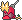
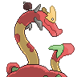
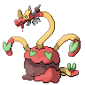
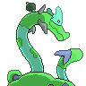
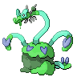

  ⬅️ <a href="https://avventureaditia.github.io/itia-wiki/pokemon/133-meattlin/"> 133 - Meattlin </a>
  <strong>134 - Hydraghetti</strong> 
   

## Pokédex

=== "Tassonomia"
    

      
      

        

          
Class

          

            
Pastamalgama

          

        

        

          
Types

          

            
            
          

        

        

          
Ability

          

            <a href='' title="Protects allies against moves that affect their mental state.">Aroma-veil</a>
          

        

        

          
Cry

          

            <audio controls>
              <source src="../../audio/hydraghetti.mp3" type="audio/mpeg">
            </audio>
          

        

      

    

=== "Aspetto"
    

      
      

        

          
Height

          

            
1,90 m

          

        

        

          
Weight

          

            
96,20 kg

          

        

        

          
Pokédex Color

          

            
Marrone

          

        

        

          
Shape

          

            
          

        

      

    

=== "Allevamento"
    

      
      

        

          

            
Catch rate

            

              
10

            

          

          

            
Gender Ratio

            

              
50.00%

              
/

              
50.00%

            

          

        

        

          

            
Egg Groups

            

              
Amorphous and Field

            

          

          

            
Hatch Time

            

              
20 Cycles

            

          

        

        

          

            
Base experience yield

            

              
270

            

          

          

            
Leveling rate

            

              
Erratic

            

          

        

        

          

            
Base friendship

            

              
50

            

          

          

            
EV yield

            

              
3 - Sp.Defense

            

          

        

      

    

## Generali

=== "Descrizione Pokedex"
    ### Descrizione

    Questo Pokémon è preferito delle cucine di Itia poiché i suoi lunghi tentacoli sono commestibili e, dopo la giusta cura, possono essere utilizzati per creare dei piatti dal sapore incredibile apprezzati in tutto il mondo.  
    I tentacoli cadono col passare del tempo e il Pokémon è in grado di rigenerarli da sé senza particolare sforzo.  
    La sostanza che secernono è molto appiccicosa; infatti, spesso si ricoprono di erbe e altri oggetti rimasti appiccicati per errore.  

    Per maggiori informazioni il [video completo](https://www.youtube.com/watch?v=_tnKWPvesjQ&list=PLniAakFPn_t9I5zqlYAwZ_iSzJmgu5Nqd&index=19).

=== "Ispirazioni"

    ### Ispirazioni
    Le ispirazioni alla base di Papplin e della sua catena evolutiva sono:
    
    - **Dadrake prima di andare a dormire** (va palesemente a dormire troppo tardi (ti vogliamo bene lo stesso)).

=== "Vincitore del contest"
    ### Non esattamente

    Il creatore di Papplin e della sua catena evolutiva è **Dadrake**.

## Base Stats
<table style="width: 100%">
  <tbody style="width: 100%;">
    <tr style="display: flex; align-items: center;">
      <th style="color: #737373;" >HP</th>
      <td style="border-top: none; width: 70px">106</td>
      <td style="width: 100%; min-width: 450px; border-top: none;">
        

        

      </td>
    </tr>
    <tr style="display: flex; align-items: center;">
      <th style="color: #737373;">Attack</th>
      <td style="border-top: none; width: 70px">80</td>
      <td style="width: 100%; min-width: 450px; border-top: none;">
        

        

      </td>
    </tr>
    <tr style="display: flex; align-items: center;">
      <th style="color: #737373;">Defense</th>
      <td style="border-top: none; width: 70px">80</td>
      <td style="width: 100%; min-width: 450px; border-top: none;">
        

        

      </td>
    </tr>
    <tr style="display: flex; align-items: center;">
      <th style="color: #737373;">SP Attack</th>
      <td style="border-top: none; width: 70px">120</td>
      <td style="width: 100%; min-width: 450px; border-top: none;">
        

        

      </td>
    </tr>
    <tr style="display: flex; align-items: center;">
      <th style="color: #737373;">SP Defense</th>
      <td style="border-top: none; width: 70px">110</td>
      <td style="width: 100%; min-width: 450px; border-top: none;">
        

        

      </td>
    </tr>
    <tr style="display: flex; align-items: center;">
      <th style="color: #737373;">Speed</th>
      <td style="border-top: none; width: 70px">44</td>
      <td style="width: 100%; min-width: 450px; border-top: none;">
        

        

      </td>
    </tr>
  </tbody>
</table>

## Aspetto di gioco

=== "Base"
    

      

        
      

      

        
      

    

=== "Shiny"
    

      

        
      

      

        
      

    

## Moveset

=== "Level Up Moves"
    | Level | Name | Power | Accuracy | PP | Type | Damage Class |
        | -- | -- | -- | -- | -- | -- | -- |
        
        

=== "Machine Moves"
    | Machine | Name | Power | Accuracy | PP | Type | Damage Class |
        | -- | -- | -- | -- | -- | -- | -- |
        
        
