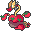
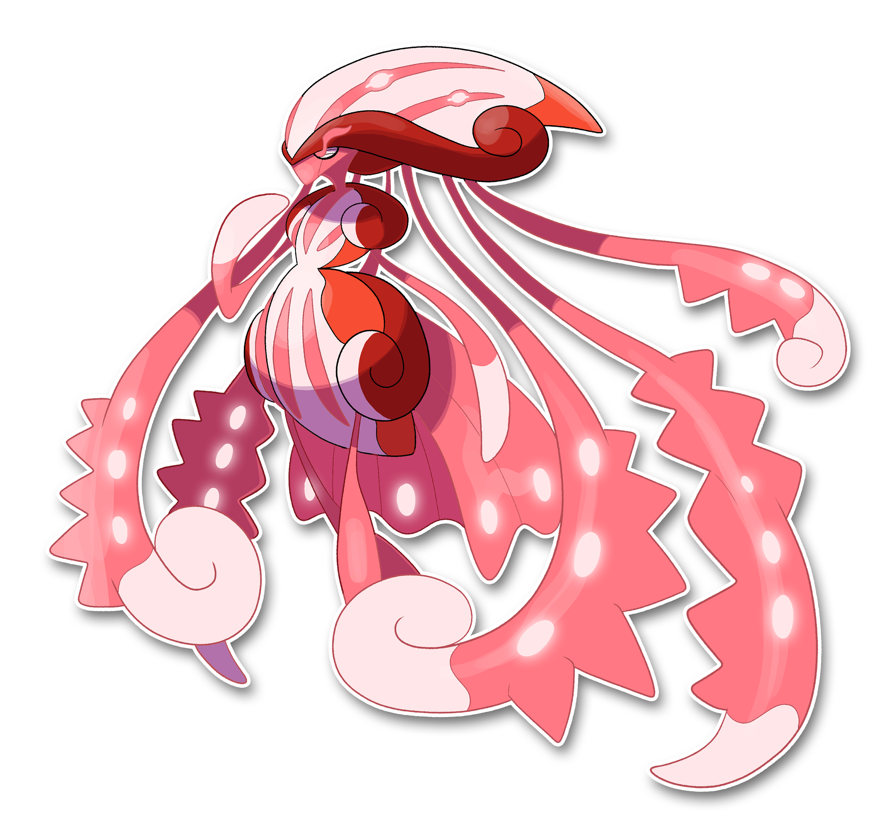

  ⬅️ <a href="https://avventureaditia.github.io/itia-wiki/pokemon/134-hydraghetti/"> 134 - Hydraghetti </a>
  <strong>135 - Harmonympha</strong> 
   
  <a href="https://avventureaditia.github.io/itia-wiki/pokemon/136-vorrakon/"> 136 - Vorrakon </a> ➡️

## Pokédex

=== "Tassonomia"
    

      
      

        

          
Class

          

            
Armonia

          

        

        

          
Types

          

            
            
          

        

        

          
Ability

          

            <a href='' title="Coming soon">Melodia Ancestrale</a>
          

        

        

          
Cry

          

            <audio controls>
              <source src="../../audio/harmonympha.mp3" type="audio/mpeg">
            </audio>
          

        

      

    

=== "Aspetto"
    

      
      

        

          
Height

          

            
2,50 m

          

        

        

          
Weight

          

            
130,57 kg

          

        

        

          
Pokédex Color

          

            
Rosso

          

        

        

          
Shape

          

            
          

        

      

    

=== "Allevamento"
    

      
      

        

          

            
Catch rate

            

              
3

            

          

          

            
Gender Ratio

            

              
100.00%

            

          

        

        

          

            
Egg Groups

            

              
Sconosciuto

            

          

          

            
Hatch Time

            

              
120 Cycles

            

          

        

        

          

            
Base experience yield

            

              
306

            

          

          

            
Leveling rate

            

              
Slow

            

          

        

        

          

            
Base friendship

            

              
0

            

          

          

            
EV yield

            

              
3 - Sp.Attack

            

          

        

      

    

## Generali

=== "Descrizione Pokedex"
    ### Descrizione

    Antico Pokémon della regione di Itia, venerato come colei che, insieme al suo amato sconfisse l'essere denominato come il "Silenzio".  
    Usa i suoi lunghissimi tentacoli per suonare gli organi presenti sulla sua testa e sul suo ventre e produrre una melodia così dolce e rassicurante da calmare anche l'animo più irrequieto e combattivo.  
    Dimora nei mari ad Est della Regione e i marinai più anziani sono certi di aver ascoltato spesso, durante i propri viaggi, il pianto di questo Pokémon provenire dalla profondità del mare, come se avesse perduto qualcosa di importante.  

    Per maggiori informazioni il [video completo](https://www.youtube.com/watch?v=U4yL_2TGwmI&list=PLniAakFPn_t9I5zqlYAwZ_iSzJmgu5Nqd&index=20).

=== "Ispirazioni"

    ### Ispirazioni
    Le ispirazioni alla base di Harmonympha sono:
    
    - Definizione di Scilla come **"Lama del mare"**;
    - **Guido D'Arezzo**;
    - **Spartito**;
    - **Ocarina**;
    - **Mandolino**;
    - **Lira**;
    - **Violino**;
    - **Arpa**;
    - **Calamaro Vampiro**.
    

=== "Vincitore del contest"
    ### Vincitori

    I Vincitori di Itia che hanno dato origine a Pairgon e la sua catena evolutiva sono: **Torre**, **Basilico**, **Spectral Dragon**, **Anna Casedda**, **Bonkaton**.

## Base Stats
<table style="width: 100%">
  <tbody style="width: 100%;">
    <tr style="display: flex; align-items: center;">
      <th style="color: #737373;" >HP</th>
      <td style="border-top: none; width: 70px">120</td>
      <td style="width: 100%; min-width: 450px; border-top: none;">
        

        

      </td>
    </tr>
    <tr style="display: flex; align-items: center;">
      <th style="color: #737373;">Attack</th>
      <td style="border-top: none; width: 70px">80</td>
      <td style="width: 100%; min-width: 450px; border-top: none;">
        

        

      </td>
    </tr>
    <tr style="display: flex; align-items: center;">
      <th style="color: #737373;">Defense</th>
      <td style="border-top: none; width: 70px">125</td>
      <td style="width: 100%; min-width: 450px; border-top: none;">
        

        

      </td>
    </tr>
    <tr style="display: flex; align-items: center;">
      <th style="color: #737373;">SP Attack</th>
      <td style="border-top: none; width: 70px">140</td>
      <td style="width: 100%; min-width: 450px; border-top: none;">
        

        

      </td>
    </tr>
    <tr style="display: flex; align-items: center;">
      <th style="color: #737373;">SP Defense</th>
      <td style="border-top: none; width: 70px">120</td>
      <td style="width: 100%; min-width: 450px; border-top: none;">
        

        

      </td>
    </tr>
    <tr style="display: flex; align-items: center;">
      <th style="color: #737373;">Speed</th>
      <td style="border-top: none; width: 70px">85</td>
      <td style="width: 100%; min-width: 450px; border-top: none;">
        

        

      </td>
    </tr>
  </tbody>
</table>

## Moveset

=== "Level Up Moves"
    | Level | Name | Power | Accuracy | PP | Type | Damage Class |
        | -- | -- | -- | -- | -- | -- | -- |
        
        

=== "Machine Moves"
    | Machine | Name | Power | Accuracy | PP | Type | Damage Class |
        | -- | -- | -- | -- | -- | -- | -- |
        
        
