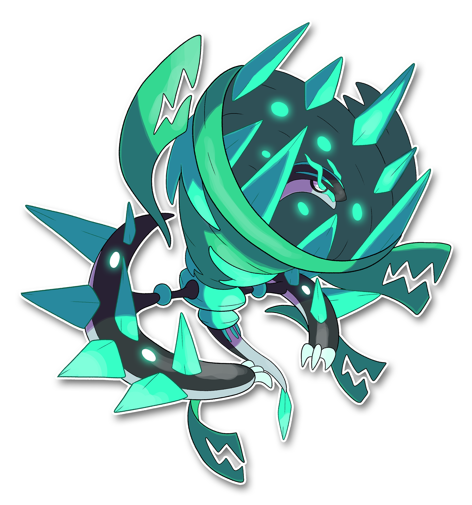

  ⬅️ <a href="https://avventureaditia.github.io/itia-wiki/pokemon/135-harmonympha/"> 135 - Harmonympha </a>
  <strong>136 - Vorrakon</strong> 
   
  <a href="https://avventureaditia.github.io/itia-wiki/pokemon/137-frosilent/"> 137 - Frosilent </a> ➡️

## Pokédex

=== "Tassonomia"
    

      
      

        

          
Class

          

            
Frastuono

          

        

        

          
Types

          

            
            
          

        

        

          
Ability

          

            <a href='' title="Coming soon">Rombo Litico</a>
          

        

        

          
Cry

          

            <audio controls>
              <source src="../../audio/vorrakon.mp3" type="audio/mpeg">
            </audio>
          

        

      

    

=== "Aspetto"
    

      
      

        

          
Height

          

            
3,20 m

          

        

        

          
Weight

          

            
197,25 kg

          

        

        

          
Pokédex Color

          

            
Verde

          

        

        

          
Shape

          

            
          

        

      

    

=== "Allevamento"
    

      
      

        

          

            
Catch rate

            

              
3

            

          

          

            
Gender Ratio

            

              
100.00%

            

          

        

        

          

            
Egg Groups

            

              
Sconosciuto

            

          

          

            
Hatch Time

            

              
120 Cycles

            

          

        

        

          

            
Base experience yield

            

              
306

            

          

          

            
Leveling rate

            

              
Slow

            

          

        

        

          

            
Base friendship

            

              
0

            

          

          

            
EV yield

            

              
3 - Attack

            

          

        

      

    

## Generali

=== "Descrizione Pokedex"
    ### Descrizione

    Antico Pokemon della regione di Itia, venerato come colui che, insieme alla sua amata sconfisse l'essere denominato come il "Silenzio".  
    Ruota le sue enormi braccia ricoperte di pietra a velocità impressionante, creando mulinelli in grado di risucchiare qualsiasi cosa nel raggio di chilometri.  
    Usa la coda appuntita per graffiare le sue braccia in movimento rotatorio, così produrre dei suoni assordanti e potenti che vengono amplificati dal tornado intorno al collo, che è formato dalla sua pelle in eccesso.  
    Essendo la sua forza prorompente, capita che alcuni pezzi di questa pelle si stacchino creando teste aggiuntive al suo corpo che attaccano e si deteriorano nel tempo.  
    Dimora nei mari ad Ovest della Regione e si dice che sia colmo di rabbia per aver perso qualcosa di importante.  

    Per maggiori informazioni il [video completo](https://www.youtube.com/watch?v=U4yL_2TGwmI&list=PLniAakFPn_t9I5zqlYAwZ_iSzJmgu5Nqd&index=20).

=== "Ispirazioni"

    ### Ispirazioni
    Le ispirazioni alla base di Harmonympha sono:
    
    - **Lamprede**;
    - **Murene**;
    - **Capodoglio**;
    - **Pesce porco**;
    - **Squalo elefante**;
    - **Organo**;
    - **Flauto di Pan**;
    - **Raganella**;
    - **Chitarra elettrica**;
    - **Grammofono**;
    - **Mirmidori**;
    - **Girolamo Savonarola**.
    

=== "Vincitore del contest"
    ### Vincitori

    I Vincitori di Itia che hanno dato origine a Pairgon e la sua catena evolutiva sono: **Metalord**, **TepigGabrix**, **Fly**, **Rikky**, **Mucco**, **Pablitoschio**, **Federex**, **Federico**, **Davide**.

## Base Stats
<table style="width: 100%">
  <tbody style="width: 100%;">
    <tr style="display: flex; align-items: center;">
      <th style="color: #737373;" >HP</th>
      <td style="border-top: none; width: 70px">105</td>
      <td style="width: 100%; min-width: 450px; border-top: none;">
        

        

      </td>
    </tr>
    <tr style="display: flex; align-items: center;">
      <th style="color: #737373;">Attack</th>
      <td style="border-top: none; width: 70px">140</td>
      <td style="width: 100%; min-width: 450px; border-top: none;">
        

        

      </td>
    </tr>
    <tr style="display: flex; align-items: center;">
      <th style="color: #737373;">Defense</th>
      <td style="border-top: none; width: 70px">105</td>
      <td style="width: 100%; min-width: 450px; border-top: none;">
        

        

      </td>
    </tr>
    <tr style="display: flex; align-items: center;">
      <th style="color: #737373;">SP Attack</th>
      <td style="border-top: none; width: 70px">80</td>
      <td style="width: 100%; min-width: 450px; border-top: none;">
        

        

      </td>
    </tr>
    <tr style="display: flex; align-items: center;">
      <th style="color: #737373;">SP Defense</th>
      <td style="border-top: none; width: 70px">100</td>
      <td style="width: 100%; min-width: 450px; border-top: none;">
        

        

      </td>
    </tr>
    <tr style="display: flex; align-items: center;">
      <th style="color: #737373;">Speed</th>
      <td style="border-top: none; width: 70px">140</td>
      <td style="width: 100%; min-width: 450px; border-top: none;">
        

        

      </td>
    </tr>
  </tbody>
</table>

## Moveset

=== "Level Up Moves"
    | Level | Name | Power | Accuracy | PP | Type | Damage Class |
        | -- | -- | -- | -- | -- | -- | -- |
        
        

=== "Machine Moves"
    | Machine | Name | Power | Accuracy | PP | Type | Damage Class |
        | -- | -- | -- | -- | -- | -- | -- |
        
        
