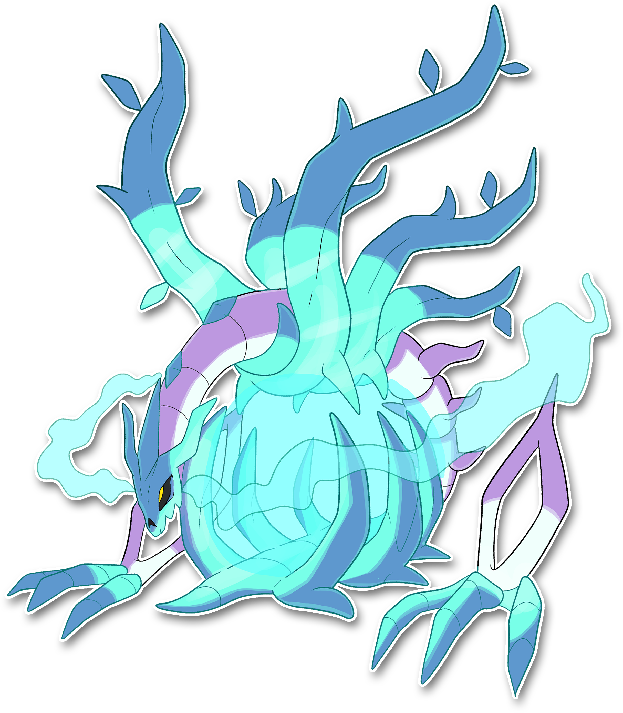
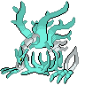

  ⬅️ <a href="https://avventureaditia.github.io/itia-wiki/pokemon/136-vorrakon/"> 136 - Vorrakon </a>
  <strong>137 - Frosilent</strong> 
  

## Pokédex

=== "Tassonomia"
    

      
      

        

          
Class

          

            
Silenzio

          

        

        

          
Types

          

            
            
          

        

        

          
Ability

          

            <a href='' title="Coming soon">Crioquiete</a>
          

        

        

          
Cry

          

            <audio controls>
              <source src="../../audio/frosilent.mp3" type="audio/mpeg">
            </audio>
          

        

      

    

=== "Aspetto"
    

      
      

        

          
Height

          

            
2,79 m

          

        

        

          
Weight

          

            
154,17 kg

          

        

        

          
Pokédex Color

          

            
Bianco

          

        

        

          
Shape

          

            
          

        

      

    

=== "Allevamento"
    

      
      

        

          

            
Catch rate

            

              
3

            

          

          

            
Gender Ratio

            

              
Sconosciuto

            

          

        

        

          

            
Egg Groups

            

              
Sconosciuto

            

          

          

            
Hatch Time

            

              
120 Cycles

            

          

        

        

          

            
Base experience yield

            

              
380

            

          

          

            
Leveling rate

            

              
Slow

            

          

        

        

          

            
Base friendship

            

              
0

            

          

          

            
EV yield

            

              
3 - HP

            

          

        

      

    

## Generali

=== "Descrizione Pokedex"
    ### Descrizione

    Nei racconti antichi di Itia, l'essere che viene chiamato il "Silenzio".   
    Secondo le leggende questo non sarebbe il suo vero aspetto, ma solo ciò che rimane del gigante Drago/Erba originale, sconfitto da Arceus all'inizio dell'universo.  
    Privato del suo nucleo che gli conferiva il suo potere, venne sconfitto da due Pokémon protettori di Itia, costringendolo a regredire alla forma di un gracile seme di ghiaccio.  
    Tuttavia, alcuni credono che si stia lentamente rigenerando per poter attaccare di nuovo e recuperare ciò che ha perduto.  
    Ingloba i nemici nella sfera di ghiaccio posta nel luogo in cui originariamente vi era il suo nucleo, per colpirli con spuntoni di ghiaccio e assorbirne la forza vitale, ma soprattutto per assorbirne i suoni, fonte primaria del suo sostentamento.  

    Per maggiori informazioni il [video completo](https://www.youtube.com/watch?v=U4yL_2TGwmI&list=PLniAakFPn_t9I5zqlYAwZ_iSzJmgu5Nqd&index=20).

=== "Ispirazioni"

    ### Ispirazioni
    Le ispirazioni alla base di Frosilent sono:
    
    - **Fontana del Nettuno a Messina**;
    - **Plutone e Proserpina**;
    - **Dea Tacita**;
    - **Arpie**;
    - **Leggenda della Morte Secca**;
    - **Endennasauro**;
    - **Cavalluccio marino**;
    - **Caravella portoghese**;
    - **Crociate**;
    - **Dittatura del Papato**;
    - **Lucifero nel lago Cogito**;
    - **Guerra delle Alpi**;
    - **Termoacustica**;
    - **Zampogna**;
    - **Camera anecoica**.
    

=== "Vincitore del contest"
    ### Vincitori

    I Vincitori di Itia che hanno dato origine a Frosilent e la sua catena evolutiva sono: **Dittomon**, **Prismo**, **Nuggetmaster**, **Valerio**, **Federico**, **Michele**, **Aki Shirota**, **IlDaddo**.

## Base Stats
<table style="width: 100%">
  <tbody style="width: 100%;">
    <tr style="display: flex; align-items: center;">
      <th style="color: #737373;" >HP</th>
      <td style="border-top: none; width: 70px">150</td>
      <td style="width: 100%; min-width: 450px; border-top: none;">
        

        

      </td>
    </tr>
    <tr style="display: flex; align-items: center;">
      <th style="color: #737373;">Attack</th>
      <td style="border-top: none; width: 70px">140</td>
      <td style="width: 100%; min-width: 450px; border-top: none;">
        

        

      </td>
    </tr>
    <tr style="display: flex; align-items: center;">
      <th style="color: #737373;">Defense</th>
      <td style="border-top: none; width: 70px">95</td>
      <td style="width: 100%; min-width: 450px; border-top: none;">
        

        

      </td>
    </tr>
    <tr style="display: flex; align-items: center;">
      <th style="color: #737373;">SP Attack</th>
      <td style="border-top: none; width: 70px">140</td>
      <td style="width: 100%; min-width: 450px; border-top: none;">
        

        

      </td>
    </tr>
    <tr style="display: flex; align-items: center;">
      <th style="color: #737373;">SP Defense</th>
      <td style="border-top: none; width: 70px">95</td>
      <td style="width: 100%; min-width: 450px; border-top: none;">
        

        

      </td>
    </tr>
    <tr style="display: flex; align-items: center;">
      <th style="color: #737373;">Speed</th>
      <td style="border-top: none; width: 70px">70</td>
      <td style="width: 100%; min-width: 450px; border-top: none;">
        

        

      </td>
    </tr>
  </tbody>
</table>

## Aspetto di gioco

=== "Base"
    

      

        
      

      

        
      

    

=== "Shiny"
    

      

        
      

      

        
      

    

## Moveset

=== "Level Up Moves"
    | Level | Name | Power | Accuracy | PP | Type | Damage Class |
        | -- | -- | -- | -- | -- | -- | -- |
        
        

=== "Machine Moves"
    | Machine | Name | Power | Accuracy | PP | Type | Damage Class |
        | -- | -- | -- | -- | -- | -- | -- |
        
        
